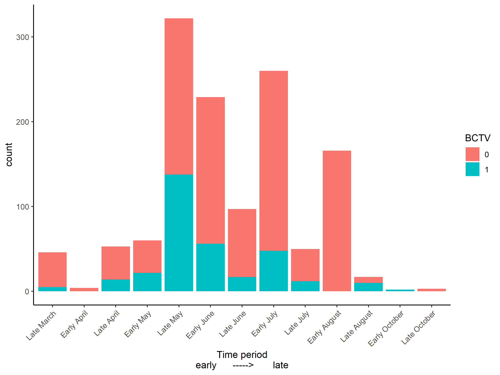
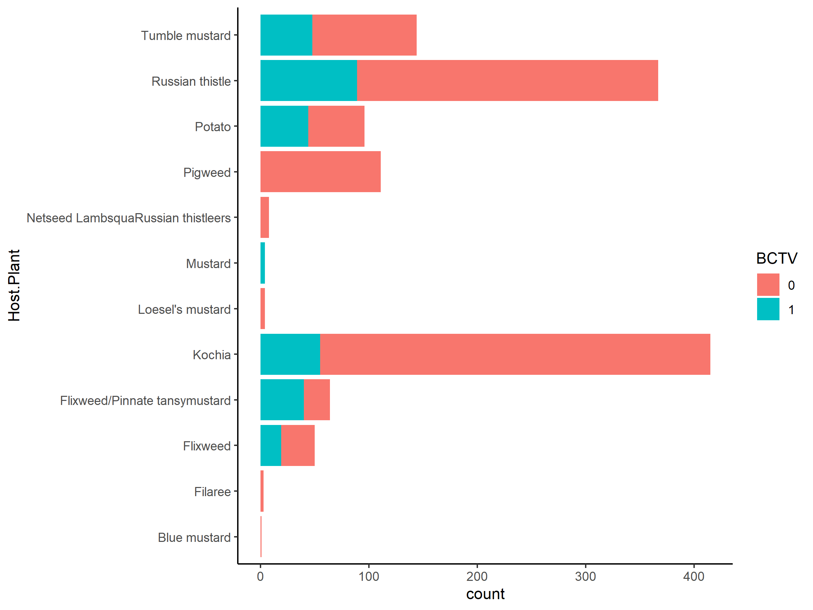

Camille’s BLH Analysis V1
================
Riley M. Anderson & Camille Wagstaff
November 13, 2023

  

- [Overview](#overview)
  - [Summary of Results](#summary-of-results)
- [Exploratory Data Analysis](#exploratory-data-analysis)
  - [BCTV by plant type (weed, crop, shrub,
    etc.)](#bctv-by-plant-type-weed-crop-shrub-etc)
  - [BCTV by plant type and year](#bctv-by-plant-type-and-year)
  - [BCTV by family](#bctv-by-family)
  - [BCTV by genus](#bctv-by-genus)
  - [BCTV by year](#bctv-by-year)
  - [BCTV by time of year (all years
    together)](#bctv-by-time-of-year-all-years-together)
  - [BCTV by host plant (plant the BLH were collected
    from)](#bctv-by-host-plant-plant-the-blh-were-collected-from)
  - [Session Information](#session-information)

## Overview

Camille’s beet leafhopper project.

### Summary of Results

- 

# Exploratory Data Analysis

### BCTV by plant type (weed, crop, shrub, etc.)

<!-- -->

### BCTV by plant type and year

<!-- -->

### BCTV by family

<!-- -->

### BCTV by genus

<!-- -->

### BCTV by year

<!-- -->

### BCTV by time of year (all years together)

<!-- -->

### BCTV by host plant (plant the BLH were collected from)

<!-- -->

## Session Information

    R version 4.2.3 (2023-03-15 ucrt)
    Platform: x86_64-w64-mingw32/x64 (64-bit)
    Running under: Windows 10 x64 (build 19045)

    Matrix products: default

    locale:
    [1] LC_COLLATE=English_United States.utf8 
    [2] LC_CTYPE=English_United States.utf8   
    [3] LC_MONETARY=English_United States.utf8
    [4] LC_NUMERIC=C                          
    [5] LC_TIME=English_United States.utf8    

    attached base packages:
    [1] stats     graphics  grDevices utils     datasets  methods   base     

    other attached packages:
     [1] cowplot_1.1.1   lubridate_1.9.2 forcats_1.0.0   stringr_1.5.0  
     [5] dplyr_1.1.1     purrr_1.0.1     readr_2.1.4     tidyr_1.3.0    
     [9] tibble_3.2.1    ggplot2_3.4.1   tidyverse_2.0.0

    loaded via a namespace (and not attached):
     [1] highr_0.10       pillar_1.9.0     compiler_4.2.3   tools_4.2.3     
     [5] digest_0.6.31    timechange_0.2.0 evaluate_0.20    lifecycle_1.0.3 
     [9] gtable_0.3.3     pkgconfig_2.0.3  rlang_1.1.0      cli_3.6.1       
    [13] rstudioapi_0.14  yaml_2.3.7       xfun_0.38        fastmap_1.1.1   
    [17] withr_2.5.0      knitr_1.42       generics_0.1.3   vctrs_0.6.1     
    [21] hms_1.1.3        rprojroot_2.0.3  grid_4.2.3       tidyselect_1.2.0
    [25] glue_1.6.2       R6_2.5.1         fansi_1.0.4      rmarkdown_2.21  
    [29] farver_2.1.1     tzdb_0.3.0       magrittr_2.0.3   codetools_0.2-19
    [33] scales_1.2.1     htmltools_0.5.5  colorspace_2.1-0 labeling_0.4.2  
    [37] utf8_1.2.3       stringi_1.7.12   munsell_0.5.0   
