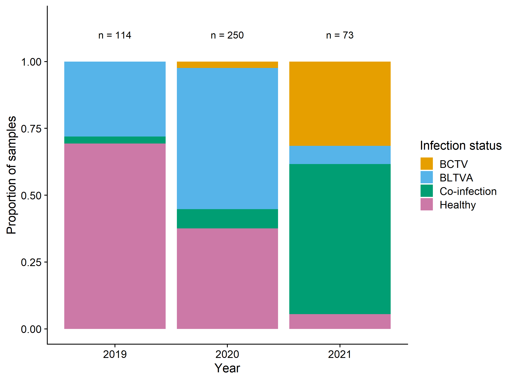
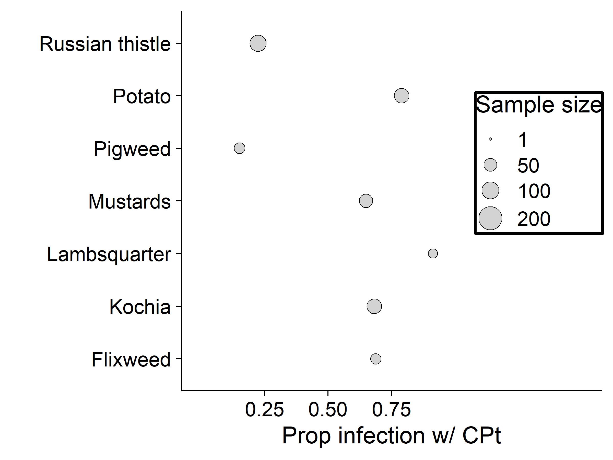
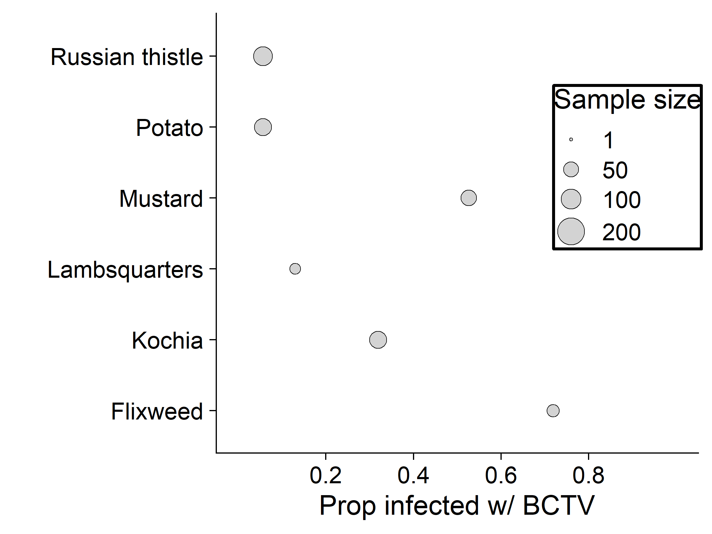
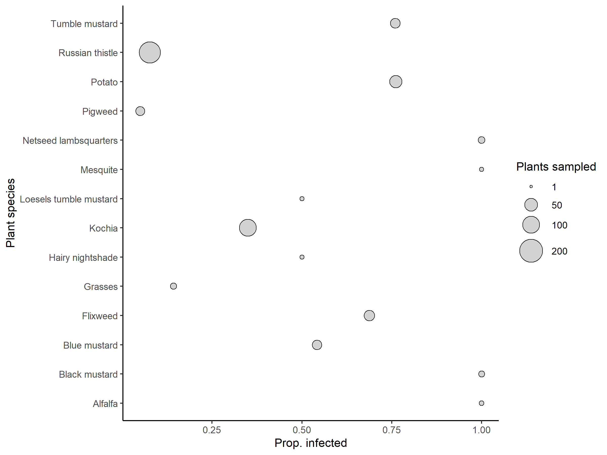
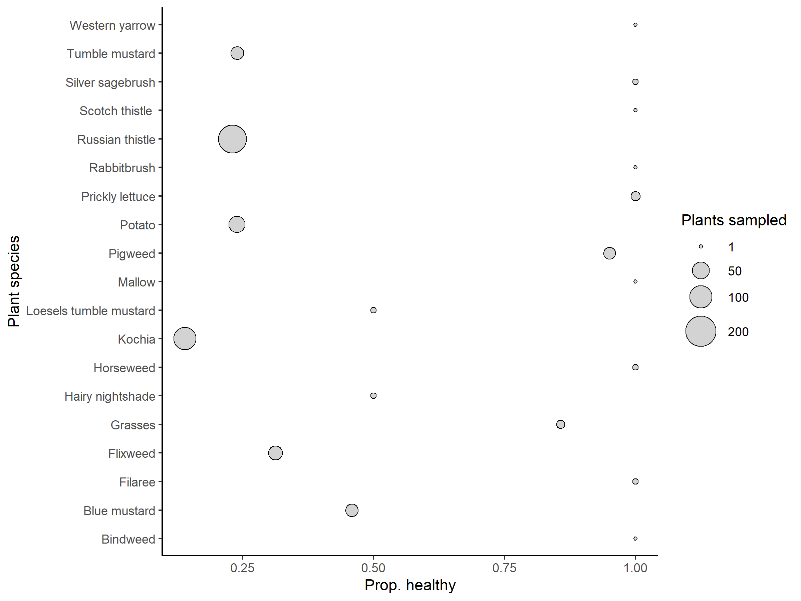
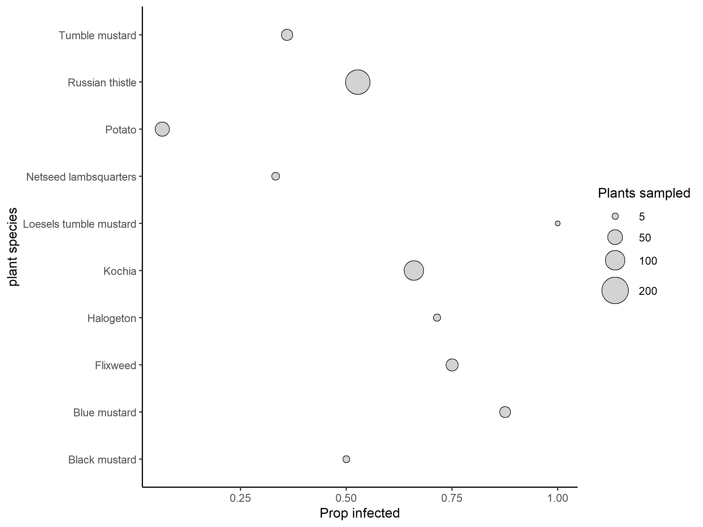
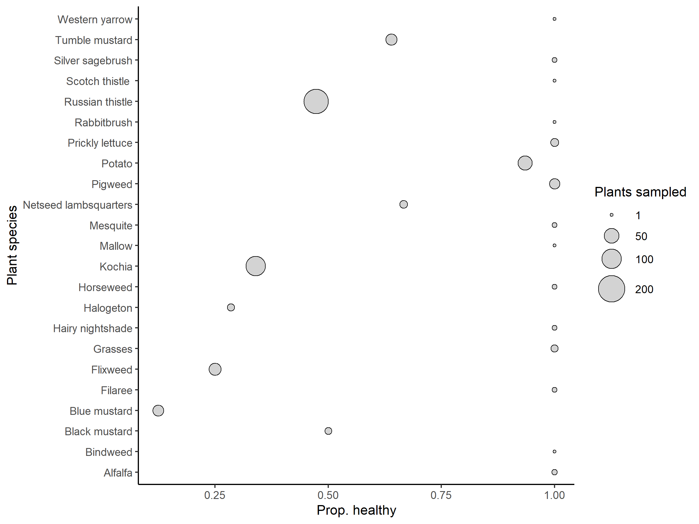

Camille’s BLTV & BLTVA plant data
================
Dr. Riley M. Anderson & Camille Wagstaff
May 23, 2024

  

- [Overview](#overview)
- [Plots](#plots)
  - [Proportion infection class per
    year](#proportion-infection-class-per-year)
  - [BLTVA (new data)](#bltva-new-data)
  - [BCTV (new data)](#bctv-new-data)
- [GLM infection](#glm-infection)
  - [BLTVA model](#bltva-model)
  - [BCTV model](#bctv-model)
- [BLTVA](#bltva)
  - [BLTVA proportion infected](#bltva-proportion-infected)
  - [BLTVA proportion healthy (not
    infected)](#bltva-proportion-healthy-not-infected)
- [BCTV](#bctv)
  - [BCTV proportion infected](#bctv-proportion-infected)
  - [BLTVA proportion healthy](#bltva-proportion-healthy)
- [Session Information](#session-information)

## Overview

This analysis plots BLTVA and BCTV infection rates of plants.

The data used to generate these plots are:

- data/2019.csv
- data/2020.csv
- data/2021.csv

These data have been cleaned manually (species name errors) and are
different from data on Camille’s machine.

## Plots

### Proportion infection class per year

<!-- -->

### BLTVA (new data)

<!-- -->

### BCTV (new data)

<!-- -->

## GLM infection

### BLTVA model

    ## 
    ## Call:
    ## glm(formula = prop.infected ~ Plant, family = binomial(link = logit), 
    ##     data = bltva.data, weights = n)
    ## 
    ## Deviance Residuals: 
    ## [1]  0  0  0  0  0  0  0
    ## 
    ## Coefficients:
    ##                            Estimate Std. Error z value Pr(>|z|)
    ## (Intercept)                 -2.6391     4.0089  -0.658    0.510
    ## PlantKochia                  3.3982     4.0211   0.845    0.398
    ## PlantMustard                 3.3673     4.0187   0.838    0.402
    ## PlantNetseed lambsquarters   4.9416     4.0836   1.210    0.226
    ## PlantPigweed                 0.9163     4.1984   0.218    0.827
    ## PlantPotato                  3.9564     4.0222   0.984    0.325
    ## PlantRussian thistle         1.4007     4.0445   0.346    0.729
    ## 
    ## (Dispersion parameter for binomial family taken to be 1)
    ## 
    ##     Null deviance: 3.4362e+01  on 6  degrees of freedom
    ## Residual deviance: 1.1030e-14  on 0  degrees of freedom
    ## AIC: 34.324
    ## 
    ## Number of Fisher Scoring iterations: 5

### BCTV model

    ## 
    ## Call:
    ## glm(formula = prop.infected ~ Plant, family = binomial(), data = bctv.data, 
    ##     weights = n)
    ## 
    ## Deviance Residuals: 
    ## [1]  0  0  0  0  0
    ## 
    ## Coefficients:
    ##                            Estimate Std. Error z value Pr(>|z|)   
    ## (Intercept)                 -0.8961     0.4929  -1.818  0.06904 . 
    ## PlantMustard                 1.6778     0.5671   2.959  0.00309 **
    ## PlantNetseed lambsquarters  -0.9497     1.7531  -0.542  0.58799   
    ## PlantPotato                 -1.9223     2.2238  -0.864  0.38736   
    ## PlantRussian thistle        -1.9253     2.0037  -0.961  0.33662   
    ## ---
    ## Signif. codes:  0 '***' 0.001 '**' 0.01 '*' 0.05 '.' 0.1 ' ' 1
    ## 
    ## (Dispersion parameter for binomial family taken to be 1)
    ## 
    ##     Null deviance: 2.2236e+01  on 4  degrees of freedom
    ## Residual deviance: 3.6676e-15  on 0  degrees of freedom
    ## AIC: 19.658
    ## 
    ## Number of Fisher Scoring iterations: 5

# BLTVA

## BLTVA proportion infected

Proportion of infected individuals / total individuals sampled
<!-- -->

## BLTVA proportion healthy (not infected)

Proportion of healthy individuals / total individuals sampled
<!-- -->

# BCTV

## BCTV proportion infected

Proportion of infected individuals / total individuals sampled
<!-- -->

## BLTVA proportion healthy

Proportion of healthy individuals / total individuals sampled
<!-- -->

# Session Information

    ## R version 4.2.3 (2023-03-15 ucrt)
    ## Platform: x86_64-w64-mingw32/x64 (64-bit)
    ## Running under: Windows 10 x64 (build 19045)
    ## 
    ## Matrix products: default
    ## 
    ## locale:
    ## [1] LC_COLLATE=English_United States.utf8 
    ## [2] LC_CTYPE=English_United States.utf8   
    ## [3] LC_MONETARY=English_United States.utf8
    ## [4] LC_NUMERIC=C                          
    ## [5] LC_TIME=English_United States.utf8    
    ## 
    ## attached base packages:
    ## [1] stats     graphics  grDevices utils     datasets  methods   base     
    ## 
    ## other attached packages:
    ##  [1] cowplot_1.1.1   lubridate_1.9.2 forcats_1.0.0   stringr_1.5.0  
    ##  [5] dplyr_1.1.1     purrr_1.0.1     readr_2.1.4     tidyr_1.3.0    
    ##  [9] tibble_3.2.1    ggplot2_3.4.4   tidyverse_2.0.0
    ## 
    ## loaded via a namespace (and not attached):
    ##  [1] highr_0.10       pillar_1.9.0     compiler_4.2.3   tools_4.2.3     
    ##  [5] digest_0.6.31    timechange_0.2.0 evaluate_0.20    lifecycle_1.0.3 
    ##  [9] gtable_0.3.3     pkgconfig_2.0.3  rlang_1.1.0      cli_3.6.1       
    ## [13] rstudioapi_0.14  yaml_2.3.7       xfun_0.38        fastmap_1.1.1   
    ## [17] withr_2.5.0      knitr_1.42       generics_0.1.3   vctrs_0.6.1     
    ## [21] hms_1.1.3        rprojroot_2.0.3  grid_4.2.3       tidyselect_1.2.0
    ## [25] glue_1.6.2       R6_2.5.1         fansi_1.0.4      rmarkdown_2.21  
    ## [29] farver_2.1.1     tzdb_0.3.0       magrittr_2.0.3   codetools_0.2-19
    ## [33] scales_1.2.1     htmltools_0.5.5  colorspace_2.1-0 labeling_0.4.2  
    ## [37] utf8_1.2.3       stringi_1.7.12   munsell_0.5.0
