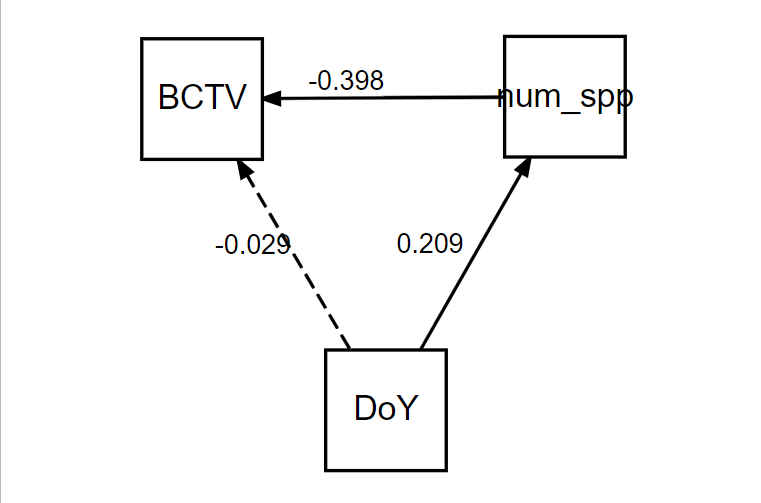

```{r setup, include = F}
# @@@@@@@@@@@@@@@@@@@@@@@@@@@@@@@@@@@@@@@@@@@@@@@@@@
# @@@@@ Knitr Options
# @@@@@@@@@@@@@@@@@@@@@@@@@@@@@@@@@@@@@@@@@@@@@@@@@@

# Set root directory to the project directory
knitr::opts_knit$set(root.dir = rprojroot::find_rstudio_root_file())


# Set default knitr options: 
# Suppress warnings and messages, cache chunks, 
#  set default figure size to 6x8 at 300 dpi, and save a png and pdf
knitr::opts_chunk$set(warning = F, message = F, collapse = T, cache = T,
    fig.height = 6, fig.width = 8, dpi = 300, # 6x8" @ 300dpi:1800x2400=4.3MP
    dev = c('png', 'pdf'), dev.args = list(pdf = list(onefile = F)))

```


# Overview

This analysis compares gut content communities to pathogen infection status.

Multiple statistical and machine learning techniques were used to find patterns in the gut contents data.

* NMDS: this ordination technique could not reveal any community patterns that explain infection status. This may be caused by the high stress induced in solutions with fewer than 4 dimensions.

* Random Forests: ML models were given plant community data, collection region, collection year, collection day of year (DoY), and gut plant richness as predictors. For both response variables, BCTV and BLTVA, RF machines resulted in ~27% out of bag error rates. This result was similar when the plant community data were converted to binary (presence/absence). Variable importance was used to inform variable selection in logistic models.

* Initial logistic models showed odd results. A Structural Equation Model was built to determine the contribution of important variables to infection status and revealed that plant richness is the main driver of infection status, while day of year (time of collection) had only weak effects on richness, and no effect on infection once richness was accounted for.

* Logistic models show a negative relationship between BCTV infection and gut richness. BLTVA infection varied independently of gut richness.

* PCA failed to explain majority variance in less than 6 dimensions.


```{r Main_Code, include = F, cache = F}

# @@@@@@@@@@@@@@@@@@@@@@@@@@@@@@@@@@@@@@@@@@@@@@@@@@
# @@@@@ Setup - This code is run, but output is hidden
# @@@@@@@@@@@@@@@@@@@@@@@@@@@@@@@@@@@@@@@@@@@@@@@@@@

# Load Packages
library(tidyverse) # for data wrangling: dplyr, tidyr, ggplot2
library(cowplot) # for publication-quality ggplots
library(vegan) # for NMDS
library(lubridate) # for cleaning the dates
library(randomForest) # for random forests
library(caret) # for training machines
library(sjPlot) # for model visualization
library(glmmTMB) # for advanced GLMMs
library(piecewiseSEM) # for SEMs
library(factoextra) # for PCA visualization

# these are only needed if you want the 3D NMDS plot:
library(vegan3d) # for 3D plots (NMDS)
library(scatterplot3d) # for 3D plots
library(plot3D) # for 3D plots
library(RColorBrewer) # for color palettes
library(rgl) # for 3D plots

# @@@@@@@@@@@@@@@@@@@@@@@@@@@@@@@@@@@@@@@@@@@@@@@@@@
# @@@@@ Data Preparation
# @@@@@@@@@@@@@@@@@@@@@@@@@@@@@@@@@@@@@@@@@@@@@@@@@@

# Import datasets
gca.raw <- read.csv("data/GCA.all.years.csv")

# RNG
set.seed(1976)

```


```{r Data_Wrangling, echo = F, comment = ""}

# convert to factors:
gca.raw <- gca.raw %>% 
  mutate(across(c(
    idBLH, BLTVA, BCTV, Organism
  ), as.factor))

# identify the rare plants:
rare.plants <- gca.raw %>% 
  group_by(Organism) %>% 
  tally() %>% 
  filter(n > 4)

# remove the rare plants from the gca data:
gca.long <- semi_join(gca.raw, rare.plants, by = "Organism")

# which BLH ate > 1 plant? Needed to make Bray-Curtis distance matrix
gca.long.ids <- gca.long %>% 
  group_by(idBLH) %>% 
  tally() %>% 
  filter(n > 1)

# only use BLH that ate >1 plant:
gca.long <- semi_join(gca.long, gca.long.ids, by = "idBLH")

# matrix format for NMDS:
gca.wide <- gca.long %>% 
  select(idBLH, Organism, Sequences) %>% 
  pivot_wider(names_from = Organism,
              values_from = Sequences) %>% 
  replace(is.na(.), 0) %>% 
  column_to_rownames('idBLH')


#################
# nmds meta data
gca.meta <- gca.long %>% 
  select(idBLH, BCTV, BLTVA, Date, Region, HostPlant, Year) %>% 
  distinct() %>% 
  mutate(Date = ymd(Date),
         DoY = yday(Date),
         across(c(Region, HostPlant, Year), as.factor)) %>% 
  slice(-204) %>% 
  column_to_rownames('idBLH')

############
# distance matrix
gca.dist <- vegdist(gca.wide, method = "bray")


#################################
# Random Forest data prep
#################################

num.spp <- gca.long %>% 
  select(idBLH, Organism) %>% 
  group_by(idBLH) %>% 
  tally()


responses <- gca.long %>% 
  select(idBLH, BCTV, BLTVA, Region, HostPlant, Date, Year) %>% 
  distinct() %>% 
  mutate(Date = ymd(Date),
         DoY = yday(Date),
         across(c(Region, HostPlant, Year), as.factor)) %>% 
  left_join(., num.spp, by = "idBLH") %>% 
  rename(num_spp = n)

gca.rf <- gca.long %>% 
  select(idBLH, Organism, Sequences) 

gca.rf$Organism <- gsub(' ', '_', gca.rf$Organism)

gca.rf <- gca.rf %>% 
  pivot_wider(names_from = Organism,
              values_from = Sequences) %>% 
  replace(is.na(.), 0) %>% 
  left_join(., responses, by = "idBLH") 


```

# NMDS
```{r NMDS_solutions, echo = F, include = F}

nmds_gca_1 <- metaMDS(gca.wide, distance = "bray",
                      k = 1, try = 250, autotransform = FALSE)

nmds_gca_2 <- metaMDS(gca.wide, distance = "bray",
                      k = 2, try = 250, autotransform = FALSE)

nmds_gca_3 <- metaMDS(gca.wide, distance = "bray",
                      k = 3, try = 250, autotransform = FALSE)

nmds_gca_4 <- metaMDS(gca.wide, distance = "bray",
                      k = 4, try = 250, autotransform = FALSE)

nmds_gca_5 <- metaMDS(gca.wide, distance = "bray",
                      k = 5, try = 250, autotransform = FALSE)

nmds_gca_6 <- metaMDS(gca.wide, distance = "bray",
                      k = 6, try = 250, autotransform = FALSE)


```

```{r stress_plot_dims1-6, echo = F}
gca_stressvector <- as.vector(c(
  nmds_gca_1$stress, nmds_gca_2$stress, nmds_gca_3$stress,
  nmds_gca_4$stress, nmds_gca_5$stress, nmds_gca_6$stress
))

plot(gca_stressvector)

```

NMDS may need 3 dimensions to bring stress within acceptable range. 2 dimensions is on the cusp of acceptability.

* 3D stress: `r nmds_gca_3$stress`
* 2D stress: `r nmds_gca_2$stress`
* stress reduced from 2 to 3 dimensions: `r gca_stressvector[2]-gca_stressvector[3]`


### Stress plot of NMDS solution with 3 dimensions

```{r stress_plot_3d, echo = F}
stressplot(nmds_gca_3)
```


## Plots

Ordination plots depict each BLH as a point. Their position in NMDS space is a function of their gut contents (plant species identity and abundance). 

```{r site_scores, echo = F}

site_scores_3d <- as.data.frame(scores(nmds_gca_3)$sites)

site_scores_3d <- merge(site_scores_3d,
                        select(gca.meta, c(BCTV, BLTVA,
                                           Region, HostPlant, Year)),
                        by.x = "row.names", by.y = "row.names")

```

```{r species_scores, echo = F}

spp_scores_3d <- as.data.frame(scores(nmds_gca_3)$species)

spp_scores_3d <- cbind(spp_scores_3d,
                       Species = row.names(spp_scores_3d))

```

```{r date_vector, echo = F}

gca_num_stand <- decostand(select_if(gca.meta, is.numeric), method = "max")

gca_fit <- envfit(nmds_gca_3, gca_num_stand,
                  choices = 1:3, permutations = 999)

date.scores <- as.data.frame(scores(gca_fit, display = "vectors"))

date.scores2 <- cbind(date.scores, date = rownames(date.scores),
                      pval = gca_fit$vectors$pvals)


```


### BCTV

```{r nmds_plot_BCTV, echo = F}

# NMDS 1 & 2

# site_scores_3d %>% 
#   filter(!is.na(BCTV)) %>% 
#   ggplot(aes(x = NMDS1, y = NMDS2)) +
#   geom_point(aes(NMDS1, NMDS2, color = BCTV),
#              size = 4) +
#   labs(color = "BCTV") +
#   ggrepel::geom_text_repel(data = spp_scores_3d,
#                            aes(x = NMDS1, y = NMDS2, label = Species),
#                            size = 2.0) +
#   geom_segment(data = date.scores2,
#                aes(x = 0, xend = NMDS1, y = 0, yend = NMDS2),
#                arrow = arrow(length = unit(0.25, "cm")),
#                colour = "grey10", lwd = 0.3) +
#   ggrepel::geom_text_repel(data = date.scores2,
#                            aes(x = NMDS1,
#                                y = NMDS2,
#                                label = date),
#                            cex = 4, direction = "both",
#                            segment.size = 0.25)


# NMDS 2 & 3

site_scores_3d %>% 
  filter(!is.na(BCTV)) %>% 
  ggplot(aes(x = NMDS2, y = NMDS3)) +
  geom_point(aes(NMDS2, NMDS3, color = BCTV),
             size = 4) +
  labs(color = "BCTV") +
  ggrepel::geom_text_repel(data = spp_scores_3d,
                           aes(x = NMDS2, y = NMDS3, label = Species),
                           size = 2.0) +
  geom_segment(data = date.scores2,
               aes(x = 0, xend = NMDS2, y = 0, yend = NMDS3),
               arrow = arrow(length = unit(0.25, "cm")),
               colour = "grey10", lwd = 0.3) +
  ggrepel::geom_text_repel(data = date.scores2,
                           aes(x = NMDS2,
                               y = NMDS3,
                               label = date),
                           cex = 4, direction = "both",
                           segment.size = 0.25) +
  theme_cowplot()

# NMDS 1 & 3

# site_scores_3d %>% 
#   filter(!is.na(BCTV)) %>% 
#   ggplot(aes(x = NMDS1, y = NMDS3)) +
#   geom_point(aes(NMDS1, NMDS3, color = BCTV),
#              size = 4) +
#   labs(color = "BCTV") +
#   ggrepel::geom_text_repel(data = spp_scores_3d,
#                            aes(x = NMDS1, y = NMDS3, label = Species),
#                            size = 2.0) +
#   geom_segment(data = date.scores2,
#                aes(x = 0, xend = NMDS1, y = 0, yend = NMDS3),
#                arrow = arrow(length = unit(0.25, "cm")),
#                colour = "grey10", lwd = 0.3) +
#   ggrepel::geom_text_repel(data = date.scores2,
#                            aes(x = NMDS1,
#                                y = NMDS3,
#                                label = date),
#                            cex = 4, direction = "both",
#                            segment.size = 0.25)

```


### BLTVA

```{r nmds_plot_BLTVA, echo = F}

# NMDS 2 & 3
# site_scores_3d %>% 
#   ggplot(aes(x = NMDS2, y = NMDS3)) +
#   geom_point(aes(NMDS2, NMDS3, color = BLTVA),
#              size = 4) +
#   labs(color = "BLTVA") +
#   ggrepel::geom_text_repel(data = spp_scores_3d,
#                            aes(x = NMDS2, y = NMDS3, label = Species),
#                            size = 2.0) +
#   geom_segment(data = date.scores2,
#                aes(x = 0, xend = NMDS2, y = 0, yend = NMDS3),
#                arrow = arrow(length = unit(0.25, "cm")),
#                colour = "grey10", lwd = 0.3) +
#   ggrepel::geom_text_repel(data = date.scores2,
#                            aes(x = NMDS2,
#                                y = NMDS3,
#                                label = date),
#                            cex = 4, direction = "both",
#                            segment.size = 0.25) +
#   theme_cowplot()


# NMDS 1 & 3
# site_scores_3d %>% 
#   ggplot(aes(x = NMDS1, y = NMDS3)) +
#   geom_point(aes(NMDS1, NMDS3, color = BLTVA),
#              size = 4) +
#   labs(color = "BLTVA") +
#   ggrepel::geom_text_repel(data = spp_scores_3d,
#                            aes(x = NMDS1, y = NMDS3, label = Species),
#                            size = 2.0) +
#   geom_segment(data = date.scores2,
#                aes(x = 0, xend = NMDS1, y = 0, yend = NMDS3),
#                arrow = arrow(length = unit(0.25, "cm")),
#                colour = "grey10", lwd = 0.3) +
#   ggrepel::geom_text_repel(data = date.scores2,
#                            aes(x = NMDS1,
#                                y = NMDS3,
#                                label = date),
#                            cex = 4, direction = "both",
#                            segment.size = 0.25) +
#   theme_cowplot()

site_scores_3d %>% 
  ggplot(aes(x = NMDS1, y = NMDS2)) +
  geom_point(aes(NMDS1, NMDS2, color = BLTVA),
             size = 4) +
  labs(color = "BLTVA") +
  ggrepel::geom_text_repel(data = spp_scores_3d,
                           aes(x = NMDS1, y = NMDS2, label = Species),
                           size = 2.0) +
  geom_segment(data = date.scores2,
               aes(x = 0, xend = NMDS1, y = 0, yend = NMDS2),
               arrow = arrow(length = unit(0.25, "cm")),
               colour = "grey10", lwd = 0.3) +
  ggrepel::geom_text_repel(data = date.scores2,
                           aes(x = NMDS1,
                               y = NMDS2,
                               label = date),
                           cex = 4, direction = "both",
                           segment.size = 0.25) +
  theme_cowplot()

```


### BCTV by Region

```{r nmds_plot_Region_BCTV, echo = F}

# NMDS 1 & 2

# site_scores_3d %>% 
#   filter(!is.na(BCTV)) %>% 
#   ggplot(aes(x = NMDS1, y = NMDS2)) +
#   geom_point(aes(NMDS1, NMDS2, color = BCTV, shape = Region),
#              size = 4) +
#   labs(color = "BCTV", shape = "Region") +
#   ggrepel::geom_text_repel(data = spp_scores_3d,
#                            aes(x = NMDS1, y = NMDS2, label = Species),
#                            size = 2.0) +
#   geom_segment(data = date.scores2,
#                aes(x = 0, xend = NMDS1, y = 0, yend = NMDS2),
#                arrow = arrow(length = unit(0.25, "cm")),
#                colour = "grey10", lwd = 0.3) +
#   ggrepel::geom_text_repel(data = date.scores2,
#                            aes(x = NMDS1,
#                                y = NMDS2,
#                                label = date),
#                            cex = 4, direction = "both",
#                            segment.size = 0.25)


# NMDS 2 & 3

site_scores_3d %>% 
  filter(!is.na(BCTV)) %>% 
  ggplot(aes(x = NMDS2, y = NMDS3)) +
  geom_point(aes(NMDS2, NMDS3, color = BCTV, shape = Region),
             size = 4) +
  labs(color = "BCTV", shape = "Region") +
  ggrepel::geom_text_repel(data = spp_scores_3d,
                           aes(x = NMDS2, y = NMDS3, label = Species),
                           size = 2.0) +
  geom_segment(data = date.scores2,
               aes(x = 0, xend = NMDS2, y = 0, yend = NMDS3),
               arrow = arrow(length = unit(0.25, "cm")),
               colour = "grey10", lwd = 0.3) +
  ggrepel::geom_text_repel(data = date.scores2,
                           aes(x = NMDS2,
                               y = NMDS3,
                               label = date),
                           cex = 4, direction = "both",
                           segment.size = 0.25) +
  theme_cowplot()

```


### BLTVA by Region

```{r nmds_plot_Region_BLTVA, echo = F}

# NMDS 1 & 2

site_scores_3d %>% 
  ggplot(aes(x = NMDS1, y = NMDS2)) +
  geom_point(aes(NMDS1, NMDS2, color = BLTVA, shape = Region),
             size = 4) +
  labs(color = "BLTVA", shape = "Region") +
  ggrepel::geom_text_repel(data = spp_scores_3d,
                           aes(x = NMDS1, y = NMDS2, label = Species),
                           size = 2.0) +
  geom_segment(data = date.scores2,
               aes(x = 0, xend = NMDS1, y = 0, yend = NMDS2),
               arrow = arrow(length = unit(0.25, "cm")),
               colour = "grey10", lwd = 0.3) +
  ggrepel::geom_text_repel(data = date.scores2,
                           aes(x = NMDS1,
                               y = NMDS2,
                               label = date),
                           cex = 4, direction = "both",
                           segment.size = 0.25) +
  theme_cowplot()

```


### BCTV by Host Plant

```{r nmds_plot_HostPlant_BCTV, echo = F}

# NMDS 2 & 3

site_scores_3d %>% 
  filter(!is.na(BCTV)) %>% 
  ggplot(aes(x = NMDS2, y = NMDS3)) +
  geom_point(aes(NMDS2, NMDS3, color = HostPlant, shape = BCTV),
             size = 4) +
  labs(color = "HostPlant", shape = "BCTV") +
  ggrepel::geom_text_repel(data = spp_scores_3d,
                           aes(x = NMDS2, y = NMDS3, label = Species),
                           size = 2.0) +
  geom_segment(data = date.scores2,
               aes(x = 0, xend = NMDS2, y = 0, yend = NMDS3),
               arrow = arrow(length = unit(0.25, "cm")),
               colour = "grey10", lwd = 0.3) +
  ggrepel::geom_text_repel(data = date.scores2,
                           aes(x = NMDS2,
                               y = NMDS3,
                               label = date),
                           cex = 4, direction = "both",
                           segment.size = 0.25) +
  theme_cowplot()


```


### BLTVA by Host Plant

```{r nmds_plot_HostPlant_BLTVA, echo = F}

# NMDS 1 & 2

site_scores_3d %>% 
  ggplot(aes(x = NMDS1, y = NMDS2)) +
  geom_point(aes(NMDS1, NMDS2, color = HostPlant, shape = BLTVA),
             size = 4) +
  labs(color = "HostPlant", shape = "BLTVA") +
  ggrepel::geom_text_repel(data = spp_scores_3d,
                           aes(x = NMDS1, y = NMDS2, label = Species),
                           size = 2.0) +
  geom_segment(data = date.scores2,
               aes(x = 0, xend = NMDS1, y = 0, yend = NMDS2),
               arrow = arrow(length = unit(0.25, "cm")),
               colour = "grey10", lwd = 0.3) +
  ggrepel::geom_text_repel(data = date.scores2,
                           aes(x = NMDS1,
                               y = NMDS2,
                               label = date),
                           cex = 4, direction = "both",
                           segment.size = 0.25) +
  theme_cowplot()


```


### BCTV by year

```{r nmds_plot_Year_BCTV, echo = F}

site_scores_3d %>% 
  filter(!is.na(BCTV)) %>% 
  ggplot(aes(x = NMDS2, y = NMDS3)) +
  geom_point(aes(NMDS2, NMDS3, color = BCTV, shape = Year),
             size = 4) +
  labs(color = "BCTV", shape = "Year") +
  ggrepel::geom_text_repel(data = spp_scores_3d,
                           aes(x = NMDS2, y = NMDS3, label = Species),
                           size = 2.0) +
  geom_segment(data = date.scores2,
               aes(x = 0, xend = NMDS2, y = 0, yend = NMDS3),
               arrow = arrow(length = unit(0.25, "cm")),
               colour = "grey10", lwd = 0.3) +
  ggrepel::geom_text_repel(data = date.scores2,
                           aes(x = NMDS2,
                               y = NMDS3,
                               label = date),
                           cex = 4, direction = "both",
                           segment.size = 0.25) +
  theme_cowplot()


```


### BLTVA by year

```{r nmds_plot_year_BLTVA, echo = F}

# NMDS 1 & 2

site_scores_3d %>% 
  ggplot(aes(x = NMDS1, y = NMDS2)) +
  geom_point(aes(NMDS1, NMDS2, color = BLTVA, shape = Year),
             size = 4) +
  labs(color = "BLTVA", shape = "Year") +
  ggrepel::geom_text_repel(data = spp_scores_3d,
                           aes(x = NMDS1, y = NMDS2, label = Species),
                           size = 2.0) +
  geom_segment(data = date.scores2,
               aes(x = 0, xend = NMDS1, y = 0, yend = NMDS2),
               arrow = arrow(length = unit(0.25, "cm")),
               colour = "grey10", lwd = 0.3) +
  ggrepel::geom_text_repel(data = date.scores2,
                           aes(x = NMDS1,
                               y = NMDS2,
                               label = date),
                           cex = 4, direction = "both",
                           segment.size = 0.25) +
  theme_cowplot()

```


## 3D plots

```{r plots3D, echo = F}

# my.colors <- brewer.pal(4, "Accent")
# 
# par3d(windowRect = c(100, 100, 912, 912))
# 
# ordirgl(nmds_gca_3, size = 4, col = my.colors[as.numeric(gca.meta$BLTVA)])
# 
# orglspider(nmds_gca_3, gca.meta$BLTVA, col = my.colors[1:4])
# 
# orglellipse(nmds_gca_3, gca.meta$BLTVA, col = my.colors[1:4],
#             kind = "se", conf = .95, scaling = "sites")
# 
# 
# legend3d("topright", legend = sort(unique(gca.meta$BLTVA)),
#          pch = 16, col = my.colors[1:4], inset = c(0.02))
# 
# rglwidget()


```


# Random Forests

### Numeric predictors random forest
```{r random_forest1, echo = F}

gca.rf.mod <- randomForest(BCTV ~
                             . -BLTVA - idBLH - Date,
                           data = gca.rf,
                           na.action = na.omit,
                           ntree = 350,
                           mtry = 2)

gca.rf.mod
# 
# plot(gca.rf.mod)
# 
# 
# update(gca.rf.mod, ntree = 350)
# 
# 
# 
# 
# train(BCTV ~ . -BLTVA - idBLH -Date,
#       data = gca.rf,
#       na.action = na.omit, method = "rf")
# 
# update(gca.rf.mod, mtry = 2)

# importance(gca.rf.mod)

varImpPlot(gca.rf.mod)

```

### Binary predictors random forest
```{r random_forest_binary, echo = F}

# convert to binary predictors:
gca.rf.bin <- gca.rf %>% 
  mutate(across(Amaranthus_blitum:Pseudofortuynia_leucoclada,
                # select all the plant cols and convert them to 1 if present,
                # or 0 if absent:
                ~ if_else(.x > 0, 1, 0)))

rf.bin <- randomForest(BCTV ~ . - BLTVA - idBLH - Date,
                       data = gca.rf.bin,
                       na.action = na.omit,
                       ntree = 300,
                       mtry = 2)

rf.bin
# plot(rf.bin)
# update(rf.bin, ntree = 300)
# 
# train(BCTV ~ . - idBLH - BLTVA - Date,
#       data = gca.rf.bin, na.action = na.omit,
#       method = "rf")
# 
# update(rf.bin, mtry = 2)

# importance(rf.bin)
varImpPlot(rf.bin)

```

# Logistic models

### Confounders
```{r log_classifier, echo = F}
mod2 <- glm(num_spp ~ scale(DoY),
            family = poisson(),
            data = gca.rf)
summary(mod2)

########################
library(piecewiseSEM)
bctv <- gca.rf %>% 
  filter(!is.na(BCTV)) %>% 
  mutate(BCTV = as.numeric(BCTV),
         BCTV = case_when(
           BCTV < 2 ~ 0,
           TRUE ~ 1
         ))

bltva <- gca.rf %>% 
  mutate(BLTVA = as.numeric(BLTVA),
         BLTVA = case_when(
           BLTVA < 2 ~ 0,
           TRUE ~ 1
         ))


psem1 <- psem(
  glm(BCTV ~ num_spp + DoY, family = binomial(),
      data = bctv),
  glm(num_spp ~ DoY, family = poisson(),
      data = bctv)
)

summary(psem1)
# plot(psem1)

######################

```

Day of year appears to explain BCTV infection, however, when gut richness (number of plant species) is accounted for, day of year has no effect on infection status. There is a weak positive effect of day of year on gut richness, but this seems obvious: Older BLH will have had more opportunity to forage on multiple plants.




### BCTV logistic model
```{r BCTV_logistic_model, echo = F}

logmod2 <- glmmTMB(BCTV ~ num_spp + (1 | Region),
                   data = filter(gca.rf, !is.na(BCTV)),
                   family = binomial())
# ranef(logmod2)

# get predicted values:
newdata <- data.frame(num_spp = gca.rf$num_spp,
                      Region = NA)

nd.preds <- as.data.frame(predict(logmod2,
                    re.form = ~0,
                    se.fit = T,
                    newdata = newdata)) %>% 
  mutate(pred = plogis(fit),
         lower = plogis(fit - (1.96 * se.fit)),
         upper = plogis(fit + (1.96 * se.fit)))

newdata <- bind_cols(newdata, nd.preds)

summary(logmod2)

plot_model(logmod2, 
           type = "pred",
           terms = "num_spp") +
  theme_cowplot() +
  geom_jitter(data = newdata,
             aes(x = num_spp, y = pred),
             shape = 21) +
  labs(x = "Count of plant species",
       y = "Pr(BCTV infection)") +
  geom_point(data = bctv,
             aes(x = num_spp, y = BCTV))
  
```

* Open circles are predicted values from the model, solid dots are the raw data, shaded ribbon is the 95% confidence interval around the predictions.


### BLTVA logistic model
```{r BLTVA_logistic_model, echo = F}

logmod3 <- glmmTMB(BLTVA ~ num_spp + (1 | Region),
                   data = bltva, family = binomial())
# ranef(logmod3)

newdata2 <- data.frame(num_spp = bltva$num_spp,
                      Region = NA)

nd.preds2 <- as.data.frame(predict(logmod3,
                    re.form = ~0,
                    se.fit = T,
                    newdata = newdata2)) %>% 
  mutate(pred = plogis(fit),
         lower = plogis(fit - (1.96 * se.fit)),
         upper = plogis(fit + (1.96 * se.fit)))

newdata2 <- bind_cols(newdata2, nd.preds2)

summary(logmod3)

plot_model(logmod3, 
           type = "pred",
           terms = "num_spp") +
  theme_cowplot() +
  geom_point(data = newdata2,
             aes(x = num_spp, y = pred),
             shape = 21) +
  labs(x = "Count of plant species",
       y = "Pr(BLTVA infection)") +
  geom_point(data = bltva,
             aes(x = num_spp, y = BLTVA))

```

* Open circles are predicted values from the model, solid dots are the raw data, shaded ribbon is the 95% confidence interval around the predictions.

# PCA

```{r prin_comp_gca, echo = F}

gca.pca <- prcomp(gca.wide, scale = T)

fviz_eig(gca.pca)


# get_eigenvalue(gca.pca)

```

PCA can't capture the variation very well. It takes 12 dimensions to explain only 50% of the variation. 

```{r pca_vis, echo = F}

# plants
fviz_pca_var(gca.pca,
             col.var = "contrib", # Color by contributions to the PC
             gradient.cols = c("#00AFBB", "#E7B800", "#FC4E07"),
             repel = TRUE     # Avoid text overlapping
             )

# # individuals
# fviz_pca_ind(gca.pca,
#              col.ind = "cos2", # Color by the quality of representation
#              gradient.cols = c("#00AFBB", "#E7B800", "#FC4E07"),
#              repel = TRUE     # Avoid text overlapping
#              )

# biplot
# fviz_pca_biplot(gca.pca, repel = TRUE,
#                 col.var = "#2E9FDF", # Variables color
#                 col.ind = "#696969"  # Individuals color
#                 )

```


# Session Information

```{r Session_Info, echo = F, comment = ""}

# Add session information to help with reproduceability
sessionInfo()


```


