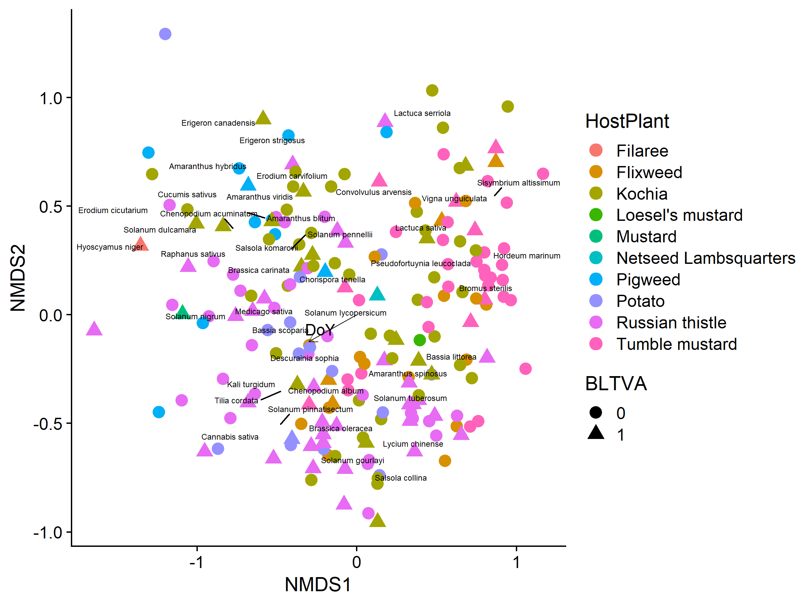

Gut Content Analysis
================
Dr. Riley M. Anderson & Camille Wagstaff
March 01, 2024

  

- [Overview](#overview)
  - [Summary of Results](#summary-of-results)
  - [Stress plot of NMDS solution with 3
    dimensions](#stress-plot-of-nmds-solution-with-3-dimensions)
  - [Plots](#plots)
    - [BCTV](#bctv)
    - [BLTVA](#bltva)
    - [BCTV by Region](#bctv-by-region)
    - [BLTVA by Region](#bltva-by-region)
    - [BCTV by Host Plant](#bctv-by-host-plant)
    - [BLTVA by Host Plant](#bltva-by-host-plant)
    - [BCTV by year](#bctv-by-year)
    - [BLTVA by year](#bltva-by-year)
- [Session Information](#session-information)

# Overview

This analysis compares gut content communities to pathogen infection
status.

Ordination plots depict each BLH as a point. Their position in NMDS
space is a function of their gut contents (plant species identity and
abundance).

### Summary of Results

- PERMUTATION tests upcoming

<!-- -->

NMDS may need 3 dimensions to bring stress within acceptable range. 2
dimensions is on the cusp of acceptability.

- 3D stress: 0.1644849
- 2D stress: 0.2216665
- stress reduced from 2 to 3 dimensions: 0.0571816

### Stress plot of NMDS solution with 3 dimensions

<!-- -->

## Plots

### BCTV

<!-- -->

### BLTVA

<!-- -->

### BCTV by Region

<!-- -->

### BLTVA by Region

<!-- -->

### BCTV by Host Plant

<!-- -->

### BLTVA by Host Plant

<!-- -->

### BCTV by year

<!-- -->

### BLTVA by year

<!-- -->

# Session Information

    R version 4.2.3 (2023-03-15 ucrt)
    Platform: x86_64-w64-mingw32/x64 (64-bit)
    Running under: Windows 10 x64 (build 19045)

    Matrix products: default

    locale:
    [1] LC_COLLATE=English_United States.utf8 
    [2] LC_CTYPE=English_United States.utf8   
    [3] LC_MONETARY=English_United States.utf8
    [4] LC_NUMERIC=C                          
    [5] LC_TIME=English_United States.utf8    

    attached base packages:
    [1] stats     graphics  grDevices utils     datasets  methods   base     

    other attached packages:
     [1] vegan_2.6-4     lattice_0.20-45 permute_0.9-7   cowplot_1.1.1  
     [5] lubridate_1.9.2 forcats_1.0.0   stringr_1.5.0   dplyr_1.1.1    
     [9] purrr_1.0.1     readr_2.1.4     tidyr_1.3.0     tibble_3.2.1   
    [13] ggplot2_3.4.4   tidyverse_2.0.0

    loaded via a namespace (and not attached):
     [1] tidyselect_1.2.0 xfun_0.38        splines_4.2.3    colorspace_2.1-0
     [5] vctrs_0.6.1      generics_0.1.3   htmltools_0.5.5  yaml_2.3.7      
     [9] mgcv_1.8-42      utf8_1.2.3       rlang_1.1.0      pillar_1.9.0    
    [13] glue_1.6.2       withr_2.5.0      lifecycle_1.0.3  munsell_0.5.0   
    [17] gtable_0.3.3     codetools_0.2-19 evaluate_0.20    labeling_0.4.2  
    [21] knitr_1.42       tzdb_0.3.0       fastmap_1.1.1    parallel_4.2.3  
    [25] fansi_1.0.4      highr_0.10       Rcpp_1.0.10      scales_1.2.1    
    [29] farver_2.1.1     hms_1.1.3        digest_0.6.31    stringi_1.7.12  
    [33] ggrepel_0.9.3    grid_4.2.3       rprojroot_2.0.3  cli_3.6.1       
    [37] tools_4.2.3      magrittr_2.0.3   cluster_2.1.4    pkgconfig_2.0.3 
    [41] MASS_7.3-58.2    Matrix_1.5-3     timechange_0.2.0 rmarkdown_2.21  
    [45] rstudioapi_0.14  R6_2.5.1         nlme_3.1-162     compiler_4.2.3  
