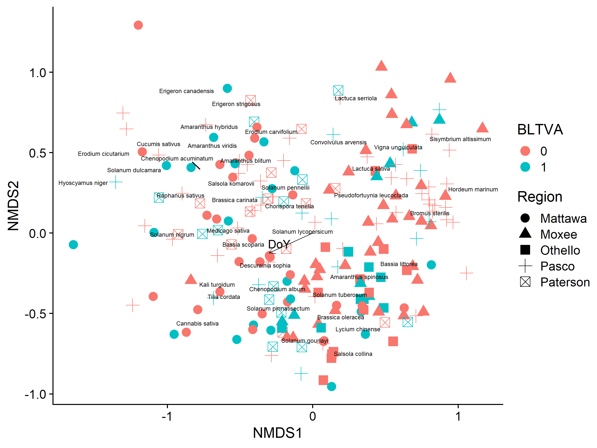
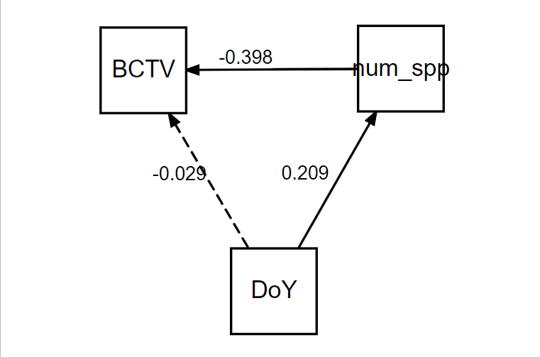

Gut Content Analysis
================
Dr. Riley M. Anderson & Camille Wagstaff
March 12, 2024

  

- [Overview](#overview)
- [NMDS](#nmds)
  - [Stress plot of NMDS solution with 3
    dimensions](#stress-plot-of-nmds-solution-with-3-dimensions)
  - [Plots](#plots)
    - [BCTV](#bctv)
    - [BLTVA](#bltva)
    - [BCTV by Region](#bctv-by-region)
    - [BLTVA by Region](#bltva-by-region)
    - [BCTV by Host Plant](#bctv-by-host-plant)
    - [BLTVA by Host Plant](#bltva-by-host-plant)
    - [BCTV by year](#bctv-by-year)
    - [BLTVA by year](#bltva-by-year)
  - [3D plots](#3d-plots)
- [Random Forests](#random-forests)
  - [Numeric predictors random
    forest](#numeric-predictors-random-forest)
  - [Binary predictors random forest](#binary-predictors-random-forest)
- [Logistic models](#logistic-models)
  - [Confounders](#confounders)
  - [BCTV logistic model](#bctv-logistic-model)
  - [BLTVA logistic model](#bltva-logistic-model)
- [PCA](#pca)
- [Session Information](#session-information)

# Overview

This analysis compares gut content communities to pathogen infection
status.

Multiple statistical and machine learning techniques were used to find
patterns in the gut contents data.

- NMDS: this ordination technique could not reveal any community
  patterns that explain infection status. This may be caused by the high
  stress induced in solutions with fewer than 4 dimensions.

- Random Forests: ML models were given plant community data, collection
  region, collection year, collection day of year (DoY), and gut plant
  richness as predictors. For both response variables, BCTV and BLTVA,
  RF machines resulted in ~27% out of bag error rates. This result was
  similar when the plant community data were converted to binary
  (presence/absence). Variable importance was used to inform variable
  selection in logistic models.

- Initial logistic models showed odd results. A Structural Equation
  Model was built to determine the contribution of important variables
  to infection status and revealed that plant richness is the main
  driver of infection status, while day of year (time of collection) had
  only weak effects on richness, and no effect on infection once
  richness was accounted for.

- Logistic models show a negative relationship between BCTV infection
  and gut richness. BLTVA infection varied independently of gut
  richness.

- PCA failed to explain majority variance in less than 6 dimensions.

# NMDS

<!-- -->

NMDS may need 3 dimensions to bring stress within acceptable range. 2
dimensions is on the cusp of acceptability.

- 3D stress: 0.1759315
- 2D stress: 0.2339968
- stress reduced from 2 to 3 dimensions: 0.0571816

### Stress plot of NMDS solution with 3 dimensions

<!-- -->

## Plots

Ordination plots depict each BLH as a point. Their position in NMDS
space is a function of their gut contents (plant species identity and
abundance).

### BCTV

<!-- -->

### BLTVA

<!-- -->

### BCTV by Region

<!-- -->

### BLTVA by Region

<!-- -->

### BCTV by Host Plant

<!-- -->

### BLTVA by Host Plant

<!-- -->

### BCTV by year

<!-- -->

### BLTVA by year

<!-- -->

## 3D plots

# Random Forests

### Numeric predictors random forest

    ## 
    ## Call:
    ##  randomForest(formula = BCTV ~ . - BLTVA - idBLH - Date, data = gca.rf,      ntree = 350, mtry = 2, na.action = na.omit) 
    ##                Type of random forest: classification
    ##                      Number of trees: 350
    ## No. of variables tried at each split: 2
    ## 
    ##         OOB estimate of  error rate: 27.23%
    ## Confusion matrix:
    ##     0  1 class.error
    ## 0 127  7  0.05223881
    ## 1  45 12  0.78947368

<!-- -->

### Binary predictors random forest

    ## 
    ## Call:
    ##  randomForest(formula = BCTV ~ . - BLTVA - idBLH - Date, data = gca.rf.bin,      ntree = 300, mtry = 2, na.action = na.omit) 
    ##                Type of random forest: classification
    ##                      Number of trees: 300
    ## No. of variables tried at each split: 2
    ## 
    ##         OOB estimate of  error rate: 27.75%
    ## Confusion matrix:
    ##     0 1 class.error
    ## 0 129 5  0.03731343
    ## 1  48 9  0.84210526

<!-- -->

# Logistic models

### Confounders

    ## 
    ## Call:
    ## glm(formula = num_spp ~ scale(DoY), family = poisson(), data = gca.rf)
    ## 
    ## Deviance Residuals: 
    ##     Min       1Q   Median       3Q      Max  
    ## -2.6205  -1.0332  -0.3340   0.5697   3.2961  
    ## 
    ## Coefficients:
    ##             Estimate Std. Error z value Pr(>|z|)    
    ## (Intercept)  1.63067    0.03112  52.392  < 2e-16 ***
    ## scale(DoY)   0.13869    0.03046   4.553 5.28e-06 ***
    ## ---
    ## Signif. codes:  0 '***' 0.001 '**' 0.01 '*' 0.05 '.' 0.1 ' ' 1
    ## 
    ## (Dispersion parameter for poisson family taken to be 1)
    ## 
    ##     Null deviance: 308.79  on 203  degrees of freedom
    ## Residual deviance: 288.27  on 202  degrees of freedom
    ## AIC: 980.67
    ## 
    ## Number of Fisher Scoring iterations: 5
    ## 
    ## Structural Equation Model of psem1 
    ## 
    ## Call:
    ##   BCTV ~ num_spp + DoY
    ##   num_spp ~ DoY
    ## 
    ##     AIC
    ##  1147.763
    ## 
    ## ---
    ## Tests of directed separation:
    ## 
    ##  No independence claims present. Tests of directed separation not possible.
    ## 
    ## --
    ## Global goodness-of-fit:
    ## 
    ## Chi-Squared = 0 with P-value = 1 and on 0 degrees of freedom
    ## Fisher's C = NA with P-value = NA and on 0 degrees of freedom
    ## 
    ## ---
    ## Coefficients:
    ## 
    ##   Response Predictor Estimate Std.Error  DF Crit.Value P.Value Std.Estimate    
    ##       BCTV   num_spp  -0.2646    0.0770 188    -3.4379  0.0006      -0.3983 ***
    ##       BCTV       DoY  -0.0015    0.0043 188    -0.3552  0.7224      -0.0290    
    ##    num_spp       DoY   0.0034    0.0008 189     4.1581  0.0000       0.2090 ***
    ## 
    ##   Signif. codes:  0 '***' 0.001 '**' 0.01 '*' 0.05
    ## 
    ## ---
    ## Individual R-squared:
    ## 
    ##   Response     method R.squared
    ##       BCTV nagelkerke      0.12
    ##    num_spp nagelkerke      0.11

Day of year appears to explain BCTV infection, however, when gut
richness (number of plant species) is accounted for, day of year has no
effect on infection status. There is a weak positive effect of day of
year on gut richness, but this seems obvious: Older BLH will have had
more opportunity to forage on multiple plants.

<figure>

<figcaption aria-hidden="true">SEM plot</figcaption>
</figure>

### BCTV logistic model

    ##  Family: binomial  ( logit )
    ## Formula:          BCTV ~ num_spp + (1 | Region)
    ## Data: filter(gca.rf, !is.na(BCTV))
    ## 
    ##      AIC      BIC   logLik deviance df.resid 
    ##    210.8    220.6   -102.4    204.8      188 
    ## 
    ## Random effects:
    ## 
    ## Conditional model:
    ##  Groups Name        Variance Std.Dev.
    ##  Region (Intercept) 0.5023   0.7087  
    ## Number of obs: 191, groups:  Region, 5
    ## 
    ## Conditional model:
    ##             Estimate Std. Error z value Pr(>|z|)    
    ## (Intercept)  0.42446    0.50207   0.845 0.397871    
    ## num_spp     -0.29816    0.08001  -3.727 0.000194 ***
    ## ---
    ## Signif. codes:  0 '***' 0.001 '**' 0.01 '*' 0.05 '.' 0.1 ' ' 1

<!-- -->

- Open circles are predicted values from the model, solid dots are the
  raw data, shaded ribbon is the 95% confidence interval around the
  predictions.

### BLTVA logistic model

    ##  Family: binomial  ( logit )
    ## Formula:          BLTVA ~ num_spp + (1 | Region)
    ## Data: bltva
    ## 
    ##      AIC      BIC   logLik deviance df.resid 
    ##    257.2    267.2   -125.6    251.2      201 
    ## 
    ## Random effects:
    ## 
    ## Conditional model:
    ##  Groups Name        Variance Std.Dev.
    ##  Region (Intercept) 0.1696   0.4119  
    ## Number of obs: 204, groups:  Region, 5
    ## 
    ## Conditional model:
    ##             Estimate Std. Error z value Pr(>|z|)  
    ## (Intercept) -0.66358    0.36801  -1.803   0.0714 .
    ## num_spp     -0.01882    0.05409  -0.348   0.7279  
    ## ---
    ## Signif. codes:  0 '***' 0.001 '**' 0.01 '*' 0.05 '.' 0.1 ' ' 1

<!-- -->

- Open circles are predicted values from the model, solid dots are the
  raw data, shaded ribbon is the 95% confidence interval around the
  predictions.

# PCA

<!-- -->

PCA can’t capture the variation very well. It takes 12 dimensions to
explain only 50% of the variation.

<!-- -->

# Session Information

    R version 4.2.3 (2023-03-15 ucrt)
    Platform: x86_64-w64-mingw32/x64 (64-bit)
    Running under: Windows 10 x64 (build 19045)

    Matrix products: default

    locale:
    [1] LC_COLLATE=English_United States.utf8 
    [2] LC_CTYPE=English_United States.utf8   
    [3] LC_MONETARY=English_United States.utf8
    [4] LC_NUMERIC=C                          
    [5] LC_TIME=English_United States.utf8    

    attached base packages:
    [1] stats     graphics  grDevices utils     datasets  methods   base     

    other attached packages:
     [1] vegan_2.6-4     lattice_0.20-45 permute_0.9-7   cowplot_1.1.1  
     [5] lubridate_1.9.2 forcats_1.0.0   stringr_1.5.0   dplyr_1.1.1    
     [9] purrr_1.0.1     readr_2.1.4     tidyr_1.3.0     tibble_3.2.1   
    [13] ggplot2_3.4.4   tidyverse_2.0.0

    loaded via a namespace (and not attached):
     [1] tidyselect_1.2.0 xfun_0.38        splines_4.2.3    colorspace_2.1-0
     [5] vctrs_0.6.1      generics_0.1.3   htmltools_0.5.5  yaml_2.3.7      
     [9] mgcv_1.8-42      utf8_1.2.3       rlang_1.1.0      pillar_1.9.0    
    [13] glue_1.6.2       withr_2.5.0      lifecycle_1.0.3  munsell_0.5.0   
    [17] gtable_0.3.3     codetools_0.2-19 evaluate_0.20    labeling_0.4.2  
    [21] knitr_1.42       tzdb_0.3.0       fastmap_1.1.1    parallel_4.2.3  
    [25] fansi_1.0.4      highr_0.10       Rcpp_1.0.10      scales_1.2.1    
    [29] farver_2.1.1     hms_1.1.3        digest_0.6.31    stringi_1.7.12  
    [33] ggrepel_0.9.3    grid_4.2.3       rprojroot_2.0.3  cli_3.6.1       
    [37] tools_4.2.3      magrittr_2.0.3   cluster_2.1.4    pkgconfig_2.0.3 
    [41] MASS_7.3-58.2    Matrix_1.5-3     timechange_0.2.0 rmarkdown_2.21  
    [45] rstudioapi_0.14  R6_2.5.1         nlme_3.1-162     compiler_4.2.3  
