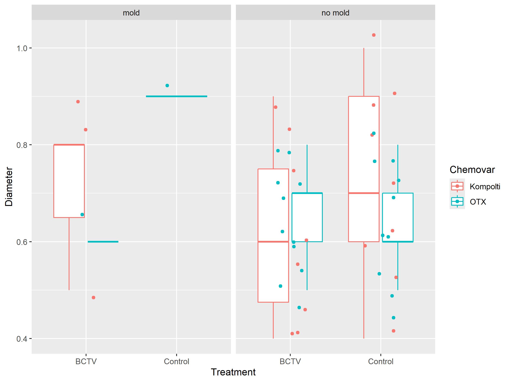

Hemp BCTV 1
================
Riley M. Anderson
June 09, 2025

  

- [Overview](#overview)
  - [Summary of Results](#summary-of-results)
- [Session Information](#session-information)

## Overview

What is this analysis about?

### Summary of Results

- 

<!-- -->

    'data.frame':   215 obs. of  24 variables:
     $ Sample     : chr  "K1" "K1" "K1" "K1" ...
     $ Chemovar   : chr  "Kompolti" "Kompolti" "Kompolti" "Kompolti" ...
     $ Type       : chr  "Fiber" "Fiber" "Fiber" "Fiber" ...
     $ Block      : int  1 1 1 1 1 1 1 1 1 1 ...
     $ Plant      : int  45743 45743 45743 45743 45743 45743 45743 45743 45743 45743 ...
     $ Transplant : int  45762 45762 45762 45762 45762 45762 45762 45762 45762 45762 ...
     $ Treatment  : chr  "BCTV" "BCTV" "BCTV" "BCTV" ...
     $ Colony     : chr  "B7" "B7" "B7" "B7" ...
     $ Infection  : int  45769 45769 45769 45769 45769 45769 45769 45769 45769 45769 ...
     $ Data       : int  45769 45777 45791 45805 45819 45769 45777 45791 45805 45819 ...
     $ Set        : int  1 2 3 4 5 1 2 3 4 5 ...
     $ Leaf       : int  12 16 14 16 22 12 14 10 17 22 ...
     $ Height     : num  23.4 33 41 48 58 18.5 27 34 38 46 ...
     $ Width      : num  22 23 23 26 30 17.3 29 23 29 30 ...
     $ Internode  : int  5 6 10 12 14 5 7 10 13 16 ...
     $ SPAD1      : num  33.2 23.6 16.4 35.6 29.6 37.6 26.1 10.2 42.3 48.6 ...
     $ SPAD2      : num  36.5 27.6 19.2 52.1 49.8 35.1 26 19.5 24.1 52.3 ...
     $ SPAD3      : num  34 29 21.5 30.7 42 40.5 31.1 22.2 19.1 32.8 ...
     $ Symptom    : int  0 5 2 0 2 0 2 3 2 3 ...
     $ Description: chr  "Healthy" "all lower leaves crispy_ curling_ brown spots" "chlorosis_ brown tips on leaves_ tacoing_ fasciation" "healthy " ...
     $ Notes      : chr  "some yellow spots on leaves_ 2 leaves are growing twisted" "" "fried/moldy/funugs leaves were removed and fertilizer was added when transplanted_ no lower leaves on lower 3/4" "Lower two leaves brown and edges brown on 2nd 2 sets" ...
     $ Diameter   : num  0.5 0.5 0.5 0.5 0.5 0.5 0.5 0.5 0.5 0.5 ...
     $ Weight     : num  18.5 18.5 18.5 18.5 18.5 11.8 11.8 11.8 11.8 11.8 ...
     $ Flower     : chr  NA NA NA NA ...
    'data.frame':   215 obs. of  26 variables:
     $ Sample     : Factor w/ 43 levels "K1","K10","K11",..: 1 1 1 1 1 2 2 2 2 2 ...
     $ Chemovar   : Factor w/ 2 levels "Kompolti","OTX": 1 1 1 1 1 1 1 1 1 1 ...
     $ Type       : Factor w/ 1 level "Fiber": 1 1 1 1 1 1 1 1 1 1 ...
     $ Block      : Factor w/ 1 level "1": 1 1 1 1 1 1 1 1 1 1 ...
     $ Plant      : Date, format: "2025-03-27" "2025-03-27" ...
     $ Transplant : Date, format: "2025-04-15" "2025-04-15" ...
     $ Treatment  : Factor w/ 2 levels "BCTV","Control": 1 1 1 1 1 1 1 1 1 1 ...
     $ Colony     : Factor w/ 3 levels "B4","B6","B7": 3 3 3 3 3 2 2 2 2 2 ...
     $ Infection  : Date, format: "2025-04-22" "2025-04-22" ...
     $ Data       : Date, format: "2025-04-22" "2025-04-30" ...
     $ Set        : int  1 2 3 4 5 1 2 3 4 5 ...
     $ Leaf       : int  12 16 14 16 22 12 14 10 17 22 ...
     $ Height     : num  23.4 33 41 48 58 18.5 27 34 38 46 ...
     $ Width      : num  22 23 23 26 30 17.3 29 23 29 30 ...
     $ Internode  : int  5 6 10 12 14 5 7 10 13 16 ...
     $ SPAD1      : num  33.2 23.6 16.4 35.6 29.6 37.6 26.1 10.2 42.3 48.6 ...
     $ SPAD2      : num  36.5 27.6 19.2 52.1 49.8 35.1 26 19.5 24.1 52.3 ...
     $ SPAD3      : num  34 29 21.5 30.7 42 40.5 31.1 22.2 19.1 32.8 ...
     $ Symptom    : int  0 5 2 0 2 0 2 3 2 3 ...
     $ Description: chr  "Healthy" "all lower leaves crispy_ curling_ brown spots" "chlorosis_ brown tips on leaves_ tacoing_ fasciation" "healthy " ...
     $ Notes      : chr  "some yellow spots on leaves_ 2 leaves are growing twisted" "" "fried/moldy/funugs leaves were removed and fertilizer was added when transplanted_ no lower leaves on lower 3/4" "Lower two leaves brown and edges brown on 2nd 2 sets" ...
     $ Diameter   : num  0.5 0.5 0.5 0.5 0.5 0.5 0.5 0.5 0.5 0.5 ...
     $ Weight     : num  18.5 18.5 18.5 18.5 18.5 11.8 11.8 11.8 11.8 11.8 ...
     $ Flower     : chr  NA NA NA NA ...
     $ SPAD       : num  34.6 26.7 19 39.5 40.5 ...
     $ moldy      : Factor w/ 2 levels "mold","no mold": 2 2 1 1 1 2 2 1 2 2 ...

<!-- --><!-- -->

<!-- -->

<!-- -->

<!-- -->

    ## 'data.frame':    215 obs. of  26 variables:
    ##  $ Sample     : Factor w/ 43 levels "K1","K10","K11",..: 1 1 1 1 1 2 2 2 2 2 ...
    ##  $ Chemovar   : Factor w/ 2 levels "Kompolti","OTX": 1 1 1 1 1 1 1 1 1 1 ...
    ##  $ Type       : Factor w/ 1 level "Fiber": 1 1 1 1 1 1 1 1 1 1 ...
    ##  $ Block      : Factor w/ 1 level "1": 1 1 1 1 1 1 1 1 1 1 ...
    ##  $ Plant      : Date, format: "2025-03-27" "2025-03-27" ...
    ##  $ Transplant : Date, format: "2025-04-15" "2025-04-15" ...
    ##  $ Treatment  : Factor w/ 2 levels "BCTV","Control": 1 1 1 1 1 1 1 1 1 1 ...
    ##  $ Colony     : Factor w/ 3 levels "B4","B6","B7": 3 3 3 3 3 2 2 2 2 2 ...
    ##  $ Infection  : Date, format: "2025-04-22" "2025-04-22" ...
    ##  $ Data       : Date, format: "2025-04-22" "2025-04-30" ...
    ##  $ Set        : int  1 2 3 4 5 1 2 3 4 5 ...
    ##  $ Leaf       : int  12 16 14 16 22 12 14 10 17 22 ...
    ##  $ Height     : num  23.4 33 41 48 58 18.5 27 34 38 46 ...
    ##  $ Width      : num  22 23 23 26 30 17.3 29 23 29 30 ...
    ##  $ Internode  : int  5 6 10 12 14 5 7 10 13 16 ...
    ##  $ SPAD1      : num  33.2 23.6 16.4 35.6 29.6 37.6 26.1 10.2 42.3 48.6 ...
    ##  $ SPAD2      : num  36.5 27.6 19.2 52.1 49.8 35.1 26 19.5 24.1 52.3 ...
    ##  $ SPAD3      : num  34 29 21.5 30.7 42 40.5 31.1 22.2 19.1 32.8 ...
    ##  $ Symptom    : int  0 5 2 0 2 0 2 3 2 3 ...
    ##  $ Description: chr  "Healthy" "all lower leaves crispy_ curling_ brown spots" "chlorosis_ brown tips on leaves_ tacoing_ fasciation" "healthy " ...
    ##  $ Notes      : chr  "some yellow spots on leaves_ 2 leaves are growing twisted" "" "fried/moldy/funugs leaves were removed and fertilizer was added when transplanted_ no lower leaves on lower 3/4" "Lower two leaves brown and edges brown on 2nd 2 sets" ...
    ##  $ Diameter   : num  0.5 0.5 0.5 0.5 0.5 0.5 0.5 0.5 0.5 0.5 ...
    ##  $ Weight     : num  18.5 18.5 18.5 18.5 18.5 11.8 11.8 11.8 11.8 11.8 ...
    ##  $ Flower     : chr  NA NA NA NA ...
    ##  $ SPAD       : num  34.6 26.7 19 39.5 40.5 ...
    ##  $ moldy      : Factor w/ 2 levels "mold","no mold": 2 2 1 1 1 2 2 1 2 2 ...

<!-- -->

    ## Linear mixed model fit by REML ['lmerMod']
    ## Formula: SPAD ~ Set * Chemovar * Treatment * moldy + (1 | Sample)
    ##    Data: d1
    ## 
    ## REML criterion at convergence: 1438.6
    ## 
    ## Scaled residuals: 
    ##     Min      1Q  Median      3Q     Max 
    ## -3.1536 -0.5602  0.1180  0.5811  2.1407 
    ## 
    ## Random effects:
    ##  Groups   Name        Variance Std.Dev.
    ##  Sample   (Intercept) 26.24    5.122   
    ##  Residual             53.84    7.337   
    ## Number of obs: 212, groups:  Sample, 43
    ## 
    ## Fixed effects:
    ##                                               Estimate Std. Error t value
    ## (Intercept)                                    21.3824     6.2988   3.395
    ## Set                                             2.6485     1.7175   1.542
    ## ChemovarOTX                                    19.4360     8.3921   2.316
    ## TreatmentControl                                4.1628    11.8933   0.350
    ## moldyno mold                                    9.1032     6.6950   1.360
    ## Set:ChemovarOTX                                -4.0399     2.5425  -1.589
    ## Set:TreatmentControl                           -1.5963     3.6638  -0.436
    ## ChemovarOTX:TreatmentControl                   -4.3157    13.9846  -0.309
    ## Set:moldyno mold                               -1.0634     1.9481  -0.546
    ## ChemovarOTX:moldyno mold                      -14.5245     9.0170  -1.611
    ## TreatmentControl:moldyno mold                  -4.2197    12.3769  -0.341
    ## Set:ChemovarOTX:TreatmentControl                1.8195     4.4210   0.412
    ## Set:ChemovarOTX:moldyno mold                    5.0301     2.8127   1.788
    ## Set:TreatmentControl:moldyno mold               1.7319     3.8915   0.445
    ## ChemovarOTX:TreatmentControl:moldyno mold      -4.1563    14.8347  -0.280
    ## Set:ChemovarOTX:TreatmentControl:moldyno mold   0.8156     4.7575   0.171

## Session Information

    R version 4.2.3 (2023-03-15 ucrt)
    Platform: x86_64-w64-mingw32/x64 (64-bit)
    Running under: Windows 10 x64 (build 19045)

    Matrix products: default

    locale:
    [1] LC_COLLATE=English_United States.utf8 
    [2] LC_CTYPE=English_United States.utf8   
    [3] LC_MONETARY=English_United States.utf8
    [4] LC_NUMERIC=C                          
    [5] LC_TIME=English_United States.utf8    

    attached base packages:
    [1] stats     graphics  grDevices utils     datasets  methods   base     

    other attached packages:
     [1] sjPlot_2.8.16   glmmTMB_1.1.9   lme4_1.1-35.3   Matrix_1.5-3   
     [5] cowplot_1.1.3   lubridate_1.9.3 forcats_1.0.0   stringr_1.5.1  
     [9] dplyr_1.1.4     purrr_1.0.2     readr_2.1.5     tidyr_1.3.1    
    [13] tibble_3.2.1    ggplot2_3.5.1   tidyverse_2.0.0

    loaded via a namespace (and not attached):
     [1] Rcpp_1.0.12         mvtnorm_1.2-5       lattice_0.20-45    
     [4] zoo_1.8-12          rprojroot_2.0.4     digest_0.6.35      
     [7] utf8_1.2.4          R6_2.5.1            evaluate_0.24.0    
    [10] coda_0.19-4.1       highr_0.11          pillar_1.9.0       
    [13] rlang_1.1.4         multcomp_1.4-25     rstudioapi_0.16.0  
    [16] minqa_1.2.7         performance_0.12.0  nloptr_2.0.3       
    [19] rmarkdown_2.27      labeling_0.4.3      ggeffects_1.6.0    
    [22] splines_4.2.3       TMB_1.9.11          munsell_0.5.1      
    [25] compiler_4.2.3      numDeriv_2016.8-1.1 xfun_0.44          
    [28] pkgconfig_2.0.3     mgcv_1.8-42         htmltools_0.5.8.1  
    [31] insight_1.0.1       tidyselect_1.2.1    codetools_0.2-19   
    [34] fansi_1.0.6         tzdb_0.4.0          withr_3.0.0        
    [37] sjmisc_2.8.10       MASS_7.3-58.2       grid_4.2.3         
    [40] nlme_3.1-162        xtable_1.8-4        gtable_0.3.5       
    [43] lifecycle_1.0.4     magrittr_2.0.3      scales_1.3.0       
    [46] datawizard_0.11.0   estimability_1.5.1  cli_3.6.2          
    [49] stringi_1.8.4       farver_2.1.2        generics_0.1.3     
    [52] vctrs_0.6.5         sjlabelled_1.2.0    boot_1.3-28.1      
    [55] sandwich_3.1-0      TH.data_1.1-2       RColorBrewer_1.1-3 
    [58] tools_4.2.3         glue_1.7.0          sjstats_0.19.0     
    [61] hms_1.1.3           emmeans_1.10.2      fastmap_1.2.0      
    [64] survival_3.5-3      yaml_2.3.8          timechange_0.3.0   
    [67] colorspace_2.1-0    haven_2.5.4         knitr_1.47         
