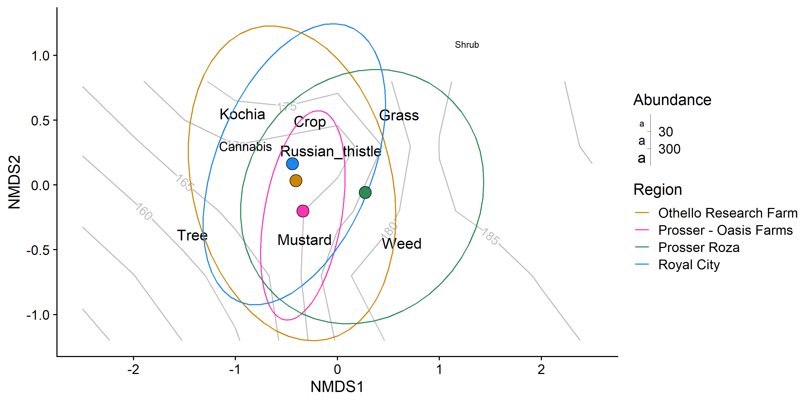
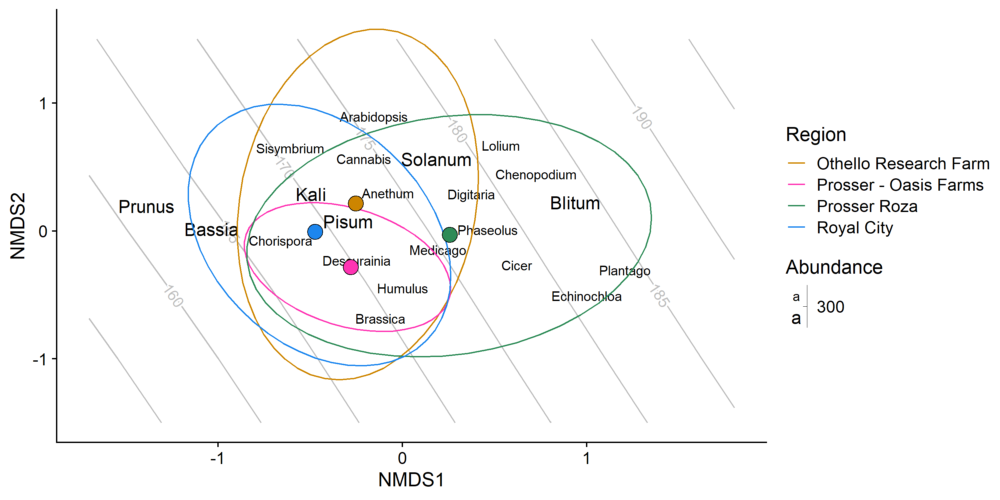
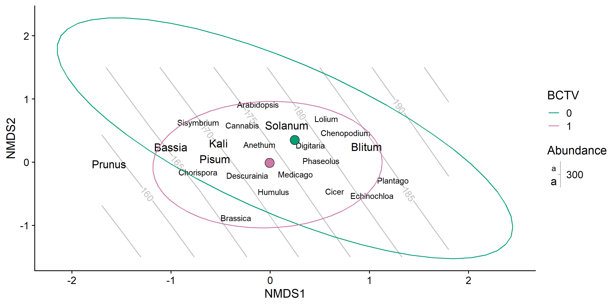

Gut Contents from Hemp, Hops, and Carrot
================
Dr. Riley M. Anderson
February 25, 2025

  

- [Overview](#overview)
  - [Summary of Results](#summary-of-results)
- [NMDS by crop type](#nmds-by-crop-type)
  - [Crop type by field plant](#crop-type-by-field-plant)
  - [Crop type by regions](#crop-type-by-regions)
  - [Crop type by terpenes](#crop-type-by-terpenes)
  - [Crop type by BCTV](#crop-type-by-bctv)
- [NMDS by genus](#nmds-by-genus)
  - [Genus by field type](#genus-by-field-type)
  - [Genus by regions](#genus-by-regions)
  - [Genus by terpenes](#genus-by-terpenes)
  - [Genus by BCTV](#genus-by-bctv)
- [Session Information](#session-information)

## Overview

Multivariate analyses of Camille’s hemp/hops/carrot BLH gut contents.

### Summary of Results

- Plant species composition in the gut contents of BLH is a function of
  sampling date (the grey contours in the NMDS figures).

- The predictors, **host plant**, **region**, **terpenes**, and **BCTV**
  help explain some variation but do not differentiate gut composition.

- **Region** performs better as a block effect (random intercept) in the
  models. As a fixed effect, it creates spurious effects of **host
  plant** and **terpenes**.

- When the gut contents are described by the **type** (crop type)
  variable, the relationship with sampling date is extremely non-linear
  (multi-order polynomial, hence the very squiggly contours). When gut
  contents are described by **genus**, the relationship is near linear
  (straight contours).

## NMDS by crop type

    ## Square root transformation
    ## Wisconsin double standardization
    ## Run 0 stress 0.1868779 
    ## Run 1 stress 0.2002764 
    ## Run 2 stress 0.1996036 
    ## Run 3 stress 0.2014005 
    ## Run 4 stress 0.1924268 
    ## Run 5 stress 0.1936466 
    ## Run 6 stress 0.1932541 
    ## Run 7 stress 0.2298726 
    ## Run 8 stress 0.2011694 
    ## Run 9 stress 0.221328 
    ## Run 10 stress 0.1957568 
    ## Run 11 stress 0.2002856 
    ## Run 12 stress 0.2185915 
    ## Run 13 stress 0.1957702 
    ## Run 14 stress 0.2032146 
    ## Run 15 stress 0.1928995 
    ## Run 16 stress 0.2009904 
    ## Run 17 stress 0.2134194 
    ## Run 18 stress 0.2125561 
    ## Run 19 stress 0.2283306 
    ## Run 20 stress 0.218819 
    ## Run 21 stress 0.1913138 
    ## Run 22 stress 0.2027766 
    ## Run 23 stress 0.2166593 
    ## Run 24 stress 0.1921417 
    ## Run 25 stress 0.1931844 
    ## Run 26 stress 0.2012313 
    ## Run 27 stress 0.2052962 
    ## Run 28 stress 0.2213386 
    ## Run 29 stress 0.1930391 
    ## Run 30 stress 0.2005624 
    ## Run 31 stress 0.2273372 
    ## Run 32 stress 0.1991996 
    ## Run 33 stress 0.2013676 
    ## Run 34 stress 0.2091741 
    ## Run 35 stress 0.2140062 
    ## Run 36 stress 0.2089927 
    ## Run 37 stress 0.1906991 
    ## Run 38 stress 0.2034462 
    ## Run 39 stress 0.216698 
    ## Run 40 stress 0.2073622 
    ## Run 41 stress 0.2044222 
    ## Run 42 stress 0.1926848 
    ## Run 43 stress 0.187479 
    ## Run 44 stress 0.2067104 
    ## Run 45 stress 0.1902912 
    ## Run 46 stress 0.21842 
    ## Run 47 stress 0.1962529 
    ## Run 48 stress 0.1935421 
    ## Run 49 stress 0.1881522 
    ## Run 50 stress 0.1907014 
    ## *** Best solution was not repeated -- monoMDS stopping criteria:
    ##     48: stress ratio > sratmax
    ##      2: scale factor of the gradient < sfgrmin
    ## [1] 0.1868779

<!-- -->

    ## 
    ## ***VECTORS
    ## 
    ##               NMDS1   NMDS2     r2 Pr(>r)    
    ## sample_date 0.96238 0.27171 0.1091  0.001 ***
    ## ---
    ## Signif. codes:  0 '***' 0.001 '**' 0.01 '*' 0.05 '.' 0.1 ' ' 1
    ## Blocks:  strata 
    ## Permutation: free
    ## Number of permutations: 999
    ## 
    ## ***FACTORS:
    ## 
    ## Centroids:
    ##                        NMDS1   NMDS2
    ## host_plantCarrot     -0.4413  0.1639
    ## host_plantHemp        0.1504 -0.0412
    ## host_plantHops       -0.3384 -0.2006
    ## Terpenecaryophyllene  0.2481 -0.1557
    ## Terpeneeucalyptol     0.2890 -0.1049
    ## Terpenegeraniol      -0.0871  0.0473
    ## Terpenelinalool      -0.2344 -0.1026
    ## Terpenenone          -0.1597  0.0546
    ## TerpeneR-limonene    -0.1179  0.2775
    ## Terpeneterpinolene    0.4607 -0.1995
    ## BCTV0                 0.3687  0.7063
    ## BCTV1                -0.0127 -0.0244
    ## 
    ## Goodness of fit:
    ##                r2 Pr(>r)   
    ## host_plant 0.1222  1.000   
    ## Terpene    0.1252  0.090 . 
    ## BCTV       0.0365  0.004 **
    ## ---
    ## Signif. codes:  0 '***' 0.001 '**' 0.01 '*' 0.05 '.' 0.1 ' ' 1
    ## Blocks:  strata 
    ## Permutation: free
    ## Number of permutations: 999
    ## 
    ## ***VECTORS
    ## 
    ##               NMDS1   NMDS2     r2 Pr(>r)    
    ## sample_date 0.96238 0.27171 0.1091  0.001 ***
    ## ---
    ## Signif. codes:  0 '***' 0.001 '**' 0.01 '*' 0.05 '.' 0.1 ' ' 1
    ## Permutation: free
    ## Number of permutations: 999
    ## 
    ## ***FACTORS:
    ## 
    ## Centroids:
    ##                               NMDS1   NMDS2
    ## BCTV0                        0.3687  0.7063
    ## BCTV1                       -0.0127 -0.0244
    ## host_plantCarrot            -0.4413  0.1639
    ## host_plantHemp               0.1504 -0.0412
    ## host_plantHops              -0.3384 -0.2006
    ## Terpenecaryophyllene         0.2481 -0.1557
    ## Terpeneeucalyptol            0.2890 -0.1049
    ## Terpenegeraniol             -0.0871  0.0473
    ## Terpenelinalool             -0.2344 -0.1026
    ## Terpenenone                 -0.1597  0.0546
    ## TerpeneR-limonene           -0.1179  0.2775
    ## Terpeneterpinolene           0.4607 -0.1995
    ## regionOthello Research Farm -0.4089  0.0337
    ## regionProsser - Oasis Farms -0.3384 -0.2006
    ## regionProsser Roza           0.2733 -0.0576
    ## regionRoyal City            -0.4413  0.1639
    ## 
    ## Goodness of fit:
    ##                r2 Pr(>r)    
    ## BCTV       0.0365  0.006 ** 
    ## host_plant 0.1222  0.001 ***
    ## Terpene    0.1252  0.001 ***
    ## region     0.2084  0.001 ***
    ## ---
    ## Signif. codes:  0 '***' 0.001 '**' 0.01 '*' 0.05 '.' 0.1 ' ' 1
    ## Permutation: free
    ## Number of permutations: 999
    ## 
    ## Family: gaussian 
    ## Link function: identity 
    ## 
    ## Formula:
    ## sample_date ~ s(NMDS1, NMDS2, k = 9) + Terpene + region + BCTV
    ## 
    ## Parametric coefficients:
    ##                             Estimate Std. Error t value Pr(>|t|)    
    ## (Intercept)                 186.1097     7.6658  24.278  < 2e-16 ***
    ## Terpeneeucalyptol             2.4714     4.5747   0.540  0.58995    
    ## Terpenegeraniol               0.3159     4.7237   0.067  0.94678    
    ## Terpenelinalool               6.0558     4.5537   1.330  0.18585    
    ## Terpenenone                 -11.5403     4.2286  -2.729  0.00722 ** 
    ## TerpeneR-limonene            -2.0689     4.9140  -0.421  0.67442    
    ## Terpeneterpinolene            6.6132     4.8752   1.356  0.17726    
    ## regionProsser - Oasis Farms   3.8402     7.5112   0.511  0.61002    
    ## regionProsser Roza            4.4527     4.0945   1.087  0.27880    
    ## regionRoyal City             11.7880     4.7481   2.483  0.01429 *  
    ## BCTV1                       -16.4014     6.9831  -2.349  0.02032 *  
    ## ---
    ## Signif. codes:  0 '***' 0.001 '**' 0.01 '*' 0.05 '.' 0.1 ' ' 1
    ## 
    ## Approximate significance of smooth terms:
    ##                  edf Ref.df     F p-value   
    ## s(NMDS1,NMDS2) 6.933  7.748 2.688   0.009 **
    ## ---
    ## Signif. codes:  0 '***' 0.001 '**' 0.01 '*' 0.05 '.' 0.1 ' ' 1
    ## 
    ## R-sq.(adj) =   0.28   Deviance explained = 36.2%
    ## GCV = 203.92  Scale est. = 179.54    n = 150

### Crop type by field plant

<!-- -->

### Crop type by regions

<!-- -->

### Crop type by terpenes

<!-- -->

### Crop type by BCTV

<!-- -->

## NMDS by genus

    ## Square root transformation
    ## Wisconsin double standardization
    ## Run 0 stress 0.1731914 
    ## Run 1 stress 0.1750686 
    ## Run 2 stress 0.1753677 
    ## Run 3 stress 0.1738859 
    ## Run 4 stress 0.1761266 
    ## Run 5 stress 0.1755351 
    ## Run 6 stress 0.1740302 
    ## Run 7 stress 0.1740317 
    ## Run 8 stress 0.1741745 
    ## Run 9 stress 0.1741746 
    ## Run 10 stress 0.1738588 
    ## Run 11 stress 0.1743571 
    ## Run 12 stress 0.1741738 
    ## Run 13 stress 0.1731912 
    ## ... New best solution
    ## ... Procrustes: rmse 0.0003991713  max resid 0.00194369 
    ## ... Similar to previous best
    ## Run 14 stress 0.1732897 
    ## ... Procrustes: rmse 0.008881187  max resid 0.09701386 
    ## Run 15 stress 0.173704 
    ## Run 16 stress 0.1747035 
    ## Run 17 stress 0.1741724 
    ## Run 18 stress 0.1741737 
    ## Run 19 stress 0.1745908 
    ## Run 20 stress 0.1749679 
    ## *** Best solution repeated 1 times
    ## 
    ## ***VECTORS
    ## 
    ##                NMDS1    NMDS2    NMDS3     r2 Pr(>r)   
    ## sample_date -0.89578 -0.41520 -0.15870 0.1488  0.002 **
    ## ---
    ## Signif. codes:  0 '***' 0.001 '**' 0.01 '*' 0.05 '.' 0.1 ' ' 1
    ## Blocks:  strata 
    ## Permutation: free
    ## Number of permutations: 999
    ## 
    ## ***FACTORS:
    ## 
    ## Centroids:
    ##                        NMDS1   NMDS2   NMDS3
    ## host_plantCarrot      0.4740  0.0076  0.0556
    ## host_plantHemp       -0.1622 -0.0155 -0.0075
    ## host_plantHops        0.2799  0.2826 -0.2162
    ## Terpenecaryophyllene -0.2570  0.0215  0.0318
    ## Terpeneeucalyptol    -0.3030 -0.0126 -0.1550
    ## Terpenegeraniol       0.0435 -0.0366 -0.0894
    ## Terpenelinalool       0.0316  0.0021 -0.1962
    ## Terpenenone           0.1693  0.1122  0.1047
    ## TerpeneR-limonene     0.2770 -0.0822  0.0870
    ## Terpeneterpinolene   -0.3611 -0.2180  0.0481
    ## BCTV0                -0.2461 -0.3520 -0.1983
    ## BCTV1                 0.0069  0.0098  0.0055
    ## 
    ## Goodness of fit:
    ##                r2 Pr(>r)
    ## host_plant 0.1184  1.000
    ## Terpene    0.1073  0.252
    ## BCTV       0.0094  0.347
    ## Blocks:  strata 
    ## Permutation: free
    ## Number of permutations: 999
    ## 
    ## ***VECTORS
    ## 
    ##                NMDS1    NMDS2    NMDS3     r2 Pr(>r)    
    ## sample_date -0.89578 -0.41520 -0.15870 0.1488  0.001 ***
    ## ---
    ## Signif. codes:  0 '***' 0.001 '**' 0.01 '*' 0.05 '.' 0.1 ' ' 1
    ## Permutation: free
    ## Number of permutations: 999
    ## 
    ## ***FACTORS:
    ## 
    ## Centroids:
    ##                               NMDS1   NMDS2   NMDS3
    ## BCTV0                       -0.2461 -0.3520 -0.1983
    ## BCTV1                        0.0069  0.0098  0.0055
    ## host_plantCarrot             0.4740  0.0076  0.0556
    ## host_plantHemp              -0.1622 -0.0155 -0.0075
    ## host_plantHops               0.2799  0.2826 -0.2162
    ## Terpenecaryophyllene        -0.2570  0.0215  0.0318
    ## Terpeneeucalyptol           -0.3030 -0.0126 -0.1550
    ## Terpenegeraniol              0.0435 -0.0366 -0.0894
    ## Terpenelinalool              0.0316  0.0021 -0.1962
    ## Terpenenone                  0.1693  0.1122  0.1047
    ## TerpeneR-limonene            0.2770 -0.0822  0.0870
    ## Terpeneterpinolene          -0.3611 -0.2180  0.0481
    ## regionOthello Research Farm  0.2537 -0.2159 -0.1726
    ## regionProsser - Oasis Farms  0.2799  0.2826 -0.2162
    ## regionProsser Roza          -0.2567  0.0301  0.0301
    ## regionRoyal City             0.4740  0.0076  0.0556
    ## 
    ## Goodness of fit:
    ##                r2 Pr(>r)    
    ## BCTV       0.0094  0.251    
    ## host_plant 0.1184  0.001 ***
    ## Terpene    0.1073  0.001 ***
    ## region     0.1784  0.001 ***
    ## ---
    ## Signif. codes:  0 '***' 0.001 '**' 0.01 '*' 0.05 '.' 0.1 ' ' 1
    ## Permutation: free
    ## Number of permutations: 999
    ## 
    ## Family: gaussian 
    ## Link function: identity 
    ## 
    ## Formula:
    ## sample_date ~ s(NMDS1, NMDS2, k = 9) + Terpene + region + BCTV
    ## 
    ## Parametric coefficients:
    ##                             Estimate Std. Error t value Pr(>|t|)    
    ## (Intercept)                  187.990      8.108  23.185  < 2e-16 ***
    ## Terpeneeucalyptol              2.000      4.721   0.424  0.67253    
    ## Terpenegeraniol                0.816      4.760   0.171  0.86416    
    ## Terpenelinalool                4.735      4.608   1.028  0.30603    
    ## Terpenenone                  -11.954      4.277  -2.795  0.00596 ** 
    ## TerpeneR-limonene             -1.213      4.963  -0.244  0.80725    
    ## Terpeneterpinolene             6.467      4.944   1.308  0.19305    
    ## regionProsser - Oasis Farms    2.910      7.606   0.383  0.70260    
    ## regionProsser Roza             3.406      4.104   0.830  0.40801    
    ## regionRoyal City              12.178      4.910   2.480  0.01437 *  
    ## BCTV1                        -17.534      7.290  -2.405  0.01752 *  
    ## ---
    ## Signif. codes:  0 '***' 0.001 '**' 0.01 '*' 0.05 '.' 0.1 ' ' 1
    ## 
    ## Approximate significance of smooth terms:
    ##                edf Ref.df     F p-value   
    ## s(NMDS1,NMDS2)   2      2 6.972 0.00132 **
    ## ---
    ## Signif. codes:  0 '***' 0.001 '**' 0.01 '*' 0.05 '.' 0.1 ' ' 1
    ## 
    ## R-sq.(adj) =  0.256   Deviance explained = 31.8%
    ## GCV =    207  Scale est. = 188.7     n = 147

    ## 
    ## Family: gaussian 
    ## Link function: identity 
    ## 
    ## Formula:
    ## sample_date ~ s(NMDS1, NMDS2, bs = "ts")
    ## 
    ## Parametric coefficients:
    ##             Estimate Std. Error t value Pr(>|t|)    
    ## (Intercept)  173.721      1.222   142.1   <2e-16 ***
    ## ---
    ## Signif. codes:  0 '***' 0.001 '**' 0.01 '*' 0.05 '.' 0.1 ' ' 1
    ## 
    ## Approximate significance of smooth terms:
    ##                 edf Ref.df     F  p-value    
    ## s(NMDS1,NMDS2) 1.98     29 0.769 1.18e-05 ***
    ## ---
    ## Signif. codes:  0 '***' 0.001 '**' 0.01 '*' 0.05 '.' 0.1 ' ' 1
    ## 
    ## R-sq.(adj) =  0.135   Deviance explained = 14.6%
    ## GCV = 224.11  Scale est. = 219.57    n = 147

### Genus by field type

<!-- -->

### Genus by regions

<!-- -->

### Genus by terpenes

<!-- -->

### Genus by BCTV

<!-- -->

## Session Information

    R version 4.2.3 (2023-03-15 ucrt)
    Platform: x86_64-w64-mingw32/x64 (64-bit)
    Running under: Windows 10 x64 (build 19045)

    Matrix products: default

    locale:
    [1] LC_COLLATE=English_United States.utf8 
    [2] LC_CTYPE=English_United States.utf8   
    [3] LC_MONETARY=English_United States.utf8
    [4] LC_NUMERIC=C                          
    [5] LC_TIME=English_United States.utf8    

    attached base packages:
    [1] stats     graphics  grDevices utils     datasets  methods   base     

    other attached packages:
     [1] mgcv_1.8-42          nlme_3.1-162         ggrepel_0.9.5       
     [4] sjPlot_2.8.16        randomForest_4.7-1.1 vegan_2.6-6.1       
     [7] lattice_0.20-45      permute_0.9-7        cowplot_1.1.3       
    [10] lubridate_1.9.3      forcats_1.0.0        stringr_1.5.1       
    [13] dplyr_1.1.4          purrr_1.0.2          readr_2.1.5         
    [16] tidyr_1.3.1          tibble_3.2.1         ggplot2_3.5.1       
    [19] tidyverse_2.0.0     

    loaded via a namespace (and not attached):
     [1] Rcpp_1.0.12        rprojroot_2.0.4    digest_0.6.35      utf8_1.2.4        
     [5] plyr_1.8.9         R6_2.5.1           backports_1.5.0    evaluate_0.24.0   
     [9] highr_0.11         pillar_1.9.0       rlang_1.1.4        data.table_1.15.4 
    [13] rstudioapi_0.16.0  performance_0.12.0 Matrix_1.5-3       checkmate_2.3.1   
    [17] rmarkdown_2.27     labeling_0.4.3     ggeffects_1.6.0    splines_4.2.3     
    [21] munsell_0.5.1      compiler_4.2.3     metR_0.17.0        xfun_0.44         
    [25] pkgconfig_2.0.3    htmltools_0.5.8.1  insight_1.0.1      tidyselect_1.2.1  
    [29] codetools_0.2-19   fansi_1.0.6        tzdb_0.4.0         withr_3.0.0       
    [33] MASS_7.3-58.2      sjmisc_2.8.10      grid_4.2.3         gtable_0.3.5      
    [37] lifecycle_1.0.4    magrittr_2.0.3     scales_1.3.0       datawizard_0.11.0 
    [41] cachem_1.1.0       cli_3.6.2          stringi_1.8.4      farver_2.1.2      
    [45] generics_0.1.3     vctrs_0.6.5        sjlabelled_1.2.0   tools_4.2.3       
    [49] glue_1.7.0         sjstats_0.19.0     hms_1.1.3          parallel_4.2.3    
    [53] fastmap_1.2.0      yaml_2.3.8         timechange_0.3.0   colorspace_2.1-0  
    [57] cluster_2.1.4      isoband_0.2.7      memoise_2.0.1      knitr_1.47        
