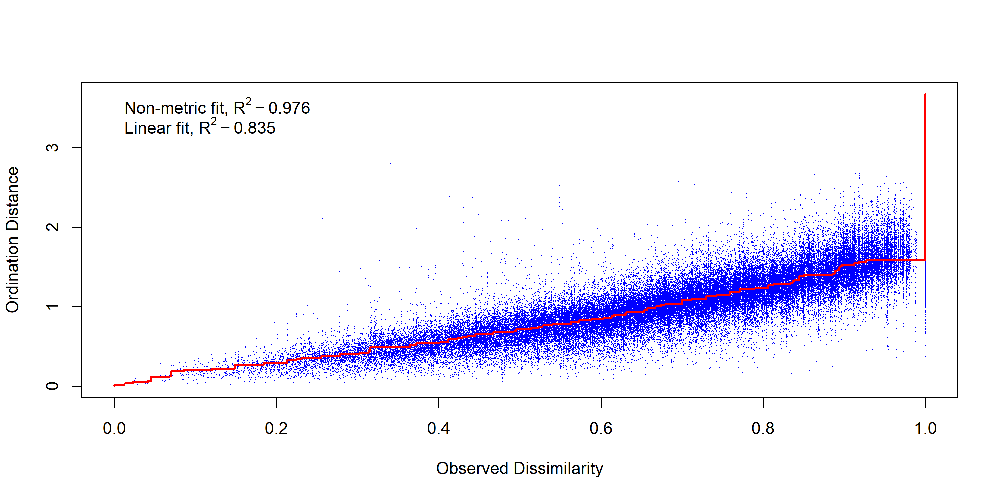

Gut Contents from Hemp, Hops, and Carrot
================
Dr. Riley M. Anderson
February 27, 2025

  

- [Overview](#overview)
  - [Summary of Results](#summary-of-results)
- [NMDS by crop type](#nmds-by-crop-type)
  - [Crop type by field plant](#crop-type-by-field-plant)
  - [Crop type by regions](#crop-type-by-regions)
  - [Crop type by BCTV](#crop-type-by-bctv)
- [NMDS by genus](#nmds-by-genus)
  - [Gut contents by sample date](#gut-contents-by-sample-date)
  - [Genus by year](#genus-by-year)
  - [Genus by month](#genus-by-month)
  - [Genus by field type](#genus-by-field-type)
  - [Genus by regions](#genus-by-regions)
  - [Genus by BCTV](#genus-by-bctv)
- [Session Information](#session-information)

## Overview

Multivariate analyses of Camille’s potato/hemp/hops/carrot BLH gut
contents.

### Summary of Results

- Plant species composition in the gut contents of BLH is weakly tied to
  sampling date (the grey contours in the NMDS figures).

- The predictors, **region**, and **BCTV** help explain some variation
  but do not differentiate gut composition.

- **Host plant** was used as a block effect (random intercept and
  permutation stratification) in the models.

- The relationship with sampling date is convoluted and highly
  non-linear. I suspect this has much to do with the sampling across
  multiple years where regions were not sampled every year, or sampled
  at different times across years.

- The benchmark plant *Solanum*, for standardizing primer efficiency
  stands out by an order of magnitude. To me, this suggests that
  **sequences** are not representative of concentration in the gut.
  Instead, **sequences** are a function of primer efficiency. If so,
  this entire analysis should be ignored, as the ordinations are built
  from the assumption that **sequences** are at least partially a
  function of concentration in the gut.

## NMDS by crop type

    ## Square root transformation
    ## Wisconsin double standardization
    ## Run 0 stress 0.1551435 
    ## Run 1 stress 0.1557918 
    ## Run 2 stress 0.1553199 
    ## ... Procrustes: rmse 0.005378292  max resid 0.0976427 
    ## Run 3 stress 0.1552371 
    ## ... Procrustes: rmse 0.01088006  max resid 0.1042598 
    ## Run 4 stress 0.1555245 
    ## ... Procrustes: rmse 0.01190478  max resid 0.1209787 
    ## Run 5 stress 0.1552908 
    ## ... Procrustes: rmse 0.009172077  max resid 0.126804 
    ## Run 6 stress 0.1555737 
    ## ... Procrustes: rmse 0.008343259  max resid 0.1246765 
    ## Run 7 stress 0.1551479 
    ## ... Procrustes: rmse 0.01291299  max resid 0.1286133 
    ## Run 8 stress 0.15556 
    ## ... Procrustes: rmse 0.01440689  max resid 0.1279671 
    ## Run 9 stress 0.1555531 
    ## ... Procrustes: rmse 0.006838378  max resid 0.1292539 
    ## Run 10 stress 0.1560512 
    ## Run 11 stress 0.1552377 
    ## ... Procrustes: rmse 0.01089558  max resid 0.104301 
    ## Run 12 stress 0.1553288 
    ## ... Procrustes: rmse 0.01158185  max resid 0.1058608 
    ## Run 13 stress 0.1557769 
    ## Run 14 stress 0.1561686 
    ## Run 15 stress 0.1553662 
    ## ... Procrustes: rmse 0.007841729  max resid 0.1017894 
    ## Run 16 stress 0.1553396 
    ## ... Procrustes: rmse 0.01213933  max resid 0.1265297 
    ## Run 17 stress 0.1552784 
    ## ... Procrustes: rmse 0.01056059  max resid 0.1057722 
    ## Run 18 stress 0.1553768 
    ## ... Procrustes: rmse 0.006723783  max resid 0.1247696 
    ## Run 19 stress 0.1551454 
    ## ... Procrustes: rmse 0.0004525935  max resid 0.005442731 
    ## ... Similar to previous best
    ## Run 20 stress 0.1557802 
    ## *** Best solution repeated 1 times
    ## [1] 0.1551435

<!-- -->

    ## 
    ## ***VECTORS
    ## 
    ##                 NMDS1     NMDS2     NMDS3     r2 Pr(>r)    
    ## sample_date -0.049303  0.984270  0.169667 0.1592  0.001 ***
    ## ---
    ## Signif. codes:  0 '***' 0.001 '**' 0.01 '*' 0.05 '.' 0.1 ' ' 1
    ## Blocks:  strata 
    ## Permutation: free
    ## Number of permutations: 999
    ## 
    ## ***FACTORS:
    ## 
    ## Centroids:
    ##                             NMDS1   NMDS2   NMDS3
    ## host_plantCarrot           0.0881 -0.1697  0.0756
    ## host_plantFlixweed         0.1395 -0.1143 -0.1676
    ## host_plantHemp            -0.5448  0.0778  0.0804
    ## host_plantHops            -0.3165 -0.1266  0.2070
    ## host_plantKochia           0.1973 -0.0108  0.0413
    ## host_plantPigweed         -0.0946  0.5275  0.0397
    ## host_plantPotato           0.3944  0.4717  0.3243
    ## host_plantRussian thistle  0.4655  0.2206 -0.2587
    ## host_plantTumble mustard   0.1455 -0.6699 -0.0151
    ## BCTV0                      0.1830 -0.0030 -0.0270
    ## BCTV1                     -0.1377  0.0023  0.0203
    ## 
    ## Goodness of fit:
    ##                r2 Pr(>r)    
    ## host_plant 0.2980  0.001 ***
    ## BCTV       0.0304  0.855    
    ## ---
    ## Signif. codes:  0 '***' 0.001 '**' 0.01 '*' 0.05 '.' 0.1 ' ' 1
    ## Blocks:  strata 
    ## Permutation: free
    ## Number of permutations: 999
    ## 
    ## ***VECTORS
    ## 
    ##                 NMDS1     NMDS2     NMDS3     r2 Pr(>r)    
    ## sample_date -0.049303  0.984270  0.169667 0.1592  0.001 ***
    ## ---
    ## Signif. codes:  0 '***' 0.001 '**' 0.01 '*' 0.05 '.' 0.1 ' ' 1
    ## Permutation: free
    ## Number of permutations: 999
    ## 
    ## ***FACTORS:
    ## 
    ## Centroids:
    ##                             NMDS1   NMDS2   NMDS3
    ## BCTV0                      0.1830 -0.0030 -0.0270
    ## BCTV1                     -0.1377  0.0023  0.0203
    ## host_plantCarrot           0.0881 -0.1697  0.0756
    ## host_plantFlixweed         0.1395 -0.1143 -0.1676
    ## host_plantHemp            -0.5448  0.0778  0.0804
    ## host_plantHops            -0.3165 -0.1266  0.2070
    ## host_plantKochia           0.1973 -0.0108  0.0413
    ## host_plantPigweed         -0.0946  0.5275  0.0397
    ## host_plantPotato           0.3944  0.4717  0.3243
    ## host_plantRussian thistle  0.4655  0.2206 -0.2587
    ## host_plantTumble mustard   0.1455 -0.6699 -0.0151
    ## regionMattawa              0.2627  0.2405 -0.1066
    ## regionMoxee                0.1692 -0.2239 -0.0382
    ## regionOthello              0.2646 -0.0749  0.2146
    ## regionPasco                0.1977 -0.1796 -0.0573
    ## regionPaterson             0.1748  0.1246 -0.1209
    ## regionProsser             -0.5816  0.1581  0.0354
    ## regionRoyal City           0.0881 -0.1697  0.0756
    ## 
    ## Goodness of fit:
    ##                r2 Pr(>r)    
    ## BCTV       0.0304  0.001 ***
    ## host_plant 0.2980  0.001 ***
    ## region     0.1895  0.001 ***
    ## ---
    ## Signif. codes:  0 '***' 0.001 '**' 0.01 '*' 0.05 '.' 0.1 ' ' 1
    ## Permutation: free
    ## Number of permutations: 999
    ## 
    ## Family: gaussian 
    ## Link function: identity 
    ## 
    ## Formula:
    ## sample_date ~ s(NMDS1, NMDS2, NMDS3, k = 9) + region + BCTV + 
    ##     host_plant
    ## 
    ## Parametric coefficients:
    ##                           Estimate Std. Error t value Pr(>|t|)    
    ## (Intercept)               143.0331     4.0192  35.588  < 2e-16 ***
    ## regionMoxee                 0.2678     5.5533   0.048 0.961559    
    ## regionOthello               8.7527     6.6051   1.325 0.185986    
    ## regionPasco                -1.2635     5.1762  -0.244 0.807298    
    ## regionPaterson             11.8525     5.8148   2.038 0.042268 *  
    ## regionProsser               7.2934     9.0849   0.803 0.422633    
    ## regionRoyal City           30.1595     5.2062   5.793 1.54e-08 ***
    ## BCTV1                       0.2042     3.6271   0.056 0.955131    
    ## host_plantFlixweed        -24.2258     5.5231  -4.386 1.53e-05 ***
    ## host_plantHemp             26.7141     7.1631   3.729 0.000224 ***
    ## host_plantHops             13.9488    12.4206   1.123 0.262192    
    ## host_plantKochia           24.5113     3.5820   6.843 3.48e-11 ***
    ## host_plantPigweed          35.9392     7.5515   4.759 2.85e-06 ***
    ## host_plantPotato           24.4855     6.6829   3.664 0.000287 ***
    ## host_plantRussian thistle  21.3565     4.1825   5.106 5.41e-07 ***
    ## host_plantTumble mustard   -9.8559     5.1502  -1.914 0.056476 .  
    ## ---
    ## Signif. codes:  0 '***' 0.001 '**' 0.01 '*' 0.05 '.' 0.1 ' ' 1
    ## 
    ## Approximate significance of smooth terms:
    ##                        edf Ref.df     F  p-value    
    ## s(NMDS1,NMDS2,NMDS3) 9.938  9.996 3.988 3.34e-05 ***
    ## ---
    ## Signif. codes:  0 '***' 0.001 '**' 0.01 '*' 0.05 '.' 0.1 ' ' 1
    ## 
    ## Rank: 25/26
    ## R-sq.(adj) =  0.443   Deviance explained = 47.8%
    ## GCV = 611.64  Scale est. = 570.97    n = 375

    ## 
    ## Family: gaussian 
    ## Link function: identity 
    ## 
    ## Formula:
    ## sample_date ~ s(NMDS1, NMDS2, k = 9)
    ## 
    ## Parametric coefficients:
    ##             Estimate Std. Error t value Pr(>|t|)    
    ## (Intercept)  165.096      1.463   112.8   <2e-16 ***
    ## ---
    ## Signif. codes:  0 '***' 0.001 '**' 0.01 '*' 0.05 '.' 0.1 ' ' 1
    ## 
    ## Approximate significance of smooth terms:
    ##                  edf Ref.df     F p-value    
    ## s(NMDS1,NMDS2) 7.351  7.902 12.98  <2e-16 ***
    ## ---
    ## Signif. codes:  0 '***' 0.001 '**' 0.01 '*' 0.05 '.' 0.1 ' ' 1
    ## 
    ## R-sq.(adj) =  0.216   Deviance explained = 23.1%
    ## GCV = 821.44  Scale est. = 803.14    n = 375

### Crop type by field plant

<!-- -->

### Crop type by regions

<!-- -->

### Crop type by BCTV

<!-- -->

## NMDS by genus

    ## Square root transformation
    ## Wisconsin double standardization
    ## Run 0 stress 0.1577003 
    ## Run 1 stress 0.1554888 
    ## ... New best solution
    ## ... Procrustes: rmse 0.01999146  max resid 0.1201577 
    ## Run 2 stress 0.1597955 
    ## Run 3 stress 0.1570356 
    ## Run 4 stress 0.1573806 
    ## Run 5 stress 0.156193 
    ## Run 6 stress 0.157424 
    ## Run 7 stress 0.1563623 
    ## Run 8 stress 0.1569344 
    ## Run 9 stress 0.1573324 
    ## Run 10 stress 0.1567431 
    ## Run 11 stress 0.157734 
    ## Run 12 stress 0.1585003 
    ## Run 13 stress 0.1577068 
    ## Run 14 stress 0.1579937 
    ## Run 15 stress 0.1574495 
    ## Run 16 stress 0.1568275 
    ## Run 17 stress 0.1564206 
    ## Run 18 stress 0.1552501 
    ## ... New best solution
    ## ... Procrustes: rmse 0.008814363  max resid 0.1287799 
    ## Run 19 stress 0.1560457 
    ## Run 20 stress 0.1585145 
    ## Run 21 stress 0.1585615 
    ## Run 22 stress 0.1565034 
    ## Run 23 stress 0.1554848 
    ## ... Procrustes: rmse 0.008836421  max resid 0.1058163 
    ## Run 24 stress 0.1598 
    ## Run 25 stress 0.1582695 
    ## Run 26 stress 0.1553153 
    ## ... Procrustes: rmse 0.00958542  max resid 0.1135734 
    ## Run 27 stress 0.157947 
    ## Run 28 stress 0.1567221 
    ## Run 29 stress 0.1576704 
    ## Run 30 stress 0.1581991 
    ## Run 31 stress 0.1567589 
    ## Run 32 stress 0.1562855 
    ## Run 33 stress 0.1570307 
    ## Run 34 stress 0.1558158 
    ## Run 35 stress 0.1574807 
    ## Run 36 stress 0.1573399 
    ## Run 37 stress 0.1589632 
    ## Run 38 stress 0.1573867 
    ## Run 39 stress 0.158007 
    ## Run 40 stress 0.1563417 
    ## Run 41 stress 0.1577817 
    ## Run 42 stress 0.1571497 
    ## Run 43 stress 0.1562144 
    ## Run 44 stress 0.1584438 
    ## Run 45 stress 0.1595729 
    ## Run 46 stress 0.1574515 
    ## Run 47 stress 0.1568797 
    ## Run 48 stress 0.1583685 
    ## Run 49 stress 0.1574298 
    ## Run 50 stress 0.1558831 
    ## *** Best solution was not repeated -- monoMDS stopping criteria:
    ##     47: stress ratio > sratmax
    ##      3: scale factor of the gradient < sfgrmin

<!-- --><!-- -->

    ## 
    ## ***VECTORS
    ## 
    ##                 NMDS1     NMDS2     NMDS3     r2 Pr(>r)    
    ## sample_date -0.517290 -0.855410 -0.026202 0.1917  0.001 ***
    ## ---
    ## Signif. codes:  0 '***' 0.001 '**' 0.01 '*' 0.05 '.' 0.1 ' ' 1
    ## Blocks:  strata 
    ## Permutation: free
    ## Number of permutations: 999
    ## 
    ## ***FACTORS:
    ## 
    ## Centroids:
    ##                    NMDS1   NMDS2   NMDS3
    ## regionMattawa     0.1933 -0.4483 -0.0736
    ## regionMoxee       0.5750  0.2226 -0.0875
    ## regionOthello     0.1588  0.0889 -0.0572
    ## regionPasco       0.5150  0.0774  0.0479
    ## regionPaterson    0.3020 -0.2889  0.0245
    ## regionProsser    -0.8533  0.0383 -0.0601
    ## regionRoyal City -0.2878  0.2900  0.3726
    ## BCTV0             0.3796 -0.1018 -0.0340
    ## BCTV1            -0.2878  0.0772  0.0258
    ## Year2022         -0.6598  0.1424  0.0530
    ## Year2019          0.1927 -0.5459 -0.0358
    ## Year2020          0.3928 -0.1938  0.0312
    ## Year2021          0.7224  0.4837 -0.1202
    ## 
    ## Goodness of fit:
    ##            r2 Pr(>r)    
    ## region 0.3758  0.001 ***
    ## BCTV   0.1207  0.902    
    ## Year   0.4396  0.001 ***
    ## ---
    ## Signif. codes:  0 '***' 0.001 '**' 0.01 '*' 0.05 '.' 0.1 ' ' 1
    ## Blocks:  strata 
    ## Permutation: free
    ## Number of permutations: 999
    ## 
    ## Family: gaussian 
    ## Link function: identity 
    ## 
    ## Formula:
    ## sample_date ~ s(NMDS1, NMDS2, NMDS3)
    ## 
    ## Parametric coefficients:
    ##             Estimate Std. Error t value Pr(>|t|)    
    ## (Intercept)   162.44       6.67   24.35   <2e-16 ***
    ## ---
    ## Signif. codes:  0 '***' 0.001 '**' 0.01 '*' 0.05 '.' 0.1 ' ' 1
    ## 
    ## Approximate significance of smooth terms:
    ##                        edf Ref.df     F p-value    
    ## s(NMDS1,NMDS2,NMDS3) 26.14  26.14 3.784  <2e-16 ***
    ## ---
    ## Signif. codes:  0 '***' 0.001 '**' 0.01 '*' 0.05 '.' 0.1 ' ' 1
    ## 
    ## R-sq.(adj) =   0.25   
    ## lmer.REML = 3372.9  Scale est. = 500.43    n = 371

<!-- -->

    ## 
    ## Family: gaussian 
    ## Link function: identity 
    ## 
    ## Formula:
    ## sample_date ~ s(NMDS1, NMDS2)
    ## 
    ## Parametric coefficients:
    ##             Estimate Std. Error t value Pr(>|t|)    
    ## (Intercept)  162.030      6.327   25.61   <2e-16 ***
    ## ---
    ## Signif. codes:  0 '***' 0.001 '**' 0.01 '*' 0.05 '.' 0.1 ' ' 1
    ## 
    ## Approximate significance of smooth terms:
    ##                  edf Ref.df     F p-value    
    ## s(NMDS1,NMDS2) 15.05  15.05 5.144  <2e-16 ***
    ## ---
    ## Signif. codes:  0 '***' 0.001 '**' 0.01 '*' 0.05 '.' 0.1 ' ' 1
    ## 
    ## R-sq.(adj) =  0.259   
    ## lmer.REML = 3412.4  Scale est. = 523.58    n = 371

<!-- -->

    ## 
    ## Family: gaussian 
    ## Link function: identity 
    ## 
    ## Formula:
    ## year_time ~ s(NMDS1, NMDS2) + Year
    ## 
    ## Parametric coefficients:
    ##              Estimate Std. Error t value Pr(>|t|)    
    ## (Intercept)  1269.849      6.743  188.31   <2e-16 ***
    ## Year2019    -1086.362      9.162 -118.57   <2e-16 ***
    ## Year2020     -746.690      8.819  -84.67   <2e-16 ***
    ## Year2021     -418.497      9.711  -43.10   <2e-16 ***
    ## ---
    ## Signif. codes:  0 '***' 0.001 '**' 0.01 '*' 0.05 '.' 0.1 ' ' 1
    ## 
    ## Approximate significance of smooth terms:
    ##                  edf Ref.df     F p-value    
    ## s(NMDS1,NMDS2) 14.27  14.27 4.316   1e-06 ***
    ## ---
    ## Signif. codes:  0 '***' 0.001 '**' 0.01 '*' 0.05 '.' 0.1 ' ' 1
    ## 
    ## R-sq.(adj) =  0.997   
    ## lmer.REML = 3315.6  Scale est. = 434.79    n = 371

<!-- -->

    ## 
    ## Family: gaussian 
    ## Link function: identity 
    ## 
    ## Formula:
    ## sample_date ~ s(NMDS1, NMDS2, bs = "ts")
    ## 
    ## Parametric coefficients:
    ##             Estimate Std. Error t value Pr(>|t|)    
    ## (Intercept)  165.191      1.335   123.8   <2e-16 ***
    ## ---
    ## Signif. codes:  0 '***' 0.001 '**' 0.01 '*' 0.05 '.' 0.1 ' ' 1
    ## 
    ## Approximate significance of smooth terms:
    ##                  edf Ref.df     F p-value    
    ## s(NMDS1,NMDS2) 18.37     29 6.929  <2e-16 ***
    ## ---
    ## Signif. codes:  0 '***' 0.001 '**' 0.01 '*' 0.05 '.' 0.1 ' ' 1
    ## 
    ## R-sq.(adj) =  0.349   Deviance explained = 38.1%
    ## GCV =  697.3  Scale est. = 660.89    n = 371

### Gut contents by sample date

<!-- -->

### Genus by year

<!-- -->

### Genus by month

<!-- -->

### Genus by field type

<!-- -->

### Genus by regions

<!-- -->

### Genus by BCTV

<!-- -->

## Session Information

    R version 4.2.3 (2023-03-15 ucrt)
    Platform: x86_64-w64-mingw32/x64 (64-bit)
    Running under: Windows 10 x64 (build 19045)

    Matrix products: default

    locale:
    [1] LC_COLLATE=English_United States.utf8 
    [2] LC_CTYPE=English_United States.utf8   
    [3] LC_MONETARY=English_United States.utf8
    [4] LC_NUMERIC=C                          
    [5] LC_TIME=English_United States.utf8    

    attached base packages:
    [1] stats     graphics  grDevices utils     datasets  methods   base     

    other attached packages:
     [1] gamm4_0.2-6          lme4_1.1-35.3        Matrix_1.5-3        
     [4] mgcv_1.8-42          nlme_3.1-162         ggrepel_0.9.5       
     [7] sjPlot_2.8.16        randomForest_4.7-1.1 vegan_2.6-6.1       
    [10] lattice_0.20-45      permute_0.9-7        cowplot_1.1.3       
    [13] lubridate_1.9.3      forcats_1.0.0        stringr_1.5.1       
    [16] dplyr_1.1.4          purrr_1.0.2          readr_2.1.5         
    [19] tidyr_1.3.1          tibble_3.2.1         ggplot2_3.5.1       
    [22] tidyverse_2.0.0     

    loaded via a namespace (and not attached):
     [1] viridisLite_0.4.2  splines_4.2.3      metR_0.17.0        datawizard_0.11.0 
     [5] highr_0.11         yaml_2.3.8         pillar_1.9.0       backports_1.5.0   
     [9] glue_1.7.0         digest_0.6.35      checkmate_2.3.1    minqa_1.2.7       
    [13] colorspace_2.1-0   htmltools_0.5.8.1  plyr_1.8.9         pkgconfig_2.0.3   
    [17] scales_1.3.0       tzdb_0.4.0         timechange_0.3.0   generics_0.1.3    
    [21] farver_2.1.2       sjlabelled_1.2.0   cachem_1.1.0       withr_3.0.0       
    [25] cli_3.6.2          magrittr_2.0.3     memoise_2.0.1      evaluate_0.24.0   
    [29] fansi_1.0.6        MASS_7.3-58.2      tools_4.2.3        data.table_1.15.4 
    [33] hms_1.1.3          lifecycle_1.0.4    munsell_0.5.1      cluster_2.1.4     
    [37] ggeffects_1.6.0    isoband_0.2.7      compiler_4.2.3     rlang_1.1.4       
    [41] grid_4.2.3         nloptr_2.0.3       rstudioapi_0.16.0  labeling_0.4.3    
    [45] rmarkdown_2.27     boot_1.3-28.1      gtable_0.3.5       sjstats_0.19.0    
    [49] sjmisc_2.8.10      R6_2.5.1           knitr_1.47         performance_0.12.0
    [53] fastmap_1.2.0      utf8_1.2.4         rprojroot_2.0.4    insight_1.0.1     
    [57] stringi_1.8.4      parallel_4.2.3     Rcpp_1.0.12        vctrs_0.6.5       
    [61] tidyselect_1.2.1   xfun_0.44         
