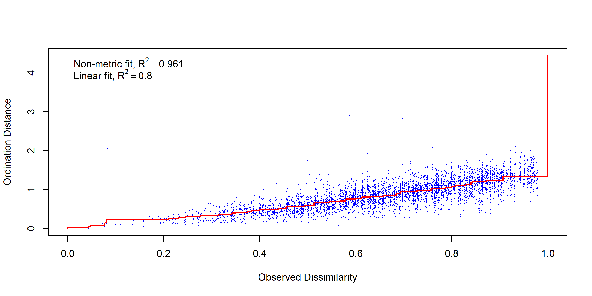
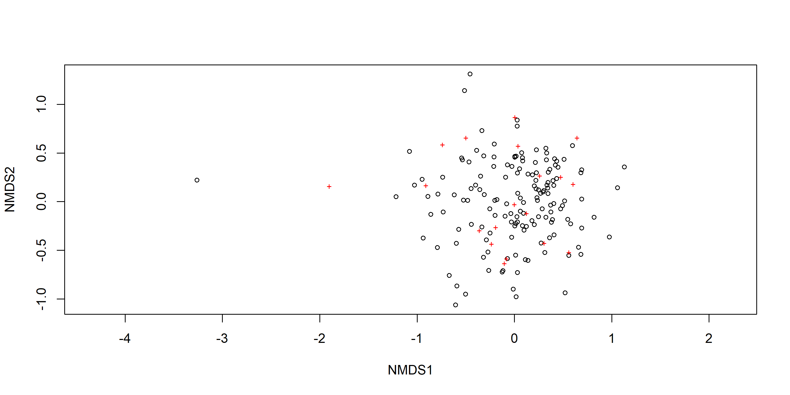
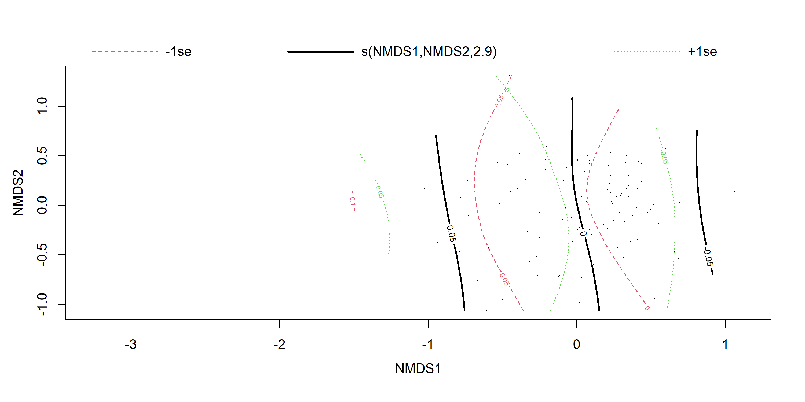
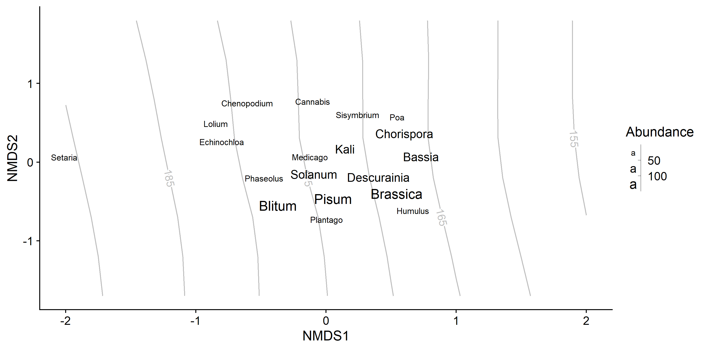
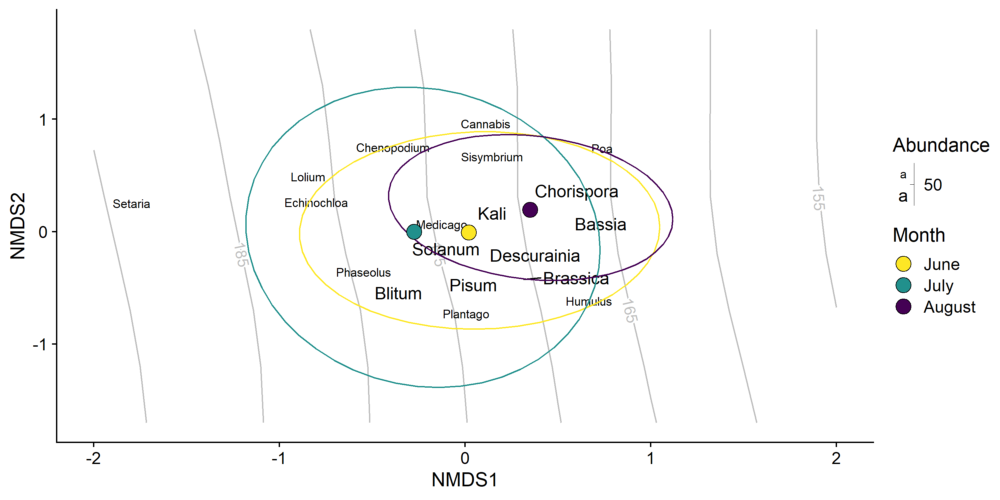
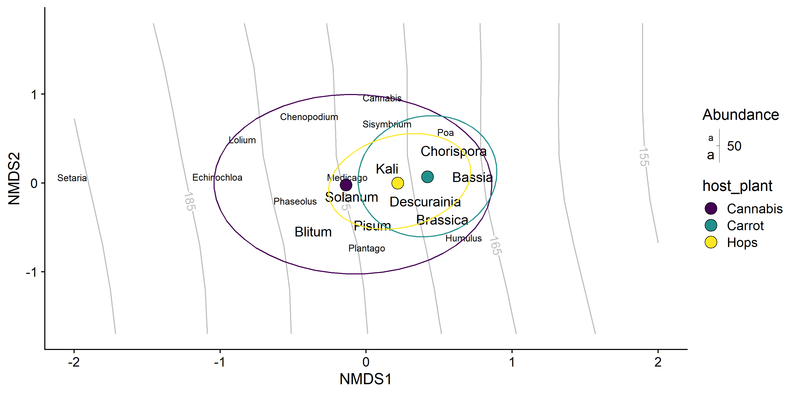
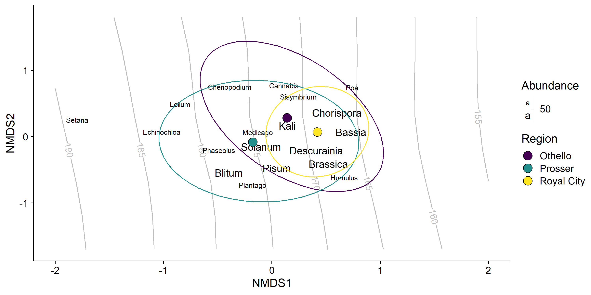
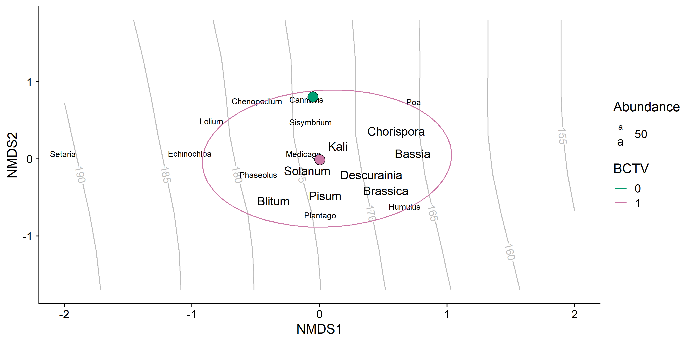

Gut Contents Hemp, Hops, and Carrot
================
Riley M. Anderson
March 04, 2025

  

- [Overview](#overview)
  - [Summary of Results](#summary-of-results)
- [NMDS by genus](#nmds-by-genus)
  - [Gut contents by sample date](#gut-contents-by-sample-date)
  - [Genus by month](#genus-by-month)
  - [Genus by field type](#genus-by-field-type)
  - [Genus by regions](#genus-by-regions)
  - [Genus by BCTV](#genus-by-bctv)
- [Random forest BCTV](#random-forest-bctv)
- [Session Information](#session-information)

## Overview

Multivariate analyses of Camille’s potato/hemp/hops/carrot BLH gut
contents. This analysis considers only presence/absence of plants, no
assumptions of concentration are made.

### Summary of Results

- Plant species composition in the gut contents of BLH is weakly tied to
  sampling date (the grey contours in the NMDS figures).

- The predictors, **region**, and **BCTV** help explain some variation
  but do not differentiate gut composition.

- **Host plant** was used as a block effect (random intercept and
  permutation stratification) in the models.

- The relationship with sampling date is convoluted and highly
  non-linear. I suspect this has much to do with the sampling across
  multiple years where regions were not sampled every year, or sampled
  at different times across years.

- The benchmark plant *Solanum*, for standardizing primer efficiency
  stands out by an order of magnitude. To me, this suggests that
  **sequences** are not representative of concentration in the gut.
  Instead, **sequences** are a function of primer efficiency. If so,
  this entire analysis should be ignored, as the ordinations are built
  from the assumption that **sequences** are at least partially a
  function of concentration in the gut.

## NMDS by genus

    ## Wisconsin double standardization
    ## Run 0 stress 0.1977332 
    ## Run 1 stress 0.1977309 
    ## ... New best solution
    ## ... Procrustes: rmse 0.0004631675  max resid 0.00295135 
    ## ... Similar to previous best
    ## Run 2 stress 0.197435 
    ## ... New best solution
    ## ... Procrustes: rmse 0.02855166  max resid 0.1664865 
    ## Run 3 stress 0.1985748 
    ## Run 4 stress 0.1973806 
    ## ... New best solution
    ## ... Procrustes: rmse 0.004377888  max resid 0.03893831 
    ## Run 5 stress 0.1985319 
    ## Run 6 stress 0.1973825 
    ## ... Procrustes: rmse 0.02286485  max resid 0.2364157 
    ## Run 7 stress 0.1987238 
    ## Run 8 stress 0.1977837 
    ## ... Procrustes: rmse 0.02691582  max resid 0.1055501 
    ## Run 9 stress 0.1985749 
    ## Run 10 stress 0.1999332 
    ## Run 11 stress 0.1986811 
    ## Run 12 stress 0.1973778 
    ## ... New best solution
    ## ... Procrustes: rmse 0.02343752  max resid 0.2372953 
    ## Run 13 stress 0.1977296 
    ## ... Procrustes: rmse 0.03175179  max resid 0.1658129 
    ## Run 14 stress 0.1973798 
    ## ... Procrustes: rmse 0.0004600616  max resid 0.004483612 
    ## ... Similar to previous best
    ## Run 15 stress 0.1977356 
    ## ... Procrustes: rmse 0.03223157  max resid 0.1675696 
    ## Run 16 stress 0.1975478 
    ## ... Procrustes: rmse 0.02543759  max resid 0.2392327 
    ## Run 17 stress 0.1989168 
    ## Run 18 stress 0.198678 
    ## Run 19 stress 0.1977744 
    ## ... Procrustes: rmse 0.03419318  max resid 0.1728518 
    ## Run 20 stress 0.1988955 
    ## *** Best solution repeated 1 times
    ## [1] 0.1973778

<!-- --><!-- -->

    ## 
    ## ***VECTORS
    ## 
    ##                NMDS1    NMDS2    NMDS3     r2 Pr(>r)   
    ## sample_date -0.92737 -0.10151 -0.36011 0.1027  0.006 **
    ## ---
    ## Signif. codes:  0 '***' 0.001 '**' 0.01 '*' 0.05 '.' 0.1 ' ' 1
    ## Blocks:  strata 
    ## Permutation: free
    ## Number of permutations: 999
    ## 
    ## ***FACTORS:
    ## 
    ## Centroids:
    ##                    NMDS1   NMDS2   NMDS3
    ## regionOthello     0.1414  0.2839  0.2082
    ## regionProsser    -0.1765 -0.0828 -0.0107
    ## regionRoyal City  0.4204  0.0691 -0.0918
    ## BCTV0            -0.0529  0.8063  0.3651
    ## BCTV1             0.0007 -0.0108 -0.0049
    ## Year2022          0.0000  0.0000  0.0000
    ## 
    ## Goodness of fit:
    ##            r2 Pr(>r)    
    ## region 0.1432  0.001 ***
    ## BCTV   0.0175  0.062 .  
    ## Year   0.0000  1.000    
    ## ---
    ## Signif. codes:  0 '***' 0.001 '**' 0.01 '*' 0.05 '.' 0.1 ' ' 1
    ## Blocks:  strata 
    ## Permutation: free
    ## Number of permutations: 999
    ## 
    ## ***VECTORS
    ## 
    ##                NMDS1    NMDS2    NMDS3     r2 Pr(>r)    
    ## sample_date -0.92737 -0.10151 -0.36011 0.1027  0.001 ***
    ## ---
    ## Signif. codes:  0 '***' 0.001 '**' 0.01 '*' 0.05 '.' 0.1 ' ' 1
    ## Permutation: free
    ## Number of permutations: 999
    ## 
    ## ***FACTORS:
    ## 
    ## Centroids:
    ##                      NMDS1   NMDS2   NMDS3
    ## Year2022            0.0000  0.0000  0.0000
    ## regionOthello       0.1414  0.2839  0.2082
    ## regionProsser      -0.1765 -0.0828 -0.0107
    ## regionRoyal City    0.4204  0.0691 -0.0918
    ## BCTV0              -0.0529  0.8063  0.3651
    ## BCTV1               0.0007 -0.0108 -0.0049
    ## host_plantCannabis -0.1373 -0.0209  0.0208
    ## host_plantCarrot    0.4204  0.0691 -0.0918
    ## host_plantHops      0.2172 -0.0021  0.1572
    ## 
    ## Goodness of fit:
    ##                r2 Pr(>r)    
    ## Year       0.0000  1.000    
    ## region     0.1432  0.001 ***
    ## BCTV       0.0175  0.030 *  
    ## host_plant 0.0992  0.001 ***
    ## ---
    ## Signif. codes:  0 '***' 0.001 '**' 0.01 '*' 0.05 '.' 0.1 ' ' 1
    ## Permutation: free
    ## Number of permutations: 999
    ## 
    ## Family: gaussian 
    ## Link function: identity 
    ## 
    ## Formula:
    ## log(sample_date) ~ s(NMDS1, NMDS2, k = 8)
    ## 
    ## Parametric coefficients:
    ##             Estimate Std. Error t value Pr(>|t|)    
    ## (Intercept) 5.154279   0.006823   755.5   <2e-16 ***
    ## ---
    ## Signif. codes:  0 '***' 0.001 '**' 0.01 '*' 0.05 '.' 0.1 ' ' 1
    ## 
    ## Approximate significance of smooth terms:
    ##                  edf Ref.df     F  p-value    
    ## s(NMDS1,NMDS2) 2.896  2.896 5.659 0.000864 ***
    ## ---
    ## Signif. codes:  0 '***' 0.001 '**' 0.01 '*' 0.05 '.' 0.1 ' ' 1
    ## 
    ## R-sq.(adj) =  0.0991   
    ## lmer.REML = -297.66  Scale est. = 0.0070289  n = 151

<!-- -->

    ## Permutation test for adonis under reduced model
    ## Terms added sequentially (first to last)
    ## Blocks:  strata 
    ## Permutation: free
    ## Number of permutations: 999
    ## 
    ## adonis2(formula = gut_mat_species ~ splines::ns(sample_date, df = 7) + BCTV + region, data = gut_matrix, strata = gut_matrix$host_plant)
    ##                                   Df SumOfSqs      R2      F Pr(>F)    
    ## splines::ns(sample_date, df = 7)   4    3.189 0.09720 4.2997  0.001 ***
    ## BCTV                               1    0.551 0.01680 2.9731  0.013 *  
    ## region                             2    2.555 0.07786 6.8889  0.005 ** 
    ## Residual                         143   26.515 0.80814                  
    ## Total                            150   32.810 1.00000                  
    ## ---
    ## Signif. codes:  0 '***' 0.001 '**' 0.01 '*' 0.05 '.' 0.1 ' ' 1

### Gut contents by sample date

<!-- -->

### Genus by month

<!-- -->

### Genus by field type

<!-- -->

### Genus by regions

<!-- -->

### Genus by BCTV

<!-- -->

## Random forest BCTV

## Session Information

    R version 4.2.3 (2023-03-15 ucrt)
    Platform: x86_64-w64-mingw32/x64 (64-bit)
    Running under: Windows 10 x64 (build 19045)

    Matrix products: default

    locale:
    [1] LC_COLLATE=English_United States.utf8 
    [2] LC_CTYPE=English_United States.utf8   
    [3] LC_MONETARY=English_United States.utf8
    [4] LC_NUMERIC=C                          
    [5] LC_TIME=English_United States.utf8    

    attached base packages:
    [1] stats     graphics  grDevices utils     datasets  methods   base     

    other attached packages:
     [1] gamm4_0.2-6          mgcv_1.8-42          nlme_3.1-162        
     [4] lme4_1.1-35.3        Matrix_1.5-3         ggrepel_0.9.5       
     [7] sjPlot_2.8.16        randomForest_4.7-1.1 vegan_2.6-6.1       
    [10] lattice_0.20-45      permute_0.9-7        cowplot_1.1.3       
    [13] lubridate_1.9.3      forcats_1.0.0        stringr_1.5.1       
    [16] dplyr_1.1.4          purrr_1.0.2          readr_2.1.5         
    [19] tidyr_1.3.1          tibble_3.2.1         ggplot2_3.5.1       
    [22] tidyverse_2.0.0     

    loaded via a namespace (and not attached):
     [1] viridisLite_0.4.2  splines_4.2.3      metR_0.17.0        datawizard_0.11.0 
     [5] highr_0.11         yaml_2.3.8         pillar_1.9.0       backports_1.5.0   
     [9] glue_1.7.0         digest_0.6.35      checkmate_2.3.1    minqa_1.2.7       
    [13] colorspace_2.1-0   htmltools_0.5.8.1  plyr_1.8.9         pkgconfig_2.0.3   
    [17] scales_1.3.0       tzdb_0.4.0         timechange_0.3.0   generics_0.1.3    
    [21] farver_2.1.2       sjlabelled_1.2.0   cachem_1.1.0       withr_3.0.0       
    [25] cli_3.6.2          magrittr_2.0.3     memoise_2.0.1      evaluate_0.24.0   
    [29] fansi_1.0.6        MASS_7.3-58.2      tools_4.2.3        data.table_1.15.4 
    [33] hms_1.1.3          lifecycle_1.0.4    munsell_0.5.1      cluster_2.1.4     
    [37] ggeffects_1.6.0    isoband_0.2.7      compiler_4.2.3     rlang_1.1.4       
    [41] grid_4.2.3         nloptr_2.0.3       rstudioapi_0.16.0  labeling_0.4.3    
    [45] rmarkdown_2.27     boot_1.3-28.1      gtable_0.3.5       codetools_0.2-19  
    [49] sjstats_0.19.0     sjmisc_2.8.10      R6_2.5.1           knitr_1.47        
    [53] performance_0.12.0 fastmap_1.2.0      utf8_1.2.4         rprojroot_2.0.4   
    [57] insight_1.0.1      stringi_1.8.4      parallel_4.2.3     Rcpp_1.0.12       
    [61] vctrs_0.6.5        tidyselect_1.2.1   xfun_0.44         
