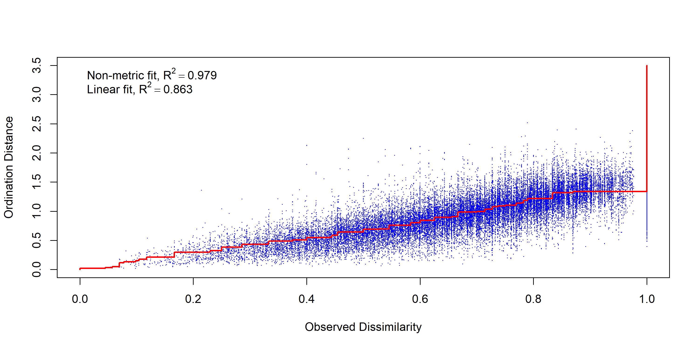
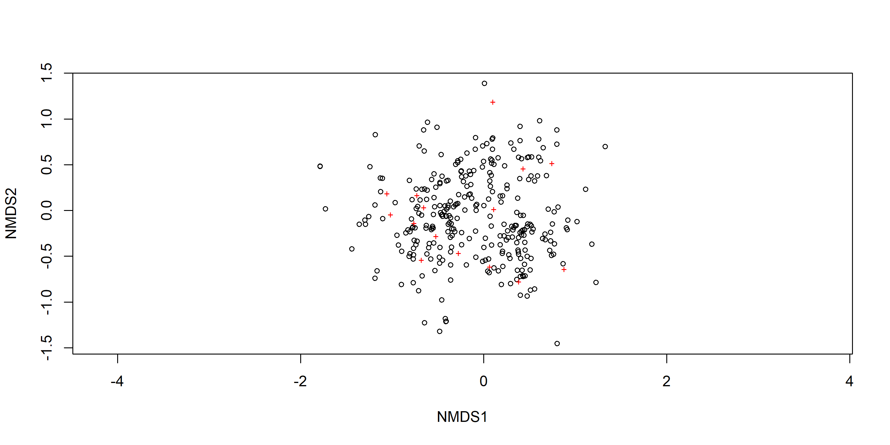
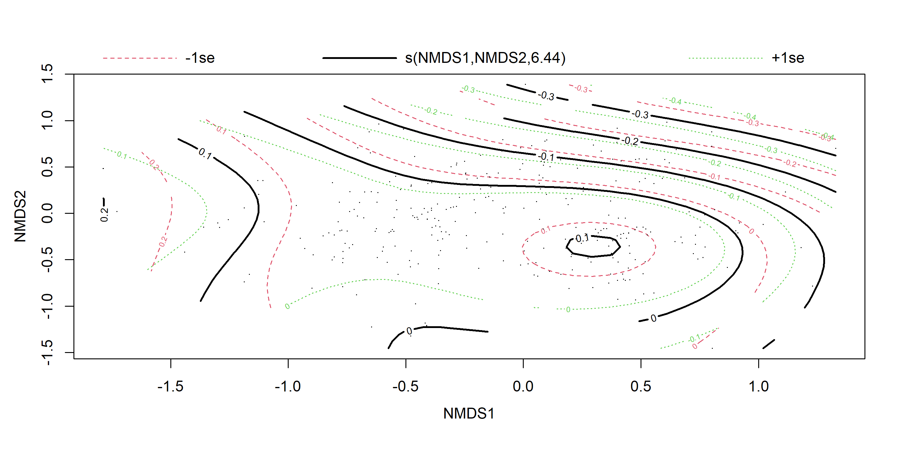
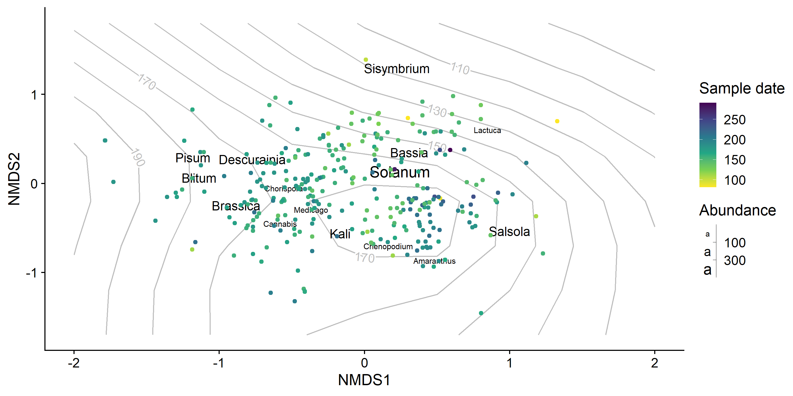
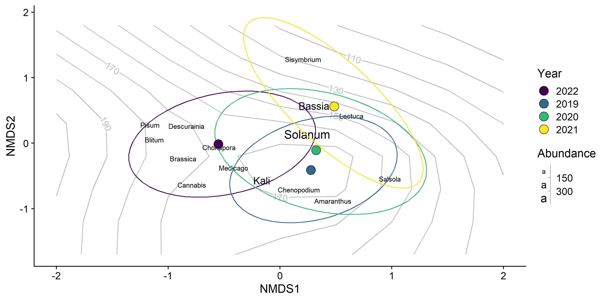
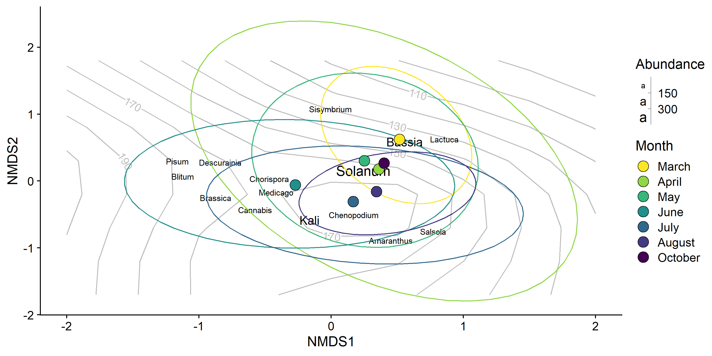
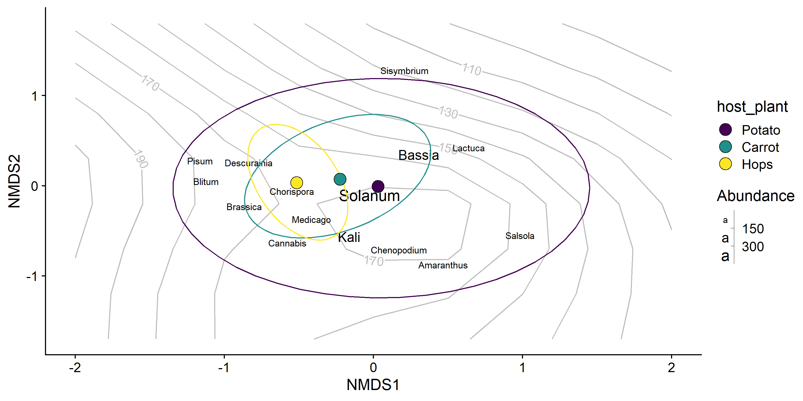
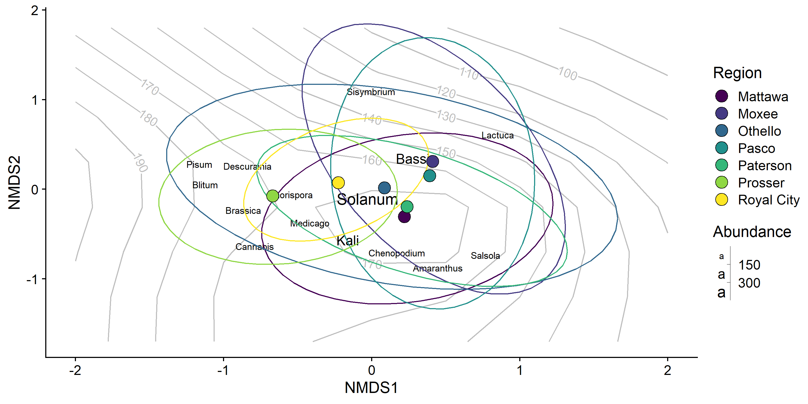
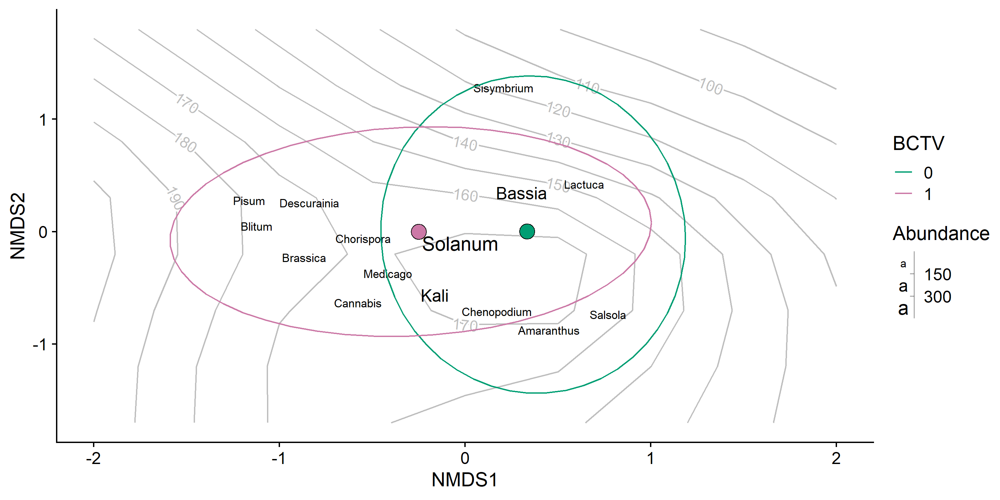

Gut Contents from Potato, Hemp, Hops, and Carrot
================
Dr. Riley M. Anderson
March 04, 2025

  

- [Overview](#overview)
  - [Summary of Results](#summary-of-results)
- [NMDS by genus](#nmds-by-genus)
  - [Gut contents by sample date](#gut-contents-by-sample-date)
  - [Genus by year](#genus-by-year)
  - [Genus by month](#genus-by-month)
  - [Genus by field type](#genus-by-field-type)
  - [Genus by regions](#genus-by-regions)
  - [Genus by BCTV](#genus-by-bctv)
- [Random forest BCTV](#random-forest-bctv)
- [Session Information](#session-information)

## Overview

Multivariate analyses of Camille’s potato/hemp/hops/carrot BLH gut
contents. This analysis considers only presence/absence of plants, no
assumptions of concentration are made.

### Summary of Results

- Plant species composition in the gut contents of BLH is weakly tied to
  sampling date (the grey contours in the NMDS figures).

- The predictors, **region**, and **BCTV** help explain some variation
  but do not differentiate gut composition.

- **Host plant** was used as a block effect (random intercept and
  permutation stratification) in the models.

- The relationship with sampling date is convoluted and highly
  non-linear. I suspect this has much to do with the sampling across
  multiple years where regions were not sampled every year, or sampled
  at different times across years.

- The benchmark plant *Solanum*, for standardizing primer efficiency
  stands out by an order of magnitude. To me, this suggests that
  **sequences** are not representative of concentration in the gut.
  Instead, **sequences** are a function of primer efficiency. If so,
  this entire analysis should be ignored, as the ordinations are built
  from the assumption that **sequences** are at least partially a
  function of concentration in the gut.

## NMDS by genus

    ## Wisconsin double standardization
    ## Run 0 stress 0.1432449 
    ## Run 1 stress 0.1432443 
    ## ... New best solution
    ## ... Procrustes: rmse 0.004012518  max resid 0.05219624 
    ## Run 2 stress 0.1433054 
    ## ... Procrustes: rmse 0.00470945  max resid 0.05195048 
    ## Run 3 stress 0.1434873 
    ## ... Procrustes: rmse 0.007636732  max resid 0.07247744 
    ## Run 4 stress 0.1483203 
    ## Run 5 stress 0.1433151 
    ## ... Procrustes: rmse 0.003404429  max resid 0.03762825 
    ## Run 6 stress 0.1481907 
    ## Run 7 stress 0.1433077 
    ## ... Procrustes: rmse 0.005010935  max resid 0.05211272 
    ## Run 8 stress 0.1435779 
    ## ... Procrustes: rmse 0.007527633  max resid 0.07533292 
    ## Run 9 stress 0.1482593 
    ## Run 10 stress 0.1433084 
    ## ... Procrustes: rmse 0.00507544  max resid 0.05215461 
    ## Run 11 stress 0.1432412 
    ## ... New best solution
    ## ... Procrustes: rmse 0.002796944  max resid 0.03495127 
    ## Run 12 stress 0.1432455 
    ## ... Procrustes: rmse 0.00456274  max resid 0.05260911 
    ## Run 13 stress 0.1483016 
    ## Run 14 stress 0.143244 
    ## ... Procrustes: rmse 0.002734441  max resid 0.03383399 
    ## Run 15 stress 0.1435428 
    ## ... Procrustes: rmse 0.007373514  max resid 0.07585109 
    ## Run 16 stress 0.143283 
    ## ... Procrustes: rmse 0.005211964  max resid 0.05300446 
    ## Run 17 stress 0.1482602 
    ## Run 18 stress 0.1432714 
    ## ... Procrustes: rmse 0.004704615  max resid 0.05249683 
    ## Run 19 stress 0.1481405 
    ## Run 20 stress 0.1493526 
    ## Run 21 stress 0.1432383 
    ## ... New best solution
    ## ... Procrustes: rmse 0.0007763976  max resid 0.01078947 
    ## Run 22 stress 0.1432406 
    ## ... Procrustes: rmse 0.002026409  max resid 0.03136757 
    ## Run 23 stress 0.1435427 
    ## ... Procrustes: rmse 0.00748753  max resid 0.07585706 
    ## Run 24 stress 0.1434259 
    ## ... Procrustes: rmse 0.005975817  max resid 0.05463618 
    ## Run 25 stress 0.1435586 
    ## ... Procrustes: rmse 0.00744239  max resid 0.07494086 
    ## Run 26 stress 0.1432367 
    ## ... New best solution
    ## ... Procrustes: rmse 0.003598536  max resid 0.0524216 
    ## Run 27 stress 0.1482602 
    ## Run 28 stress 0.148141 
    ## Run 29 stress 0.1481439 
    ## Run 30 stress 0.1481944 
    ## Run 31 stress 0.1435433 
    ## ... Procrustes: rmse 0.007367736  max resid 0.07599499 
    ## Run 32 stress 0.1432453 
    ## ... Procrustes: rmse 0.001581149  max resid 0.02665741 
    ## Run 33 stress 0.143245 
    ## ... Procrustes: rmse 0.003490043  max resid 0.05202581 
    ## Run 34 stress 0.1494271 
    ## Run 35 stress 0.1434991 
    ## ... Procrustes: rmse 0.008340047  max resid 0.07234116 
    ## Run 36 stress 0.1433816 
    ## ... Procrustes: rmse 0.005336538  max resid 0.068403 
    ## Run 37 stress 0.1432901 
    ## ... Procrustes: rmse 0.002909811  max resid 0.03663796 
    ## Run 38 stress 0.143487 
    ## ... Procrustes: rmse 0.008230191  max resid 0.07197766 
    ## Run 39 stress 0.1481978 
    ## Run 40 stress 0.1435693 
    ## ... Procrustes: rmse 0.007007542  max resid 0.07550556 
    ## Run 41 stress 0.1432438 
    ## ... Procrustes: rmse 0.003779828  max resid 0.05251297 
    ## Run 42 stress 0.1433934 
    ## ... Procrustes: rmse 0.007013065  max resid 0.05541537 
    ## Run 43 stress 0.1434868 
    ## ... Procrustes: rmse 0.00823051  max resid 0.07221292 
    ## Run 44 stress 0.1481571 
    ## Run 45 stress 0.1435432 
    ## ... Procrustes: rmse 0.007132687  max resid 0.07488647 
    ## Run 46 stress 0.1482376 
    ## Run 47 stress 0.1432873 
    ## ... Procrustes: rmse 0.003771925  max resid 0.05181585 
    ## Run 48 stress 0.1434263 
    ## ... Procrustes: rmse 0.005932621  max resid 0.05546397 
    ## Run 49 stress 0.1434008 
    ## ... Procrustes: rmse 0.005674479  max resid 0.06842246 
    ## Run 50 stress 0.1432858 
    ## ... Procrustes: rmse 0.004730213  max resid 0.05301451 
    ## *** Best solution was not repeated -- monoMDS stopping criteria:
    ##     47: stress ratio > sratmax
    ##      3: scale factor of the gradient < sfgrmin
    ## [1] 0.1432367

<!-- --><!-- -->

    ## 
    ## ***VECTORS
    ## 
    ##                 NMDS1     NMDS2     NMDS3     r2 Pr(>r)    
    ## sample_date -0.342070 -0.939620 -0.010035 0.1264  0.001 ***
    ## ---
    ## Signif. codes:  0 '***' 0.001 '**' 0.01 '*' 0.05 '.' 0.1 ' ' 1
    ## Blocks:  strata 
    ## Permutation: free
    ## Number of permutations: 999
    ## 
    ## ***FACTORS:
    ## 
    ## Centroids:
    ##                    NMDS1   NMDS2   NMDS3
    ## regionMattawa     0.2202 -0.3055  0.0944
    ## regionMoxee       0.4110  0.3102  0.0577
    ## regionOthello     0.0860  0.0165 -0.0020
    ## regionPasco       0.3919  0.1519  0.0398
    ## regionPaterson    0.2393 -0.1957  0.0099
    ## regionProsser    -0.6687 -0.0753  0.0321
    ## regionRoyal City -0.2252  0.0729 -0.4250
    ## BCTV0             0.3338  0.0030  0.0673
    ## BCTV1            -0.2496 -0.0023 -0.0503
    ## Year2022         -0.5511 -0.0143 -0.0817
    ## Year2019          0.2753 -0.4093  0.1743
    ## Year2020          0.3223 -0.1051 -0.0452
    ## Year2021          0.4847  0.5635  0.0689
    ## 
    ## Goodness of fit:
    ##            r2 Pr(>r)    
    ## region 0.2733  0.001 ***
    ## BCTV   0.1006  0.001 ***
    ## Year   0.3499  0.001 ***
    ## ---
    ## Signif. codes:  0 '***' 0.001 '**' 0.01 '*' 0.05 '.' 0.1 ' ' 1
    ## Blocks:  strata 
    ## Permutation: free
    ## Number of permutations: 999
    ## 
    ## ***VECTORS
    ## 
    ##                 NMDS1     NMDS2     NMDS3     r2 Pr(>r)    
    ## sample_date -0.342070 -0.939620 -0.010035 0.1264  0.001 ***
    ## ---
    ## Signif. codes:  0 '***' 0.001 '**' 0.01 '*' 0.05 '.' 0.1 ' ' 1
    ## Permutation: free
    ## Number of permutations: 999
    ## 
    ## ***FACTORS:
    ## 
    ## Centroids:
    ##                    NMDS1   NMDS2   NMDS3
    ## Year2022         -0.5511 -0.0143 -0.0817
    ## Year2019          0.2753 -0.4093  0.1743
    ## Year2020          0.3223 -0.1051 -0.0452
    ## Year2021          0.4847  0.5635  0.0689
    ## regionMattawa     0.2202 -0.3055  0.0944
    ## regionMoxee       0.4110  0.3102  0.0577
    ## regionOthello     0.0860  0.0165 -0.0020
    ## regionPasco       0.3919  0.1519  0.0398
    ## regionPaterson    0.2393 -0.1957  0.0099
    ## regionProsser    -0.6687 -0.0753  0.0321
    ## regionRoyal City -0.2252  0.0729 -0.4250
    ## BCTV0             0.3338  0.0030  0.0673
    ## BCTV1            -0.2496 -0.0023 -0.0503
    ## host_plantPotato  0.0299 -0.0077  0.0464
    ## host_plantCarrot -0.2252  0.0729 -0.4250
    ## host_plantHops   -0.5154  0.0343 -0.2826
    ## 
    ## Goodness of fit:
    ##                r2 Pr(>r)    
    ## Year       0.3499  0.001 ***
    ## region     0.2733  0.001 ***
    ## BCTV       0.1006  0.001 ***
    ## host_plant 0.0330  0.001 ***
    ## ---
    ## Signif. codes:  0 '***' 0.001 '**' 0.01 '*' 0.05 '.' 0.1 ' ' 1
    ## Permutation: free
    ## Number of permutations: 999
    ## 
    ## Family: gaussian 
    ## Link function: identity 
    ## 
    ## Formula:
    ## log(sample_date) ~ s(NMDS1, NMDS2, k = 8)
    ## 
    ## Parametric coefficients:
    ##             Estimate Std. Error t value Pr(>|t|)    
    ## (Intercept) 5.085314   0.009324   545.4   <2e-16 ***
    ## ---
    ## Signif. codes:  0 '***' 0.001 '**' 0.01 '*' 0.05 '.' 0.1 ' ' 1
    ## 
    ## Approximate significance of smooth terms:
    ##                  edf Ref.df     F p-value    
    ## s(NMDS1,NMDS2) 6.444  6.444 19.89  <2e-16 ***
    ## ---
    ## Signif. codes:  0 '***' 0.001 '**' 0.01 '*' 0.05 '.' 0.1 ' ' 1
    ## 
    ## R-sq.(adj) =  0.249   
    ## lmer.REML = -186.08  Scale est. = 0.033123  n = 381

<!-- -->

    ## Permutation test for adonis under reduced model
    ## Terms added sequentially (first to last)
    ## Blocks:  strata 
    ## Permutation: free
    ## Number of permutations: 999
    ## 
    ## adonis2(formula = gut_mat_species ~ splines::ns(sample_date, df = 7) + BCTV * Year + region, data = gut_matrix, strata = gut_matrix$host_plant)
    ##                                   Df SumOfSqs      R2       F Pr(>F)    
    ## splines::ns(sample_date, df = 7)   7   15.807 0.14256 12.2727  0.001 ***
    ## BCTV                               1    5.291 0.04772 28.7577  0.001 ***
    ## Year                               3   18.309 0.16512 33.1686  0.001 ***
    ## region                             6    4.292 0.03870  3.8872  0.001 ***
    ## BCTV:Year                          3    0.945 0.00852  1.7116  0.059 .  
    ## Residual                         360   66.240 0.59738                   
    ## Total                            380  110.884 1.00000                   
    ## ---
    ## Signif. codes:  0 '***' 0.001 '**' 0.01 '*' 0.05 '.' 0.1 ' ' 1

### Gut contents by sample date

<!-- -->

### Genus by year

<!-- -->

### Genus by month

<!-- -->

### Genus by field type

<!-- -->

### Genus by regions

<!-- -->

### Genus by BCTV

<!-- -->

## Random forest BCTV

## Session Information

    R version 4.2.3 (2023-03-15 ucrt)
    Platform: x86_64-w64-mingw32/x64 (64-bit)
    Running under: Windows 10 x64 (build 19045)

    Matrix products: default

    locale:
    [1] LC_COLLATE=English_United States.utf8 
    [2] LC_CTYPE=English_United States.utf8   
    [3] LC_MONETARY=English_United States.utf8
    [4] LC_NUMERIC=C                          
    [5] LC_TIME=English_United States.utf8    

    attached base packages:
    [1] stats     graphics  grDevices utils     datasets  methods   base     

    other attached packages:
     [1] gamm4_0.2-6          mgcv_1.8-42          nlme_3.1-162        
     [4] lme4_1.1-35.3        Matrix_1.5-3         ggrepel_0.9.5       
     [7] sjPlot_2.8.16        randomForest_4.7-1.1 vegan_2.6-6.1       
    [10] lattice_0.20-45      permute_0.9-7        cowplot_1.1.3       
    [13] lubridate_1.9.3      forcats_1.0.0        stringr_1.5.1       
    [16] dplyr_1.1.4          purrr_1.0.2          readr_2.1.5         
    [19] tidyr_1.3.1          tibble_3.2.1         ggplot2_3.5.1       
    [22] tidyverse_2.0.0     

    loaded via a namespace (and not attached):
     [1] viridisLite_0.4.2  splines_4.2.3      metR_0.17.0        datawizard_0.11.0 
     [5] highr_0.11         yaml_2.3.8         pillar_1.9.0       backports_1.5.0   
     [9] glue_1.7.0         digest_0.6.35      checkmate_2.3.1    minqa_1.2.7       
    [13] colorspace_2.1-0   htmltools_0.5.8.1  plyr_1.8.9         pkgconfig_2.0.3   
    [17] scales_1.3.0       tzdb_0.4.0         timechange_0.3.0   generics_0.1.3    
    [21] farver_2.1.2       sjlabelled_1.2.0   cachem_1.1.0       withr_3.0.0       
    [25] cli_3.6.2          magrittr_2.0.3     memoise_2.0.1      evaluate_0.24.0   
    [29] fansi_1.0.6        MASS_7.3-58.2      tools_4.2.3        data.table_1.15.4 
    [33] hms_1.1.3          lifecycle_1.0.4    munsell_0.5.1      cluster_2.1.4     
    [37] ggeffects_1.6.0    isoband_0.2.7      compiler_4.2.3     rlang_1.1.4       
    [41] grid_4.2.3         nloptr_2.0.3       rstudioapi_0.16.0  labeling_0.4.3    
    [45] rmarkdown_2.27     boot_1.3-28.1      gtable_0.3.5       codetools_0.2-19  
    [49] sjstats_0.19.0     sjmisc_2.8.10      R6_2.5.1           knitr_1.47        
    [53] performance_0.12.0 fastmap_1.2.0      utf8_1.2.4         rprojroot_2.0.4   
    [57] insight_1.0.1      stringi_1.8.4      parallel_4.2.3     Rcpp_1.0.12       
    [61] vctrs_0.6.5        tidyselect_1.2.1   xfun_0.44         
