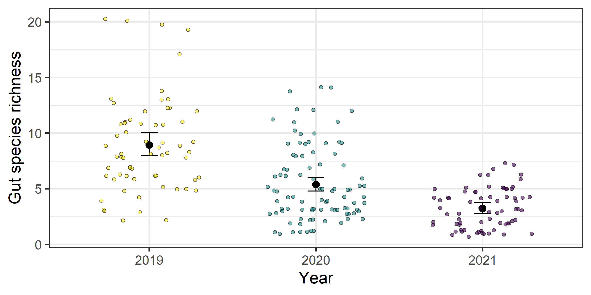
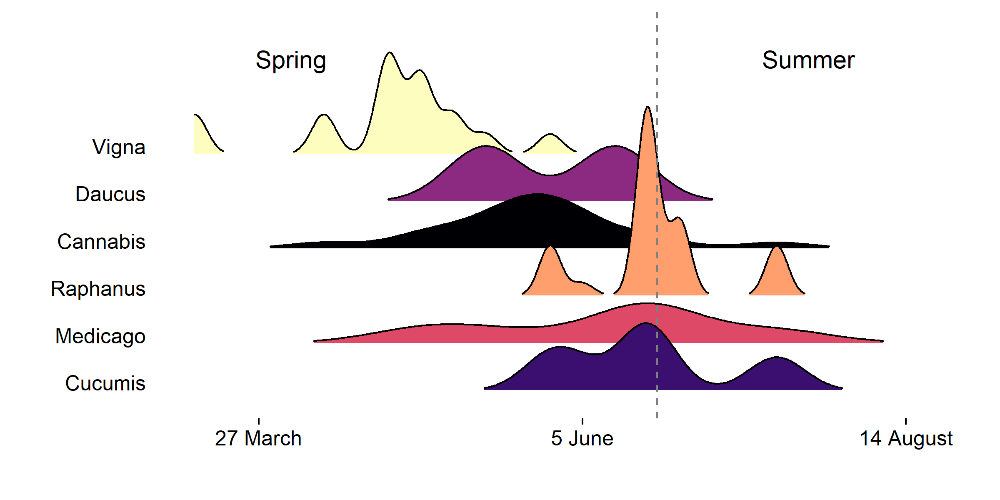

BLH Gut Diversity in Potato
================
Riley M. Anderson
May 09, 2025

  

- [Overview](#overview)
  - [Summary of Results](#summary-of-results)
- [BCTV by richness](#bctv-by-richness)
- [CPt by richness](#cpt-by-richness)
- [Proportion plants infected](#proportion-plants-infected)
- [Proportion plants infected by
  virus](#proportion-plants-infected-by-virus)
- [Plants in the gut over time](#plants-in-the-gut-over-time)
  - [Crops by time](#crops-by-time)
  - [Non-crops by time](#non-crops-by-time)
  - [Trees by time](#trees-by-time)
  - [Session Information](#session-information)

## Overview

What is this analysis about?

### Summary of Results

- 

# BCTV by richness

    ##  Family: binomial  ( logit )
    ## Formula:          BCTV ~ richness + (1 | region)
    ## Data: richness
    ## 
    ##      AIC      BIC   logLik deviance df.resid 
    ##    263.3    273.6   -128.7    257.3      225 
    ## 
    ## Random effects:
    ## 
    ## Conditional model:
    ##  Groups Name        Variance Std.Dev.
    ##  region (Intercept) 0.5871   0.7662  
    ## Number of obs: 228, groups:  region, 5
    ## 
    ## Conditional model:
    ##             Estimate Std. Error z value Pr(>|z|)    
    ## (Intercept) -0.04784    0.45048  -0.106 0.915427    
    ## richness    -0.16319    0.04923  -3.315 0.000916 ***
    ## ---
    ## Signif. codes:  0 '***' 0.001 '**' 0.01 '*' 0.05 '.' 0.1 ' ' 1

<!-- -->

- Simple models show a robust effect of gut species richness on BCTV
  infection
  ( =
  -0.16, SE = 0.05, *P* \< 0.001, AIC = 263.35. This effect is
  independent of region. That is, each region has varying levels of BCTV
  infection, but the effect of richness does not vary by region.

- However, there may be an effect of **year** on the variation in BCTV.
  In the plot above, the raw data are shown and colored by year with
  2019 in yellow, 2020 in blue, and 2021 in purple. Let’s have a
  detailed look below:

<!-- -->

    ##  Family: binomial  ( logit )
    ## Formula:          BCTV ~ Year + (1 | region)
    ## Data: richness
    ## 
    ##      AIC      BIC   logLik deviance df.resid 
    ##    246.1    259.9   -119.1    238.1      224 
    ## 
    ## Random effects:
    ## 
    ## Conditional model:
    ##  Groups Name        Variance Std.Dev.
    ##  region (Intercept) 0.9713   0.9856  
    ## Number of obs: 228, groups:  region, 5
    ## 
    ## Conditional model:
    ##             Estimate Std. Error z value Pr(>|z|)    
    ## (Intercept)  -2.9916     0.6787  -4.408 1.04e-05 ***
    ## Year2020      2.5697     0.5494   4.678 2.90e-06 ***
    ## Year2021      2.6392     0.6583   4.009 6.10e-05 ***
    ## ---
    ## Signif. codes:  0 '***' 0.001 '**' 0.01 '*' 0.05 '.' 0.1 ' ' 1

<!-- -->

- Okay, so 2019 had much lower levels of BCTV, relative to 2020
  and 2021. Moreover, **year** is a better predictor of BCTV than
  **richness** (AIC = 246.15)

- Did gut species richness also vary across years? Let’s find out:

<!-- -->

    ## Overdispersion ratio for model: richness_mod1 
    ## formula: richness ~ Year + (1 | region) 
    ## 
    ## Acceptable range: 1 - 1.4
    ## Overdispersion ratio: 1.016  df: 223  p = 0.421 
    ##  Data are not overdispersed
    ##    ratio deviance       df   pvalue 
    ##   1.0160 226.5496 223.0000   0.4210
    ##  Family: nbinom2  ( log )
    ## Formula:          richness ~ Year + (1 | region)
    ## Data: richness
    ## 
    ##      AIC      BIC   logLik deviance df.resid 
    ##   1117.2   1134.4   -553.6   1107.2      223 
    ## 
    ## Random effects:
    ## 
    ## Conditional model:
    ##  Groups Name        Variance  Std.Dev. 
    ##  region (Intercept) 2.398e-10 1.548e-05
    ## Number of obs: 228, groups:  region, 5
    ## 
    ## Dispersion parameter for nbinom2 family (): 8.46 
    ## 
    ## Conditional model:
    ##             Estimate Std. Error z value Pr(>|z|)    
    ## (Intercept)  2.19026    0.05996   36.53  < 2e-16 ***
    ## Year2020    -0.51025    0.08288   -6.16 7.44e-10 ***
    ## Year2021    -1.01486    0.09801  -10.35  < 2e-16 ***
    ## ---
    ## Signif. codes:  0 '***' 0.001 '**' 0.01 '*' 0.05 '.' 0.1 ' ' 1

<!-- -->

- Yes, gut species richness varies significantly across years, with
  richness declining over time. This evidence suggests that **richness**
  and **year** are both important predictors of BCTV. Is this because
  they are collinear? Or do they each contribute to model fit?

- This is not the same as a statistical interaction. When two
  independent variables are collinear, we may be fooled into thinking
  one is significant when in reality, its significance comes from its
  proxy as the other.

- Test for collinearity and model fit with AIC:

<!-- -->

    ##             (Intercept)   richness      nYear
    ## (Intercept)   1.0000000 -0.4217605 -0.9999997
    ## richness     -0.4217605  1.0000000  0.4214301
    ## nYear        -0.9999997  0.4214301  1.0000000
    ##  Family: binomial  ( logit )
    ## Formula:          BCTV ~ richness + nYear + (1 | region)
    ## Data: richness
    ## 
    ##      AIC      BIC   logLik deviance df.resid 
    ##    256.0    269.7   -124.0    248.0      224 
    ## 
    ## Random effects:
    ## 
    ## Conditional model:
    ##  Groups Name        Variance Std.Dev.
    ##  region (Intercept) 1.033    1.016   
    ## Number of obs: 228, groups:  region, 5
    ## 
    ## Conditional model:
    ##               Estimate Std. Error z value Pr(>|z|)   
    ## (Intercept) -1.899e+03  6.584e+02  -2.885  0.00392 **
    ## richness    -8.811e-02  5.439e-02  -1.620  0.10525   
    ## nYear        9.400e-01  3.259e-01   2.885  0.00392 **
    ## ---
    ## Signif. codes:  0 '***' 0.001 '**' 0.01 '*' 0.05 '.' 0.1 ' ' 1

<!-- -->

- Correlation between **year** and **richness** is weak (*r* = 0.42), so
  no collinearity. However, including **year** in the model loses the
  **richness** effect.

- We’ve now fit three versions of models to predict BCTV. Lets compare
  with AIC and decide which model to use:

``` r

AIC(bctv_mod1, bctv_mod2, bctv_mod3)
##           df      AIC
## bctv_mod1  3 263.3452
## bctv_mod2  4 246.1459
## bctv_mod3  4 255.9598
```

- Model selection with AIC suggests the model with **year** alone is the
  best predictor.

- This means that our evidence of the dilution effect in BCTV is weak.
  Probably should not make this the main point of the paper.

# CPt by richness

    ##  Family: binomial  ( logit )
    ## Formula:          CPt ~ richness + Year + (1 | region)
    ## Data: richness
    ## 
    ##      AIC      BIC   logLik deviance df.resid 
    ##    278.1    295.3   -134.1    268.1      223 
    ## 
    ## Random effects:
    ## 
    ## Conditional model:
    ##  Groups Name        Variance Std.Dev.
    ##  region (Intercept) 0.08371  0.2893  
    ## Number of obs: 228, groups:  region, 5
    ## 
    ## Conditional model:
    ##             Estimate Std. Error z value Pr(>|z|)  
    ## (Intercept) -0.78833    0.53405  -1.476   0.1399  
    ## richness    -0.02993    0.04516  -0.663   0.5075  
    ## Year2020     0.79665    0.42428   1.878   0.0604 .
    ## Year2021    -0.55283    0.64374  -0.859   0.3905  
    ## ---
    ## Signif. codes:  0 '***' 0.001 '**' 0.01 '*' 0.05 '.' 0.1 ' ' 1

<!-- -->

- Both **richness** and **year** have no effect on CPt infection (*P* \>
  0.5).

# Proportion plants infected

<!-- -->

# Proportion plants infected by virus

<!-- -->

# Plants in the gut over time

## Crops by time

<!-- -->

## Non-crops by time

<!-- -->

## Trees by time

<!-- -->

## Session Information

    R version 4.2.3 (2023-03-15 ucrt)
    Platform: x86_64-w64-mingw32/x64 (64-bit)
    Running under: Windows 10 x64 (build 19045)

    Matrix products: default

    locale:
    [1] LC_COLLATE=English_United States.utf8 
    [2] LC_CTYPE=English_United States.utf8   
    [3] LC_MONETARY=English_United States.utf8
    [4] LC_NUMERIC=C                          
    [5] LC_TIME=English_United States.utf8    

    attached base packages:
    [1] stats     graphics  grDevices utils     datasets  methods   base     

    other attached packages:
     [1] gamm4_0.2-6        mgcv_1.8-42        nlme_3.1-162       lme4_1.1-35.3     
     [5] Matrix_1.5-3       knitr_1.47         ggridges_0.5.6     yardstick_1.3.1   
     [9] workflowsets_1.1.0 workflows_1.1.4    tune_1.2.1         rsample_1.2.1     
    [13] recipes_1.0.10     parsnip_1.2.1      modeldata_1.3.0    infer_1.0.7       
    [17] dials_1.2.1        scales_1.3.0       broom_1.0.6        tidymodels_1.2.0  
    [21] sjPlot_2.8.16      glmmTMB_1.1.9      emmeans_1.10.2     vegan_2.6-6.1     
    [25] lattice_0.20-45    permute_0.9-7      cowplot_1.1.3      lubridate_1.9.3   
    [29] forcats_1.0.0      stringr_1.5.1      dplyr_1.1.4        purrr_1.0.2       
    [33] readr_2.1.5        tidyr_1.3.1        tibble_3.2.1       ggplot2_3.5.1     
    [37] tidyverse_2.0.0   

    loaded via a namespace (and not attached):
     [1] TH.data_1.1-2       minqa_1.2.7         colorspace_2.1-0   
     [4] class_7.3-21        sjlabelled_1.2.0    rprojroot_2.0.4    
     [7] estimability_1.5.1  rstudioapi_0.16.0   farver_2.1.2       
    [10] furrr_0.3.1         listenv_0.9.1       prodlim_2023.08.28 
    [13] fansi_1.0.6         mvtnorm_1.2-5       codetools_0.2-19   
    [16] splines_4.2.3       sjmisc_2.8.10       nloptr_2.0.3       
    [19] ggeffects_1.6.0     cluster_2.1.4       compiler_4.2.3     
    [22] sjstats_0.19.0      backports_1.5.0     fastmap_1.2.0      
    [25] cli_3.6.2           htmltools_0.5.8.1   tools_4.2.3        
    [28] coda_0.19-4.1       gtable_0.3.5        glue_1.7.0         
    [31] Rcpp_1.0.12         DiceDesign_1.10     vctrs_0.6.5        
    [34] iterators_1.0.14    insight_1.0.1       timeDate_4032.109  
    [37] xfun_0.44           gower_1.0.1         globals_0.16.3     
    [40] timechange_0.3.0    lifecycle_1.0.4     future_1.33.2      
    [43] MASS_7.3-58.2       zoo_1.8-12          ipred_0.9-14       
    [46] hms_1.1.3           parallel_4.2.3      sandwich_3.1-0     
    [49] TMB_1.9.11          yaml_2.3.8          rpart_4.1.23       
    [52] stringi_1.8.4       highr_0.11          foreach_1.5.2      
    [55] lhs_1.1.6           hardhat_1.4.0       boot_1.3-28.1      
    [58] lava_1.8.0          rlang_1.1.4         pkgconfig_2.0.3    
    [61] evaluate_0.24.0     labeling_0.4.3      tidyselect_1.2.1   
    [64] parallelly_1.37.1   magrittr_2.0.3      R6_2.5.1           
    [67] generics_0.1.3      multcomp_1.4-25     pillar_1.9.0       
    [70] withr_3.0.0         survival_3.5-3      datawizard_0.11.0  
    [73] nnet_7.3-18         future.apply_1.11.2 performance_0.12.0 
    [76] utf8_1.2.4          tzdb_0.4.0          rmarkdown_2.27     
    [79] grid_4.2.3          data.table_1.15.4   digest_0.6.35      
    [82] xtable_1.8-4        numDeriv_2016.8-1.1 GPfit_1.0-8        
    [85] munsell_0.5.1       viridisLite_0.4.2  
