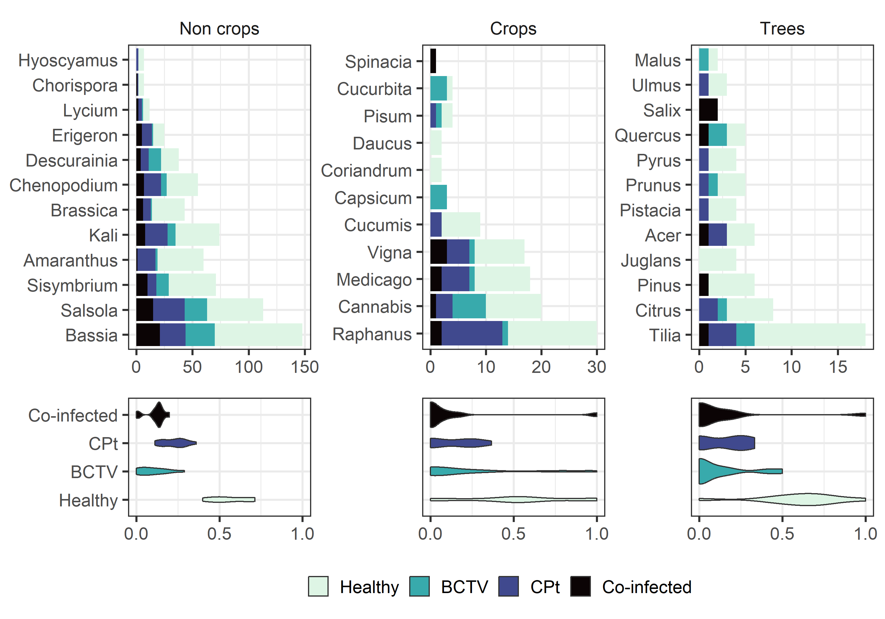
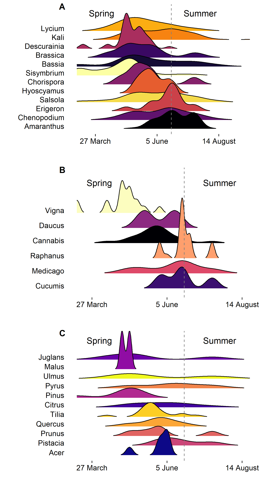
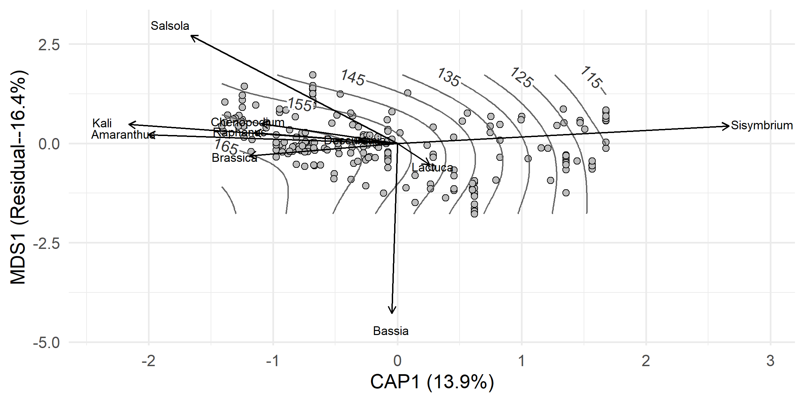

BLH Gut Diversity in Potato
================
Riley M. Anderson
November 14, 2025

  

- [Overview](#overview)
  - [Summary of Results](#summary-of-results)
- [BCTV by richness](#bctv-by-richness)
- [CPt by richness](#cpt-by-richness)
- [Proportion plants infected](#proportion-plants-infected)
  - [Figure 2 (supplement)](#figure-2-supplement)
- [Plants in the gut over time](#plants-in-the-gut-over-time)
  - [Crops by time](#crops-by-time)
  - [Non-crops by time](#non-crops-by-time)
  - [Trees by time](#trees-by-time)
    - [Gut contents by sample date](#gut-contents-by-sample-date)
    - [One figure for both NMDS](#one-figure-for-both-nmds)
    - [Genus by year](#genus-by-year)
  - [PERMANOVA](#permanova)
- [Canonical Analysis of Principle
  Components](#canonical-analysis-of-principle-components)
  - [CAP plot](#cap-plot)
  - [CAP with species vectors](#cap-with-species-vectors)
  - [CAP with Isoclines:](#cap-with-isoclines)
  - [CAP just the sample date constrained by full
    model](#cap-just-the-sample-date-constrained-by-full-model)
  - [CAP Year and sample date](#cap-year-and-sample-date)
  - [CAP everything but year in the
    model](#cap-everything-but-year-in-the-model)
  - [CAP with full model:](#cap-with-full-model)
  - [Session Information](#session-information)

## Overview

What is this analysis about?

### Summary of Results

- 

| Grouping | Mode | Median |   SD | Minimum | Maximum |
|:---------|-----:|-------:|-----:|--------:|--------:|
| Species  |    3 |      5 | 3.92 |       1 |      20 |
| Genera   |    3 |      4 | 3.00 |       1 |      18 |
| Family   |    2 |      3 | 1.88 |       1 |      10 |

# BCTV by richness

    ##  Family: binomial  ( logit )
    ## Formula:          BCTV ~ richness + (1 | region)
    ## Data: richness
    ## 
    ##      AIC      BIC   logLik deviance df.resid 
    ##    263.3    273.6   -128.7    257.3      225 
    ## 
    ## Random effects:
    ## 
    ## Conditional model:
    ##  Groups Name        Variance Std.Dev.
    ##  region (Intercept) 0.5871   0.7662  
    ## Number of obs: 228, groups:  region, 5
    ## 
    ## Conditional model:
    ##             Estimate Std. Error z value Pr(>|z|)    
    ## (Intercept) -0.04784    0.45048  -0.106 0.915427    
    ## richness    -0.16319    0.04923  -3.315 0.000916 ***
    ## ---
    ## Signif. codes:  0 '***' 0.001 '**' 0.01 '*' 0.05 '.' 0.1 ' ' 1

<!-- -->

- Simple models show a robust effect of gut species richness on BCTV
  infection
  ( =
  -0.16, SE = 0.05, *P* \< 0.001, AIC = 263.35. This effect is
  independent of region. That is, each region has varying levels of BCTV
  infection, but the effect of richness does not vary by region.

- However, there may be an effect of **year** on the variation in BCTV.
  In the plot above, the raw data are shown and colored by year with
  2019 in yellow, 2020 in blue, and 2021 in purple. Let’s have a
  detailed look below:

<!-- -->

    ##  Family: binomial  ( logit )
    ## Formula:          BCTV ~ Year + (1 | region)
    ## Data: richness
    ## 
    ##      AIC      BIC   logLik deviance df.resid 
    ##    246.1    259.9   -119.1    238.1      224 
    ## 
    ## Random effects:
    ## 
    ## Conditional model:
    ##  Groups Name        Variance Std.Dev.
    ##  region (Intercept) 0.9713   0.9856  
    ## Number of obs: 228, groups:  region, 5
    ## 
    ## Conditional model:
    ##             Estimate Std. Error z value Pr(>|z|)    
    ## (Intercept)  -2.9916     0.6787  -4.408 1.04e-05 ***
    ## Year2020      2.5697     0.5494   4.678 2.90e-06 ***
    ## Year2021      2.6392     0.6583   4.009 6.10e-05 ***
    ## ---
    ## Signif. codes:  0 '***' 0.001 '**' 0.01 '*' 0.05 '.' 0.1 ' ' 1

<!-- -->

- Okay, so 2019 had much lower levels of BCTV, relative to 2020
  and 2021. Moreover, **year** is a better predictor of BCTV than
  **richness** (AIC = 246.15)

- Did gut species richness also vary across years? Let’s find out:

<!-- -->

    ## Overdispersion ratio for model: richness_mod1 
    ## formula: richness ~ Year + (1 | region) 
    ## 
    ## Acceptable range: 1 - 1.4
    ## Overdispersion ratio: 1.016  df: 223  p = 0.421 
    ##  Data are not overdispersed
    ##    ratio deviance       df   pvalue 
    ##   1.0160 226.5496 223.0000   0.4210
    ##  Family: nbinom2  ( log )
    ## Formula:          richness ~ Year + (1 | region)
    ## Data: richness
    ## 
    ##      AIC      BIC   logLik deviance df.resid 
    ##   1117.2   1134.4   -553.6   1107.2      223 
    ## 
    ## Random effects:
    ## 
    ## Conditional model:
    ##  Groups Name        Variance  Std.Dev. 
    ##  region (Intercept) 2.398e-10 1.548e-05
    ## Number of obs: 228, groups:  region, 5
    ## 
    ## Dispersion parameter for nbinom2 family (): 8.46 
    ## 
    ## Conditional model:
    ##             Estimate Std. Error z value Pr(>|z|)    
    ## (Intercept)  2.19026    0.05996   36.53  < 2e-16 ***
    ## Year2020    -0.51025    0.08288   -6.16 7.44e-10 ***
    ## Year2021    -1.01486    0.09801  -10.35  < 2e-16 ***
    ## ---
    ## Signif. codes:  0 '***' 0.001 '**' 0.01 '*' 0.05 '.' 0.1 ' ' 1

<!-- -->

- Yes, gut species richness varies significantly across years, with
  richness declining over time. This evidence suggests that **richness**
  and **year** are both important predictors of BCTV. Is this because
  they are collinear? Or do they each contribute to model fit?

- This is not the same as a statistical interaction. When two
  independent variables are collinear, we may be fooled into thinking
  one is significant when in reality, its significance comes from its
  proxy as the other.

- Test for collinearity and model fit with AIC:

<!-- -->

    ##             (Intercept)   richness      nYear
    ## (Intercept)   1.0000000 -0.4217605 -0.9999997
    ## richness     -0.4217605  1.0000000  0.4214301
    ## nYear        -0.9999997  0.4214301  1.0000000
    ##  Family: binomial  ( logit )
    ## Formula:          BCTV ~ richness + nYear + (1 | region)
    ## Data: richness
    ## 
    ##      AIC      BIC   logLik deviance df.resid 
    ##    256.0    269.7   -124.0    248.0      224 
    ## 
    ## Random effects:
    ## 
    ## Conditional model:
    ##  Groups Name        Variance Std.Dev.
    ##  region (Intercept) 1.033    1.016   
    ## Number of obs: 228, groups:  region, 5
    ## 
    ## Conditional model:
    ##               Estimate Std. Error z value Pr(>|z|)   
    ## (Intercept) -1.899e+03  6.584e+02  -2.885  0.00392 **
    ## richness    -8.811e-02  5.439e-02  -1.620  0.10525   
    ## nYear        9.400e-01  3.259e-01   2.885  0.00392 **
    ## ---
    ## Signif. codes:  0 '***' 0.001 '**' 0.01 '*' 0.05 '.' 0.1 ' ' 1

<!-- -->

- Correlation between **year** and **richness** is weak (*r* = 0.42), so
  no collinearity. However, including **year** in the model loses the
  **richness** effect.

- We’ve now fit three versions of models to predict BCTV. Lets compare
  with AIC and decide which model to use:

``` r

AIC(bctv_mod1, bctv_mod2, bctv_mod3)
##           df      AIC
## bctv_mod1  3 263.3452
## bctv_mod2  4 246.1459
## bctv_mod3  4 255.9598
```

- Model selection with AIC suggests the model with **year** alone is the
  best predictor.

- This means that our evidence of the dilution effect in BCTV is weak.
  Probably should not make this the main point of the paper.

# CPt by richness

    ##  Family: binomial  ( logit )
    ## Formula:          CPt ~ richness + Year + (1 | region)
    ## Data: richness
    ## 
    ##      AIC      BIC   logLik deviance df.resid 
    ##    278.1    295.3   -134.1    268.1      223 
    ## 
    ## Random effects:
    ## 
    ## Conditional model:
    ##  Groups Name        Variance Std.Dev.
    ##  region (Intercept) 0.08371  0.2893  
    ## Number of obs: 228, groups:  region, 5
    ## 
    ## Conditional model:
    ##             Estimate Std. Error z value Pr(>|z|)  
    ## (Intercept) -0.78833    0.53405  -1.476   0.1399  
    ## richness    -0.02993    0.04516  -0.663   0.5075  
    ## Year2020     0.79665    0.42428   1.878   0.0604 .
    ## Year2021    -0.55283    0.64374  -0.859   0.3905  
    ## ---
    ## Signif. codes:  0 '***' 0.001 '**' 0.01 '*' 0.05 '.' 0.1 ' ' 1

<!-- -->

- Both **richness** and **year** have no effect on CPt infection (*P* \>
  0.5).

# Proportion plants infected

<!-- -->

<!-- -->

<!-- -->

<!-- -->

    ## Analysis of Variance Table
    ## 
    ## Response: n
    ##                   Df  Sum Sq Mean Sq  F value Pr(>F)    
    ## status             3 107.715  35.905 163.3123 <2e-16 ***
    ## crop_type          2   0.000   0.000   0.0000 1.0000    
    ## status:crop_type   6   1.699   0.283   1.2879 0.2671    
    ## Residuals        132  29.021   0.220                    
    ## ---
    ## Signif. codes:  0 '***' 0.001 '**' 0.01 '*' 0.05 '.' 0.1 ' ' 1
    ## 
    ## Call:
    ## lm(formula = n ~ status * crop_type, data = inf_stat_data, weights = total)
    ## 
    ## Weighted Residuals:
    ##     Min      1Q  Median      3Q     Max 
    ## -0.9777 -0.2559 -0.0944  0.2148  1.4329 
    ## 
    ## Coefficients:
    ##                                   Estimate Std. Error t value Pr(>|t|)    
    ## (Intercept)                       0.534456   0.018349  29.127   <2e-16 ***
    ## statusBCTV                       -0.404288   0.025949 -15.580   <2e-16 ***
    ## statusCPt                        -0.321593   0.025949 -12.393   <2e-16 ***
    ## statusCo-infected                -0.411945   0.025949 -15.875   <2e-16 ***
    ## crop_typeCrops                   -0.025365   0.036552  -0.694   0.4889    
    ## crop_typeTrees                    0.107335   0.060151   1.784   0.0767 .  
    ## statusBCTV:crop_typeCrops         0.067924   0.051692   1.314   0.1911    
    ## statusCPt:crop_typeCrops          0.039774   0.051692   0.769   0.4430    
    ## statusCo-infected:crop_typeCrops -0.006237   0.051692  -0.121   0.9041    
    ## statusBCTV:crop_typeTrees        -0.133026   0.085066  -1.564   0.1203    
    ## statusCPt:crop_typeTrees         -0.156019   0.085066  -1.834   0.0689 .  
    ## statusCo-infected:crop_typeTrees -0.140294   0.085066  -1.649   0.1015    
    ## ---
    ## Signif. codes:  0 '***' 0.001 '**' 0.01 '*' 0.05 '.' 0.1 ' ' 1
    ## 
    ## Residual standard error: 0.4689 on 132 degrees of freedom
    ## Multiple R-squared:  0.7904, Adjusted R-squared:  0.7729 
    ## F-statistic: 45.24 on 11 and 132 DF,  p-value: < 2.2e-16

<!-- -->

## Figure 2 (supplement)

<!-- -->

# Plants in the gut over time

## Crops by time

## Non-crops by time

## Trees by time

<!-- -->

    ## Run 0 stress 0.1261772 
    ## Run 1 stress 0.1262639 
    ## ... Procrustes: rmse 0.009515764  max resid 0.1050654 
    ## Run 2 stress 0.126255 
    ## ... Procrustes: rmse 0.01079008  max resid 0.08110342 
    ## Run 3 stress 0.1301131 
    ## Run 4 stress 0.1262231 
    ## ... Procrustes: rmse 0.007450413  max resid 0.07249258 
    ## Run 5 stress 0.1302872 
    ## Run 6 stress 0.1261955 
    ## ... Procrustes: rmse 0.00370574  max resid 0.04028635 
    ## Run 7 stress 0.1263789 
    ## ... Procrustes: rmse 0.01168202  max resid 0.1078897 
    ## Run 8 stress 0.126216 
    ## ... Procrustes: rmse 0.005378706  max resid 0.04943043 
    ## Run 9 stress 0.1263932 
    ## ... Procrustes: rmse 0.01364235  max resid 0.1084676 
    ## Run 10 stress 0.1300454 
    ## Run 11 stress 0.1262764 
    ## ... Procrustes: rmse 0.009190995  max resid 0.1052875 
    ## Run 12 stress 0.1261809 
    ## ... Procrustes: rmse 0.001272821  max resid 0.01179881 
    ## Run 13 stress 0.1262191 
    ## ... Procrustes: rmse 0.006734314  max resid 0.06715669 
    ## Run 14 stress 0.1291296 
    ## Run 15 stress 0.1301826 
    ## Run 16 stress 0.126263 
    ## ... Procrustes: rmse 0.009499253  max resid 0.105115 
    ## Run 17 stress 0.1262593 
    ## ... Procrustes: rmse 0.00806342  max resid 0.07551278 
    ## Run 18 stress 0.1264528 
    ## ... Procrustes: rmse 0.01078792  max resid 0.1049117 
    ## Run 19 stress 0.1289554 
    ## Run 20 stress 0.1262542 
    ## ... Procrustes: rmse 0.009180188  max resid 0.1054593 
    ## Run 21 stress 0.1262221 
    ## ... Procrustes: rmse 0.007257553  max resid 0.07195871 
    ## Run 22 stress 0.1303475 
    ## Run 23 stress 0.1304008 
    ## Run 24 stress 0.1262515 
    ## ... Procrustes: rmse 0.01073004  max resid 0.07973805 
    ## Run 25 stress 0.1262604 
    ## ... Procrustes: rmse 0.009451046  max resid 0.1053243 
    ## Run 26 stress 0.1262151 
    ## ... Procrustes: rmse 0.004321545  max resid 0.02924139 
    ## Run 27 stress 0.1262611 
    ## ... Procrustes: rmse 0.009446567  max resid 0.1054781 
    ## Run 28 stress 0.1299684 
    ## Run 29 stress 0.1262576 
    ## ... Procrustes: rmse 0.009355074  max resid 0.1048235 
    ## Run 30 stress 0.1262602 
    ## ... Procrustes: rmse 0.009485084  max resid 0.1051496 
    ## Run 31 stress 0.1262591 
    ## ... Procrustes: rmse 0.00945569  max resid 0.1053228 
    ## Run 32 stress 0.1262188 
    ## ... Procrustes: rmse 0.006061124  max resid 0.05966013 
    ## Run 33 stress 0.1262236 
    ## ... Procrustes: rmse 0.007520312  max resid 0.07316856 
    ## Run 34 stress 0.1262546 
    ## ... Procrustes: rmse 0.00936129  max resid 0.1048326 
    ## Run 35 stress 0.1262243 
    ## ... Procrustes: rmse 0.007517146  max resid 0.07300971 
    ## Run 36 stress 0.1262488 
    ## ... Procrustes: rmse 0.0102787  max resid 0.07824694 
    ## Run 37 stress 0.126382 
    ## ... Procrustes: rmse 0.01234577  max resid 0.1083378 
    ## Run 38 stress 0.1308267 
    ## Run 39 stress 0.1262595 
    ## ... Procrustes: rmse 0.00857483  max resid 0.07886016 
    ## Run 40 stress 0.1302778 
    ## Run 41 stress 0.1262608 
    ## ... Procrustes: rmse 0.009470882  max resid 0.1051813 
    ## Run 42 stress 0.1286589 
    ## Run 43 stress 0.1299713 
    ## Run 44 stress 0.130402 
    ## Run 45 stress 0.1262596 
    ## ... Procrustes: rmse 0.00763857  max resid 0.07387195 
    ## Run 46 stress 0.1262285 
    ## ... Procrustes: rmse 0.009199422  max resid 0.07551788 
    ## Run 47 stress 0.1262292 
    ## ... Procrustes: rmse 0.009331507  max resid 0.07588789 
    ## Run 48 stress 0.1286814 
    ## Run 49 stress 0.1262547 
    ## ... Procrustes: rmse 0.009356223  max resid 0.1048447 
    ## Run 50 stress 0.1262121 
    ## ... Procrustes: rmse 0.004638457  max resid 0.03725925 
    ## *** Best solution was not repeated -- monoMDS stopping criteria:
    ##     50: stress ratio > sratmax
    ## [1] 0.1261772

<!-- --><!-- -->

    ## 
    ## ***VECTORS
    ## 
    ##                 NMDS1     NMDS2     NMDS3     r2 Pr(>r)    
    ## sample_date -0.977860 -0.184600 -0.098582 0.1961  0.001 ***
    ## ---
    ## Signif. codes:  0 '***' 0.001 '**' 0.01 '*' 0.05 '.' 0.1 ' ' 1
    ## Blocks:  strata 
    ## Permutation: free
    ## Number of permutations: 999
    ## 
    ## ***FACTORS:
    ## 
    ## Centroids:
    ##                   NMDS1   NMDS2   NMDS3
    ## regionMattawa   -0.2810  0.0275  0.0988
    ## regionMoxee      0.2973  0.0318 -0.0607
    ## regionOthello   -0.2181 -0.0562 -0.3615
    ## regionPasco      0.1453 -0.0311  0.0521
    ## regionPaterson  -0.1992  0.0120  0.1099
    ## healthyInfected -0.0603  0.0398 -0.0384
    ## healthyHealthy   0.0598 -0.0395  0.0381
    ## Year2019        -0.3666 -0.1516  0.2767
    ## Year2020        -0.1684  0.1218 -0.1361
    ## Year2021         0.5590 -0.0232 -0.0721
    ## 
    ## Goodness of fit:
    ##             r2 Pr(>r)    
    ## region  0.1048  0.001 ***
    ## healthy 0.0092  0.133    
    ## Year    0.2614  0.001 ***
    ## ---
    ## Signif. codes:  0 '***' 0.001 '**' 0.01 '*' 0.05 '.' 0.1 ' ' 1
    ## Blocks:  strata 
    ## Permutation: free
    ## Number of permutations: 999
    ## 
    ## Family: gaussian 
    ## Link function: identity 
    ## 
    ## Formula:
    ## log(sample_date) ~ s(NMDS1, NMDS2, k = 5)
    ## 
    ## Parametric coefficients:
    ##             Estimate Std. Error t value Pr(>|t|)    
    ## (Intercept)  5.00358    0.05821   85.95   <2e-16 ***
    ## ---
    ## Signif. codes:  0 '***' 0.001 '**' 0.01 '*' 0.05 '.' 0.1 ' ' 1
    ## 
    ## Approximate significance of smooth terms:
    ##                  edf Ref.df     F  p-value    
    ## s(NMDS1,NMDS2) 3.706  3.706 10.62 9.68e-07 ***
    ## ---
    ## Signif. codes:  0 '***' 0.001 '**' 0.01 '*' 0.05 '.' 0.1 ' ' 1
    ## 
    ## R-sq.(adj) =  0.207   
    ## lmer.REML = -99.51  Scale est. = 0.031691  n = 227

<!-- -->

### Gut contents by sample date

### One figure for both NMDS

### Genus by year

## PERMANOVA

    ## Permutation test for adonis under reduced model
    ## Terms added sequentially (first to last)
    ## Blocks:  strata 
    ## Permutation: free
    ## Number of permutations: 999
    ## 
    ## adonis2(formula = gut_mat_species ~ splines::ns(sample_date, df = 5) + BCTV * Year + CPt + region, data = gut_matrix, strata = gut_matrix$host_plant)
    ##                                   Df SumOfSqs      R2       F Pr(>F)    
    ## splines::ns(sample_date, df = 5)   5    9.998 0.16166 10.2925  0.001 ***
    ## BCTV                               1    0.704 0.01138  3.6214  0.007 ** 
    ## Year                               2    8.163 0.13199 21.0087  0.001 ***
    ## CPt                                1    0.280 0.00453  1.4431  0.319    
    ## region                             4    1.072 0.01734  1.3801  0.402    
    ## BCTV:Year                          2    0.635 0.01026  1.6331  0.212    
    ## Residual                         211   40.992 0.66283                   
    ## Total                            226   61.844 1.00000                   
    ## ---
    ## Signif. codes:  0 '***' 0.001 '**' 0.01 '*' 0.05 '.' 0.1 ' ' 1
    ## 
    ## Permutation test for homogeneity of multivariate dispersions
    ## Permutation: free
    ## Number of permutations: 999
    ## 
    ## Response: Distances
    ##            Df Sum Sq  Mean Sq      F N.Perm Pr(>F)
    ## Groups      1 0.0483 0.048255 2.3974    999  0.134
    ## Residuals 225 4.5288 0.020128
    ## 
    ## Contrast: 0_1 
    ## 
    ##             average      sd   ratio     ava     avb cumsum     p  
    ## Bassia      0.11085 0.11481 0.96550 0.63920 0.68120  0.160 0.041 *
    ## Solanum     0.09017 0.10662 0.84570 0.48730 0.47830  0.289 0.159  
    ## Salsola     0.08812 0.10408 0.84660 0.49370 0.50720  0.416 0.017 *
    ## Sisymbrium  0.08196 0.11391 0.71950 0.31650 0.30430  0.534 0.238  
    ## Kali        0.06231 0.08224 0.75760 0.37340 0.21740  0.624 0.591  
    ## Lactuca     0.05520 0.08713 0.63360 0.28480 0.15940  0.703 0.781  
    ## Chenopodium 0.04857 0.08084 0.60080 0.27220 0.17390  0.773 0.654  
    ## Amaranthus  0.04842 0.09804 0.49390 0.36080 0.04350  0.843 0.995  
    ## Descurainia 0.04602 0.08219 0.56000 0.14560 0.21740  0.909 0.078 .
    ## Brassica    0.03984 0.07263 0.54850 0.22780 0.10140  0.967 0.935  
    ## Raphanus    0.02317 0.06025 0.38460 0.17090 0.04350  1.000 0.909  
    ## ---
    ## Signif. codes:  0 '***' 0.001 '**' 0.01 '*' 0.05 '.' 0.1 ' ' 1
    ## Permutation: free
    ## Number of permutations: 999

# Canonical Analysis of Principle Components

- A constrained ordination

<!-- -->

    ## 
    ## Call:
    ## capscale(formula = gut_mat_species ~ BCTV, data = gut_matrix,      distance = "bray") 
    ## 
    ## Partitioning of squared Bray distance:
    ##               Inertia Proportion
    ## Total         86.7337    1.00000
    ## Constrained    0.9085    0.01047
    ## Unconstrained 85.8253    0.98953
    ## 
    ## Eigenvalues, and their contribution to the squared Bray distance 
    ## 
    ## Importance of components:
    ##                          CAP1    MDS1    MDS2    MDS3    MDS4    MDS5    MDS6
    ## Eigenvalue            0.90846 20.9040 15.2066 10.6593 8.48642 6.21071 6.17462
    ## Proportion Explained  0.01047  0.2410  0.1753  0.1229 0.09784 0.07161 0.07119
    ## Cumulative Proportion 0.01047  0.2515  0.4268  0.5497 0.64755 0.71916 0.79035
    ##                          MDS7    MDS8    MDS9   MDS10   MDS11   MDS12    MDS13
    ## Eigenvalue            5.11316 4.32565 2.75625 1.95775 1.29086 0.96493 0.603012
    ## Proportion Explained  0.05895 0.04987 0.03178 0.02257 0.01488 0.01113 0.006952
    ## Cumulative Proportion 0.84930 0.89918 0.93095 0.95353 0.96841 0.97953 0.986487
    ##                          MDS14    MDS15    MDS16   MDS17     MDS18     MDS19
    ## Eigenvalue            0.495785 0.294483 0.227991 0.09630 0.0340924 0.0234002
    ## Proportion Explained  0.005716 0.003395 0.002629 0.00111 0.0003931 0.0002698
    ## Cumulative Proportion 0.992203 0.995598 0.998227 0.99934 0.9997302 1.0000000
    ## 
    ## Accumulated constrained eigenvalues
    ## Importance of components:
    ##                         CAP1
    ## Eigenvalue            0.9085
    ## Proportion Explained  1.0000
    ## Cumulative Proportion 1.0000

## CAP plot

- This is a constrained ordination, forcing the X-axis to reflect
  variation in BCTV infection status. A clear separation would indicate
  a real effect (that BLH infected with BCTV have different plant
  communities in their guts)

<!-- -->

- Doesn’t seem like there is much separation. Let’s try adding in
  species vectors.

## CAP with species vectors

<!-- -->

- This is the interesting stuff. The X-axis is constrained to only
  display the variation in plant community composition explained by BCTV
  status. The Y-axis is the first unconstrained axis that captures
  greatest proportion of variation not explained by BCTV status (the
  residual variation).

- Species vectors entirely align with variation in the MDS1 axis,
  meaning that variation in species composition is not aligned with
  viral status.

- While BCTV status has a **real** but **weak** effect on species
  composition, this effect is orthogonal to the main species gradients.

- Consistent with the PERMANOVA results that show very small R2 values
  for BCTV.

- Let’s see if sample date aligns with BCTV or helps explain the
  residual variance.

## CAP with Isoclines:

<!-- -->

## CAP just the sample date constrained by full model

    ## 
    ## Call:
    ## capscale(formula = gut_mat_species ~ Year + sample_date + BCTV +      CPt + region + host_plant, data = gut_matrix, distance = "bray") 
    ## 
    ## Partitioning of squared Bray distance:
    ##               Inertia Proportion
    ## Total           86.73      1.000
    ## Constrained     25.59      0.295
    ## Unconstrained   61.15      0.705
    ## 
    ## Eigenvalues, and their contribution to the squared Bray distance 
    ## 
    ## Importance of components:
    ##                          CAP1    CAP2    CAP3    CAP4    CAP5     CAP6     CAP7
    ## Eigenvalue            12.0420 4.88949 3.00849 2.21958 0.95642 0.758377 0.609363
    ## Proportion Explained   0.1388 0.05637 0.03469 0.02559 0.01103 0.008744 0.007026
    ## Cumulative Proportion  0.1388 0.19521 0.22990 0.25549 0.26652 0.275261 0.282286
    ##                           CAP8    CAP9    CAP10     CAP11     CAP12     CAP13
    ## Eigenvalue            0.419353 0.34956 0.183588 0.0787591 0.0272772 0.0231136
    ## Proportion Explained  0.004835 0.00403 0.002117 0.0009081 0.0003145 0.0002665
    ## Cumulative Proportion 0.287121 0.29115 0.293268 0.2941762 0.2944907 0.2947572
    ##                          CAP14     CAP15     CAP16     CAP17    MDS1    MDS2
    ## Eigenvalue            0.011966 8.265e-03 2.231e-03 7.456e-04 14.2392 10.9110
    ## Proportion Explained  0.000138 9.529e-05 2.573e-05 8.596e-06  0.1642  0.1258
    ## Cumulative Proportion 0.294895 2.950e-01 2.950e-01 2.950e-01  0.4592  0.5850
    ##                          MDS3   MDS4    MDS5    MDS6    MDS7    MDS8    MDS9
    ## Eigenvalue            6.87637 5.8801 5.07662 4.38119 3.75149 3.07619 2.00549
    ## Proportion Explained  0.07928 0.0678 0.05853 0.05051 0.04325 0.03547 0.02312
    ## Cumulative Proportion 0.66428 0.7321 0.79060 0.84112 0.88437 0.91984 0.94296
    ##                         MDS10   MDS11    MDS12    MDS13    MDS14   MDS15
    ## Eigenvalue            1.55853 1.09464 0.655661 0.584957 0.439885 0.27147
    ## Proportion Explained  0.01797 0.01262 0.007559 0.006744 0.005072 0.00313
    ## Cumulative Proportion 0.96093 0.97355 0.981108 0.987852 0.992924 0.99605
    ##                          MDS16    MDS17     MDS18     MDS19
    ## Eigenvalue            0.207120 0.087209 0.0271912 0.0207749
    ## Proportion Explained  0.002388 0.001005 0.0003135 0.0002395
    ## Cumulative Proportion 0.998441 0.999447 0.9997605 1.0000000
    ## 
    ## Accumulated constrained eigenvalues
    ## Importance of components:
    ##                          CAP1   CAP2   CAP3    CAP4    CAP5    CAP6    CAP7
    ## Eigenvalue            12.0420 4.8895 3.0085 2.21958 0.95642 0.75838 0.60936
    ## Proportion Explained   0.4706 0.1911 0.1176 0.08674 0.03738 0.02964 0.02381
    ## Cumulative Proportion  0.4706 0.6617 0.7793 0.86599 0.90337 0.93301 0.95682
    ##                          CAP8    CAP9    CAP10    CAP11    CAP12     CAP13
    ## Eigenvalue            0.41935 0.34956 0.183588 0.078759 0.027277 0.0231136
    ## Proportion Explained  0.01639 0.01366 0.007175 0.003078 0.001066 0.0009033
    ## Cumulative Proportion 0.97321 0.98687 0.994046 0.997124 0.998190 0.9990930
    ##                           CAP14    CAP15     CAP16     CAP17
    ## Eigenvalue            0.0119661 0.008265 0.0022313 7.456e-04
    ## Proportion Explained  0.0004676 0.000323 0.0000872 2.914e-05
    ## Cumulative Proportion 0.9995607 0.999884 0.9999709 1.000e+00

<!-- -->

## CAP Year and sample date

    ## 
    ## Call:
    ## capscale(formula = gut_mat_species ~ Year + Condition(sample_date),      data = gut_matrix, distance = "bray") 
    ## 
    ## Partitioning of squared Bray distance:
    ##               Inertia Proportion
    ## Total          86.734    1.00000
    ## Conditioned     5.795    0.06681
    ## Constrained    11.347    0.13083
    ## Unconstrained  69.592    0.80236
    ## 
    ## Eigenvalues, and their contribution to the squared Bray distance 
    ## after removing the contribution of conditiniong variables
    ## 
    ## Importance of components:
    ##                          CAP1    CAP2    MDS1    MDS2    MDS3    MDS4   MDS5
    ## Eigenvalue            7.22508 4.12211 16.2674 11.7360 7.37935 6.54977 5.9815
    ## Proportion Explained  0.08927 0.05093  0.2010  0.1450 0.09117 0.08092 0.0739
    ## Cumulative Proportion 0.08927 0.14019  0.3412  0.4862 0.57735 0.65827 0.7322
    ##                          MDS6    MDS7    MDS8    MDS9  MDS10   MDS11   MDS12
    ## Eigenvalue            4.82798 4.41610 4.00348 2.64109 1.7641 1.28409 0.96125
    ## Proportion Explained  0.05965 0.05456 0.04946 0.03263 0.0218 0.01587 0.01188
    ## Cumulative Proportion 0.79182 0.84638 0.89585 0.92848 0.9503 0.96614 0.97801
    ##                          MDS13    MDS14    MDS15    MDS16    MDS17     MDS18
    ## Eigenvalue            0.611548 0.493455 0.293935 0.227651 0.095749 0.0340080
    ## Proportion Explained  0.007556 0.006097 0.003632 0.002813 0.001183 0.0004202
    ## Cumulative Proportion 0.985570 0.991667 0.995298 0.998111 0.999294 0.9997142
    ##                           MDS19
    ## Eigenvalue            0.0231342
    ## Proportion Explained  0.0002858
    ## Cumulative Proportion 1.0000000
    ## 
    ## Accumulated constrained eigenvalues
    ## Importance of components:
    ##                         CAP1   CAP2
    ## Eigenvalue            7.2251 4.1221
    ## Proportion Explained  0.6367 0.3633
    ## Cumulative Proportion 0.6367 1.0000

<!-- -->

## CAP everything but year in the model

    ## 
    ## Call:
    ## capscale(formula = gut_mat_species ~ region + BCTV + CPt + host_plant +      Condition(sample_date), data = gut_matrix, distance = "bray") 
    ## 
    ## Partitioning of squared Bray distance:
    ##               Inertia Proportion
    ## Total          86.734    1.00000
    ## Conditioned     5.795    0.06681
    ## Constrained    13.492    0.15556
    ## Unconstrained  67.446    0.77763
    ## 
    ## Eigenvalues, and their contribution to the squared Bray distance 
    ## after removing the contribution of conditiniong variables
    ## 
    ## Importance of components:
    ##                          CAP1   CAP2    CAP3    CAP4     CAP5     CAP6     CAP7
    ## Eigenvalue            5.05986 3.8528 1.15026 0.92565 0.681609 0.643104 0.462039
    ## Proportion Explained  0.06251 0.0476 0.01421 0.01144 0.008421 0.007946 0.005709
    ## Cumulative Proportion 0.06251 0.1101 0.12433 0.13576 0.144185 0.152131 0.157839
    ##                           CAP8     CAP9    CAP10     CAP11     CAP12     CAP13
    ## Eigenvalue            0.346542 0.186259 0.104523 0.0474838 0.0169615 0.0112463
    ## Proportion Explained  0.004282 0.002301 0.001291 0.0005867 0.0002096 0.0001389
    ## Cumulative Proportion 0.162121 0.164422 0.165713 0.1662998 0.1665094 0.1666484
    ##                           CAP14    MDS1    MDS2  MDS3    MDS4    MDS5    MDS6
    ## Eigenvalue            4.061e-03 15.2489 11.9713 8.336 6.67019 5.53188 4.72276
    ## Proportion Explained  5.017e-05  0.1884  0.1479 0.103 0.08241 0.06835 0.05835
    ## Cumulative Proportion 1.667e-01  0.3551  0.5030 0.606 0.68841 0.75676 0.81511
    ##                          MDS7    MDS8    MDS9   MDS10   MDS11    MDS12    MDS13
    ## Eigenvalue            4.05326 3.52032 2.29449 1.68538 1.11183 0.656780 0.585393
    ## Proportion Explained  0.05008 0.04349 0.02835 0.02082 0.01374 0.008115 0.007233
    ## Cumulative Proportion 0.86519 0.90868 0.93703 0.95785 0.97159 0.979703 0.986935
    ##                          MDS14    MDS15    MDS16    MDS17     MDS18     MDS19
    ## Eigenvalue            0.440511 0.272264 0.207675 0.088539 0.0273077 0.0211352
    ## Proportion Explained  0.005443 0.003364 0.002566 0.001094 0.0003374 0.0002611
    ## Cumulative Proportion 0.992378 0.995742 0.998308 0.999401 0.9997389 1.0000000
    ## 
    ## Accumulated constrained eigenvalues
    ## Importance of components:
    ##                        CAP1   CAP2    CAP3    CAP4    CAP5    CAP6    CAP7
    ## Eigenvalue            5.060 3.8528 1.15026 0.92565 0.68161 0.64310 0.46204
    ## Proportion Explained  0.375 0.2856 0.08525 0.06861 0.05052 0.04766 0.03424
    ## Cumulative Proportion 0.375 0.6606 0.74582 0.81443 0.86494 0.91261 0.94685
    ##                          CAP8   CAP9    CAP10    CAP11    CAP12     CAP13
    ## Eigenvalue            0.34654 0.1863 0.104523 0.047484 0.016962 0.0112463
    ## Proportion Explained  0.02568 0.0138 0.007747 0.003519 0.001257 0.0008335
    ## Cumulative Proportion 0.97254 0.9863 0.994089 0.997608 0.998865 0.9996990
    ##                          CAP14
    ## Eigenvalue            0.004061
    ## Proportion Explained  0.000301
    ## Cumulative Proportion 1.000000

<!-- -->

## CAP with full model:

    ## Permutation test for capscale under reduced model
    ## Terms added sequentially (first to last)
    ## Permutation: free
    ## Number of permutations: 999
    ## 
    ## Model: capscale(formula = gut_mat_species ~ BCTV + CPt + region + host_plant + Year + Condition(sample_date), data = gut_matrix, distance = "bray")
    ##             Df SumOfSqs       F Pr(>F)    
    ## BCTV         1    0.905  2.9910  0.008 ** 
    ## CPt          1    0.422  1.3951  0.185    
    ## region       4    4.300  3.5513  0.001 ***
    ## host_plant   8    7.865  3.2478  0.001 ***
    ## Year         2    6.301 10.4084  0.001 ***
    ## Residual   202   61.145                   
    ## ---
    ## Signif. codes:  0 '***' 0.001 '**' 0.01 '*' 0.05 '.' 0.1 ' ' 1
    ## 
    ## Call:
    ## capscale(formula = gut_mat_species ~ BCTV + CPt + region + host_plant +      Year + Condition(sample_date), data = gut_matrix, distance = "bray") 
    ## 
    ## Partitioning of squared Bray distance:
    ##               Inertia Proportion
    ## Total          86.734    1.00000
    ## Conditioned     5.795    0.06681
    ## Constrained    19.794    0.22821
    ## Unconstrained  61.145    0.70498
    ## 
    ## Eigenvalues, and their contribution to the squared Bray distance 
    ## after removing the contribution of conditiniong variables
    ## 
    ## Importance of components:
    ##                         CAP1    CAP2    CAP3    CAP4    CAP5   CAP6     CAP7
    ## Eigenvalue            8.0988 4.88340 2.68087 1.25683 0.82398 0.6718 0.493885
    ## Proportion Explained  0.1001 0.06033 0.03312 0.01553 0.01018 0.0083 0.006102
    ## Cumulative Proportion 0.1001 0.16040 0.19352 0.20905 0.21923 0.2275 0.233629
    ##                           CAP8     CAP9    CAP10     CAP11     CAP12     CAP13
    ## Eigenvalue            0.367584 0.214936 0.171112 0.0729407 0.0262440 0.0148788
    ## Proportion Explained  0.004542 0.002656 0.002114 0.0009012 0.0003242 0.0001838
    ## Cumulative Proportion 0.238170 0.240826 0.242940 0.2438409 0.2441652 0.2443490
    ##                           CAP14     CAP15     CAP16    MDS1    MDS2    MDS3
    ## Eigenvalue            0.0118022 3.607e-03 8.774e-04 14.2392 10.9110 6.87637
    ## Proportion Explained  0.0001458 4.456e-05 1.084e-05  0.1759  0.1348 0.08496
    ## Cumulative Proportion 0.2444948 2.445e-01 2.446e-01  0.4205  0.5553 0.64024
    ##                          MDS4    MDS5    MDS6    MDS7    MDS8    MDS9   MDS10
    ## Eigenvalue            5.88012 5.07662 4.38119 3.75149 3.07619 2.00549 1.55853
    ## Proportion Explained  0.07265 0.06272 0.05413 0.04635 0.03801 0.02478 0.01926
    ## Cumulative Proportion 0.71289 0.77561 0.82974 0.87609 0.91410 0.93887 0.95813
    ##                         MDS11    MDS12    MDS13    MDS14    MDS15    MDS16
    ## Eigenvalue            1.09464 0.655661 0.584957 0.439885 0.271470 0.207120
    ## Proportion Explained  0.01352 0.008101 0.007227 0.005435 0.003354 0.002559
    ## Cumulative Proportion 0.97165 0.979755 0.986982 0.992417 0.995771 0.998330
    ##                          MDS17     MDS18     MDS19
    ## Eigenvalue            0.087209 0.0271912 0.0207749
    ## Proportion Explained  0.001077 0.0003359 0.0002567
    ## Cumulative Proportion 0.999407 0.9997433 1.0000000
    ## 
    ## Accumulated constrained eigenvalues
    ## Importance of components:
    ##                         CAP1   CAP2   CAP3   CAP4    CAP5    CAP6    CAP7
    ## Eigenvalue            8.0988 4.8834 2.6809 1.2568 0.82398 0.67182 0.49389
    ## Proportion Explained  0.4092 0.2467 0.1354 0.0635 0.04163 0.03394 0.02495
    ## Cumulative Proportion 0.4092 0.6559 0.7913 0.8548 0.89645 0.93039 0.95534
    ##                          CAP8    CAP9    CAP10    CAP11    CAP12     CAP13
    ## Eigenvalue            0.36758 0.21494 0.171112 0.072941 0.026244 0.0148788
    ## Proportion Explained  0.01857 0.01086 0.008645 0.003685 0.001326 0.0007517
    ## Cumulative Proportion 0.97391 0.98477 0.993415 0.997100 0.998425 0.9991772
    ##                           CAP14     CAP15     CAP16
    ## Eigenvalue            0.0118022 0.0036068 8.774e-04
    ## Proportion Explained  0.0005963 0.0001822 4.433e-05
    ## Cumulative Proportion 0.9997735 0.9999557 1.000e+00

<!-- -->

    ## Permutation test for capscale under reduced model
    ## Terms added sequentially (first to last)
    ## Permutation: free
    ## Number of permutations: 999
    ## 
    ## Model: capscale(formula = gut_mat_species ~ Year + Condition(sample_date), data = gut_matrix, distance = "bray")
    ##           Df SumOfSqs     F Pr(>F)    
    ## Year       2   11.347 17.61  0.001 ***
    ## Residual 216   69.592                 
    ## ---
    ## Signif. codes:  0 '***' 0.001 '**' 0.01 '*' 0.05 '.' 0.1 ' ' 1
    ## 
    ## Call:
    ## capscale(formula = gut_mat_species ~ Year + Condition(sample_date),      data = gut_matrix, distance = "bray") 
    ## 
    ## Partitioning of squared Bray distance:
    ##               Inertia Proportion
    ## Total          86.734    1.00000
    ## Conditioned     5.795    0.06681
    ## Constrained    11.347    0.13083
    ## Unconstrained  69.592    0.80236
    ## 
    ## Eigenvalues, and their contribution to the squared Bray distance 
    ## after removing the contribution of conditiniong variables
    ## 
    ## Importance of components:
    ##                          CAP1    CAP2    MDS1    MDS2    MDS3    MDS4   MDS5
    ## Eigenvalue            7.22508 4.12211 16.2674 11.7360 7.37935 6.54977 5.9815
    ## Proportion Explained  0.08927 0.05093  0.2010  0.1450 0.09117 0.08092 0.0739
    ## Cumulative Proportion 0.08927 0.14019  0.3412  0.4862 0.57735 0.65827 0.7322
    ##                          MDS6    MDS7    MDS8    MDS9  MDS10   MDS11   MDS12
    ## Eigenvalue            4.82798 4.41610 4.00348 2.64109 1.7641 1.28409 0.96125
    ## Proportion Explained  0.05965 0.05456 0.04946 0.03263 0.0218 0.01587 0.01188
    ## Cumulative Proportion 0.79182 0.84638 0.89585 0.92848 0.9503 0.96614 0.97801
    ##                          MDS13    MDS14    MDS15    MDS16    MDS17     MDS18
    ## Eigenvalue            0.611548 0.493455 0.293935 0.227651 0.095749 0.0340080
    ## Proportion Explained  0.007556 0.006097 0.003632 0.002813 0.001183 0.0004202
    ## Cumulative Proportion 0.985570 0.991667 0.995298 0.998111 0.999294 0.9997142
    ##                           MDS19
    ## Eigenvalue            0.0231342
    ## Proportion Explained  0.0002858
    ## Cumulative Proportion 1.0000000
    ## 
    ## Accumulated constrained eigenvalues
    ## Importance of components:
    ##                         CAP1   CAP2
    ## Eigenvalue            7.2251 4.1221
    ## Proportion Explained  0.6367 0.3633
    ## Cumulative Proportion 0.6367 1.0000

<!-- -->

- Sampling date is colinear with year.

## Session Information

    R version 4.2.3 (2023-03-15 ucrt)
    Platform: x86_64-w64-mingw32/x64 (64-bit)
    Running under: Windows 10 x64 (build 19045)

    Matrix products: default

    locale:
    [1] LC_COLLATE=English_United States.utf8 
    [2] LC_CTYPE=English_United States.utf8   
    [3] LC_MONETARY=English_United States.utf8
    [4] LC_NUMERIC=C                          
    [5] LC_TIME=English_United States.utf8    

    attached base packages:
    [1] stats     graphics  grDevices utils     datasets  methods   base     

    other attached packages:
     [1] gamm4_0.2-6        mgcv_1.8-42        nlme_3.1-162       lme4_1.1-35.3     
     [5] Matrix_1.5-3       knitr_1.47         ggridges_0.5.6     yardstick_1.3.1   
     [9] workflowsets_1.1.0 workflows_1.1.4    tune_1.2.1         rsample_1.2.1     
    [13] recipes_1.0.10     parsnip_1.2.1      modeldata_1.3.0    infer_1.0.7       
    [17] dials_1.2.1        scales_1.3.0       broom_1.0.6        tidymodels_1.2.0  
    [21] sjPlot_2.8.16      glmmTMB_1.1.9      emmeans_1.10.2     vegan_2.6-6.1     
    [25] lattice_0.20-45    permute_0.9-7      cowplot_1.1.3      lubridate_1.9.3   
    [29] forcats_1.0.0      stringr_1.5.1      dplyr_1.1.4        purrr_1.0.2       
    [33] readr_2.1.5        tidyr_1.3.1        tibble_3.2.1       ggplot2_3.5.1     
    [37] tidyverse_2.0.0   

    loaded via a namespace (and not attached):
     [1] TH.data_1.1-2       minqa_1.2.7         colorspace_2.1-0   
     [4] class_7.3-21        sjlabelled_1.2.0    rprojroot_2.0.4    
     [7] estimability_1.5.1  rstudioapi_0.16.0   farver_2.1.2       
    [10] furrr_0.3.1         listenv_0.9.1       prodlim_2023.08.28 
    [13] fansi_1.0.6         mvtnorm_1.2-5       codetools_0.2-19   
    [16] splines_4.2.3       sjmisc_2.8.10       nloptr_2.0.3       
    [19] ggeffects_1.6.0     cluster_2.1.4       compiler_4.2.3     
    [22] sjstats_0.19.0      backports_1.5.0     fastmap_1.2.0      
    [25] cli_3.6.2           htmltools_0.5.8.1   tools_4.2.3        
    [28] coda_0.19-4.1       gtable_0.3.5        glue_1.7.0         
    [31] Rcpp_1.0.12         DiceDesign_1.10     vctrs_0.6.5        
    [34] iterators_1.0.14    insight_1.0.1       timeDate_4032.109  
    [37] xfun_0.44           gower_1.0.1         globals_0.16.3     
    [40] timechange_0.3.0    lifecycle_1.0.4     future_1.33.2      
    [43] MASS_7.3-58.2       zoo_1.8-12          ipred_0.9-14       
    [46] hms_1.1.3           parallel_4.2.3      sandwich_3.1-0     
    [49] TMB_1.9.11          yaml_2.3.8          rpart_4.1.23       
    [52] stringi_1.8.4       highr_0.11          foreach_1.5.2      
    [55] lhs_1.1.6           hardhat_1.4.0       boot_1.3-28.1      
    [58] lava_1.8.0          rlang_1.1.4         pkgconfig_2.0.3    
    [61] evaluate_0.24.0     labeling_0.4.3      tidyselect_1.2.1   
    [64] parallelly_1.37.1   magrittr_2.0.3      R6_2.5.1           
    [67] generics_0.1.3      multcomp_1.4-25     pillar_1.9.0       
    [70] withr_3.0.0         survival_3.5-3      datawizard_0.11.0  
    [73] nnet_7.3-18         future.apply_1.11.2 performance_0.12.0 
    [76] utf8_1.2.4          tzdb_0.4.0          rmarkdown_2.27     
    [79] grid_4.2.3          data.table_1.15.4   digest_0.6.35      
    [82] xtable_1.8-4        numDeriv_2016.8-1.1 GPfit_1.0-8        
    [85] munsell_0.5.1       viridisLite_0.4.2  
