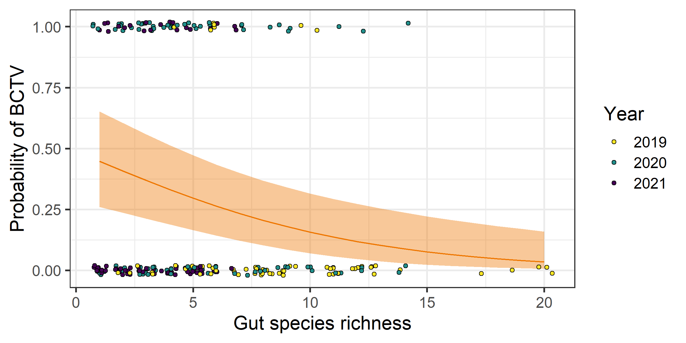
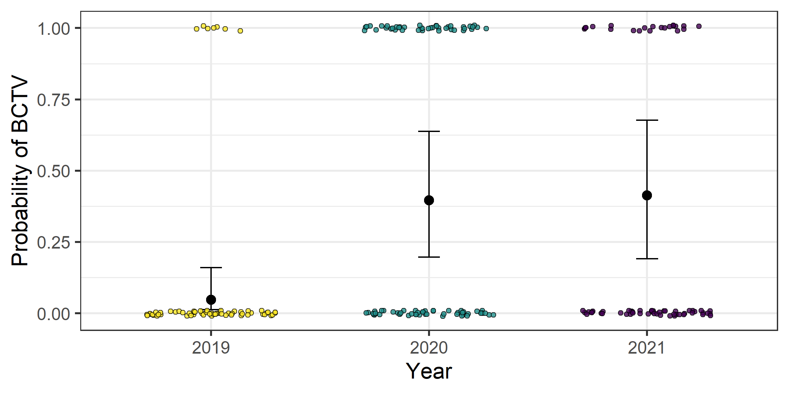
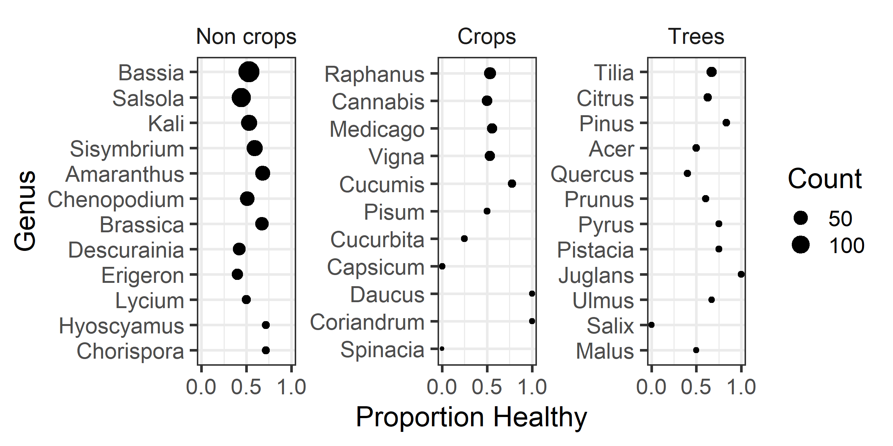
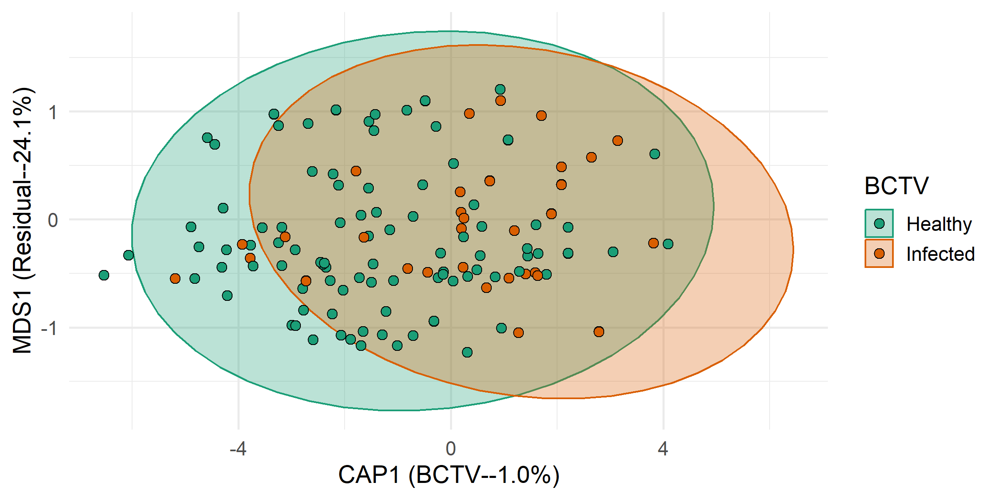
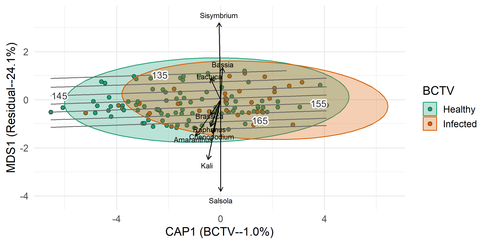
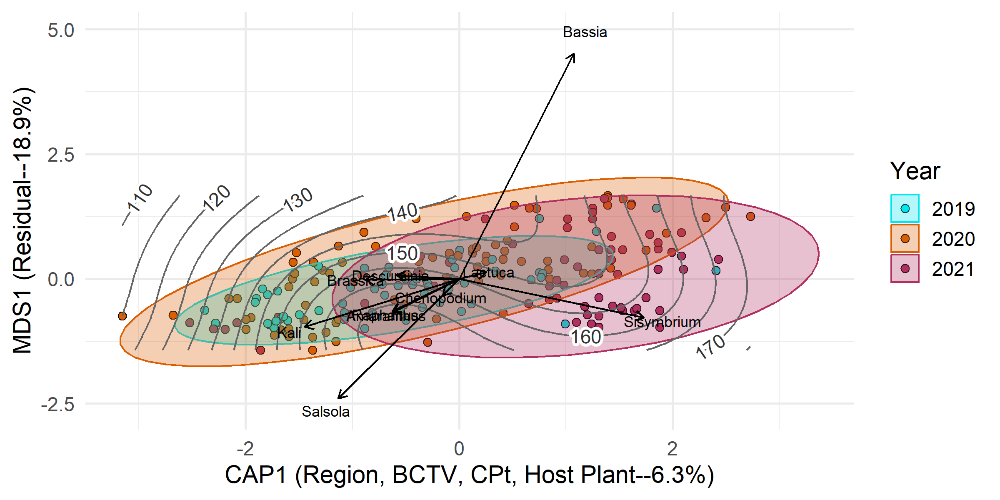
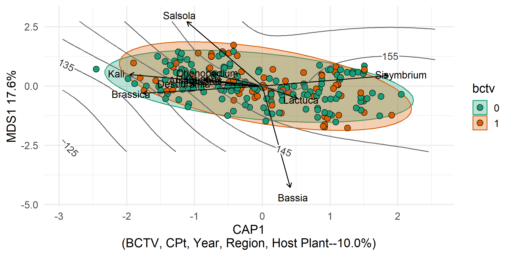

BLH Gut Diversity in Potato
================
Riley M. Anderson
November 14, 2025

  

- [Overview](#overview)
  - [Summary of Results](#summary-of-results)
- [BCTV by richness](#bctv-by-richness)
- [CPt by richness](#cpt-by-richness)
- [Proportion plants infected](#proportion-plants-infected)
- [Plants in the gut over time](#plants-in-the-gut-over-time)
  - [Crops by time](#crops-by-time)
  - [Non-crops by time](#non-crops-by-time)
  - [Trees by time](#trees-by-time)
    - [Gut contents by sample date](#gut-contents-by-sample-date)
    - [One figure for both NMDS](#one-figure-for-both-nmds)
    - [Genus by year](#genus-by-year)
  - [PERMANOVA](#permanova)
- [Canonical Analysis of Principle
  Components](#canonical-analysis-of-principle-components)
  - [CAP plot](#cap-plot)
  - [CAP with species vectors](#cap-with-species-vectors)
  - [CAP with Isoclines:](#cap-with-isoclines)
  - [CAP just the sample date constrained by full
    model](#cap-just-the-sample-date-constrained-by-full-model)
  - [CAP Year and sample date](#cap-year-and-sample-date)
  - [CAP everything but year in the
    model](#cap-everything-but-year-in-the-model)
  - [CAP with full model:](#cap-with-full-model)
  - [Session Information](#session-information)

## Overview

What is this analysis about?

### Summary of Results

- 

| Grouping | Mode | Median |   SD | Minimum | Maximum |
|:---------|-----:|-------:|-----:|--------:|--------:|
| Species  |    3 |      5 | 3.92 |       1 |      20 |
| Genera   |    3 |      4 | 3.00 |       1 |      18 |
| Family   |    2 |      3 | 1.88 |       1 |      10 |

# BCTV by richness

    ##  Family: binomial  ( logit )
    ## Formula:          BCTV ~ richness + (1 | region)
    ## Data: richness
    ## 
    ##      AIC      BIC   logLik deviance df.resid 
    ##    263.3    273.6   -128.7    257.3      225 
    ## 
    ## Random effects:
    ## 
    ## Conditional model:
    ##  Groups Name        Variance Std.Dev.
    ##  region (Intercept) 0.5871   0.7662  
    ## Number of obs: 228, groups:  region, 5
    ## 
    ## Conditional model:
    ##             Estimate Std. Error z value Pr(>|z|)    
    ## (Intercept) -0.04784    0.45048  -0.106 0.915427    
    ## richness    -0.16319    0.04923  -3.315 0.000916 ***
    ## ---
    ## Signif. codes:  0 '***' 0.001 '**' 0.01 '*' 0.05 '.' 0.1 ' ' 1

<!-- -->

- Simple models show a robust effect of gut species richness on BCTV
  infection
  ( =
  -0.16, SE = 0.05, *P* \< 0.001, AIC = 263.35. This effect is
  independent of region. That is, each region has varying levels of BCTV
  infection, but the effect of richness does not vary by region.

- However, there may be an effect of **year** on the variation in BCTV.
  In the plot above, the raw data are shown and colored by year with
  2019 in yellow, 2020 in blue, and 2021 in purple. Let’s have a
  detailed look below:

<!-- -->

    ##  Family: binomial  ( logit )
    ## Formula:          BCTV ~ Year + (1 | region)
    ## Data: richness
    ## 
    ##      AIC      BIC   logLik deviance df.resid 
    ##    246.1    259.9   -119.1    238.1      224 
    ## 
    ## Random effects:
    ## 
    ## Conditional model:
    ##  Groups Name        Variance Std.Dev.
    ##  region (Intercept) 0.9713   0.9856  
    ## Number of obs: 228, groups:  region, 5
    ## 
    ## Conditional model:
    ##             Estimate Std. Error z value Pr(>|z|)    
    ## (Intercept)  -2.9916     0.6787  -4.408 1.04e-05 ***
    ## Year2020      2.5697     0.5494   4.678 2.90e-06 ***
    ## Year2021      2.6392     0.6583   4.009 6.10e-05 ***
    ## ---
    ## Signif. codes:  0 '***' 0.001 '**' 0.01 '*' 0.05 '.' 0.1 ' ' 1

<!-- -->

- Okay, so 2019 had much lower levels of BCTV, relative to 2020
  and 2021. Moreover, **year** is a better predictor of BCTV than
  **richness** (AIC = 246.15)

- Did gut species richness also vary across years? Let’s find out:

<!-- -->

    ## Overdispersion ratio for model: richness_mod1 
    ## formula: richness ~ Year + (1 | region) 
    ## 
    ## Acceptable range: 1 - 1.4
    ## Overdispersion ratio: 1.016  df: 223  p = 0.421 
    ##  Data are not overdispersed
    ##    ratio deviance       df   pvalue 
    ##   1.0160 226.5496 223.0000   0.4210
    ##  Family: nbinom2  ( log )
    ## Formula:          richness ~ Year + (1 | region)
    ## Data: richness
    ## 
    ##      AIC      BIC   logLik deviance df.resid 
    ##   1117.2   1134.4   -553.6   1107.2      223 
    ## 
    ## Random effects:
    ## 
    ## Conditional model:
    ##  Groups Name        Variance  Std.Dev. 
    ##  region (Intercept) 2.398e-10 1.548e-05
    ## Number of obs: 228, groups:  region, 5
    ## 
    ## Dispersion parameter for nbinom2 family (): 8.46 
    ## 
    ## Conditional model:
    ##             Estimate Std. Error z value Pr(>|z|)    
    ## (Intercept)  2.19026    0.05996   36.53  < 2e-16 ***
    ## Year2020    -0.51025    0.08288   -6.16 7.44e-10 ***
    ## Year2021    -1.01486    0.09801  -10.35  < 2e-16 ***
    ## ---
    ## Signif. codes:  0 '***' 0.001 '**' 0.01 '*' 0.05 '.' 0.1 ' ' 1

<!-- -->

- Yes, gut species richness varies significantly across years, with
  richness declining over time. This evidence suggests that **richness**
  and **year** are both important predictors of BCTV. Is this because
  they are collinear? Or do they each contribute to model fit?

- This is not the same as a statistical interaction. When two
  independent variables are collinear, we may be fooled into thinking
  one is significant when in reality, its significance comes from its
  proxy as the other.

- Test for collinearity and model fit with AIC:

<!-- -->

    ##             (Intercept)   richness      nYear
    ## (Intercept)   1.0000000 -0.4217605 -0.9999997
    ## richness     -0.4217605  1.0000000  0.4214301
    ## nYear        -0.9999997  0.4214301  1.0000000
    ##  Family: binomial  ( logit )
    ## Formula:          BCTV ~ richness + nYear + (1 | region)
    ## Data: richness
    ## 
    ##      AIC      BIC   logLik deviance df.resid 
    ##    256.0    269.7   -124.0    248.0      224 
    ## 
    ## Random effects:
    ## 
    ## Conditional model:
    ##  Groups Name        Variance Std.Dev.
    ##  region (Intercept) 1.033    1.016   
    ## Number of obs: 228, groups:  region, 5
    ## 
    ## Conditional model:
    ##               Estimate Std. Error z value Pr(>|z|)   
    ## (Intercept) -1.899e+03  6.584e+02  -2.885  0.00392 **
    ## richness    -8.811e-02  5.439e-02  -1.620  0.10525   
    ## nYear        9.400e-01  3.259e-01   2.885  0.00392 **
    ## ---
    ## Signif. codes:  0 '***' 0.001 '**' 0.01 '*' 0.05 '.' 0.1 ' ' 1

<!-- -->

- Correlation between **year** and **richness** is weak (*r* = 0.42), so
  no collinearity. However, including **year** in the model loses the
  **richness** effect.

- We’ve now fit three versions of models to predict BCTV. Lets compare
  with AIC and decide which model to use:

``` r

AIC(bctv_mod1, bctv_mod2, bctv_mod3)
##           df      AIC
## bctv_mod1  3 263.3452
## bctv_mod2  4 246.1459
## bctv_mod3  4 255.9598
```

- Model selection with AIC suggests the model with **year** alone is the
  best predictor.

- This means that our evidence of the dilution effect in BCTV is weak.
  Probably should not make this the main point of the paper.

# CPt by richness

    ##  Family: binomial  ( logit )
    ## Formula:          CPt ~ richness + Year + (1 | region)
    ## Data: richness
    ## 
    ##      AIC      BIC   logLik deviance df.resid 
    ##    278.1    295.3   -134.1    268.1      223 
    ## 
    ## Random effects:
    ## 
    ## Conditional model:
    ##  Groups Name        Variance Std.Dev.
    ##  region (Intercept) 0.08371  0.2893  
    ## Number of obs: 228, groups:  region, 5
    ## 
    ## Conditional model:
    ##             Estimate Std. Error z value Pr(>|z|)  
    ## (Intercept) -0.78833    0.53405  -1.476   0.1399  
    ## richness    -0.02993    0.04516  -0.663   0.5075  
    ## Year2020     0.79665    0.42428   1.878   0.0604 .
    ## Year2021    -0.55283    0.64374  -0.859   0.3905  
    ## ---
    ## Signif. codes:  0 '***' 0.001 '**' 0.01 '*' 0.05 '.' 0.1 ' ' 1

<!-- -->

- Both **richness** and **year** have no effect on CPt infection (*P* \>
  0.5).

# Proportion plants infected

<!-- -->

<!-- -->

<!-- -->

<!-- -->

    ## Analysis of Variance Table
    ## 
    ## Response: n
    ##                   Df  Sum Sq Mean Sq  F value Pr(>F)    
    ## status             3 107.715  35.905 163.3123 <2e-16 ***
    ## crop_type          2   0.000   0.000   0.0000 1.0000    
    ## status:crop_type   6   1.699   0.283   1.2879 0.2671    
    ## Residuals        132  29.021   0.220                    
    ## ---
    ## Signif. codes:  0 '***' 0.001 '**' 0.01 '*' 0.05 '.' 0.1 ' ' 1
    ## 
    ## Call:
    ## lm(formula = n ~ status * crop_type, data = inf_stat_data, weights = total)
    ## 
    ## Weighted Residuals:
    ##     Min      1Q  Median      3Q     Max 
    ## -0.9777 -0.2559 -0.0944  0.2148  1.4329 
    ## 
    ## Coefficients:
    ##                                   Estimate Std. Error t value Pr(>|t|)    
    ## (Intercept)                       0.534456   0.018349  29.127   <2e-16 ***
    ## statusBCTV                       -0.404288   0.025949 -15.580   <2e-16 ***
    ## statusCPt                        -0.321593   0.025949 -12.393   <2e-16 ***
    ## statusCo-infected                -0.411945   0.025949 -15.875   <2e-16 ***
    ## crop_typeCrops                   -0.025365   0.036552  -0.694   0.4889    
    ## crop_typeTrees                    0.107335   0.060151   1.784   0.0767 .  
    ## statusBCTV:crop_typeCrops         0.067924   0.051692   1.314   0.1911    
    ## statusCPt:crop_typeCrops          0.039774   0.051692   0.769   0.4430    
    ## statusCo-infected:crop_typeCrops -0.006237   0.051692  -0.121   0.9041    
    ## statusBCTV:crop_typeTrees        -0.133026   0.085066  -1.564   0.1203    
    ## statusCPt:crop_typeTrees         -0.156019   0.085066  -1.834   0.0689 .  
    ## statusCo-infected:crop_typeTrees -0.140294   0.085066  -1.649   0.1015    
    ## ---
    ## Signif. codes:  0 '***' 0.001 '**' 0.01 '*' 0.05 '.' 0.1 ' ' 1
    ## 
    ## Residual standard error: 0.4689 on 132 degrees of freedom
    ## Multiple R-squared:  0.7904, Adjusted R-squared:  0.7729 
    ## F-statistic: 45.24 on 11 and 132 DF,  p-value: < 2.2e-16

<!-- -->

# Plants in the gut over time

## Crops by time

## Non-crops by time

## Trees by time

<!-- -->

    ## Run 0 stress 0.1261772 
    ## Run 1 stress 0.1262575 
    ## ... Procrustes: rmse 0.009419348  max resid 0.1054978 
    ## Run 2 stress 0.1263395 
    ## ... Procrustes: rmse 0.006763583  max resid 0.0953576 
    ## Run 3 stress 0.1262459 
    ## ... Procrustes: rmse 0.009932081  max resid 0.08121929 
    ## Run 4 stress 0.1262583 
    ## ... Procrustes: rmse 0.009438773  max resid 0.1051544 
    ## Run 5 stress 0.1262287 
    ## ... Procrustes: rmse 0.006971333  max resid 0.06116272 
    ## Run 6 stress 0.1262607 
    ## ... Procrustes: rmse 0.008762448  max resid 0.07979958 
    ## Run 7 stress 0.1261952 
    ## ... Procrustes: rmse 0.003885832  max resid 0.04019306 
    ## Run 8 stress 0.1263918 
    ## ... Procrustes: rmse 0.01233587  max resid 0.1078685 
    ## Run 9 stress 0.1263322 
    ## ... Procrustes: rmse 0.008815924  max resid 0.1044903 
    ## Run 10 stress 0.1262216 
    ## ... Procrustes: rmse 0.007092325  max resid 0.07110358 
    ## Run 11 stress 0.1287883 
    ## Run 12 stress 0.1299689 
    ## Run 13 stress 0.1262556 
    ## ... Procrustes: rmse 0.009186755  max resid 0.1057134 
    ## Run 14 stress 0.1263611 
    ## ... Procrustes: rmse 0.008801547  max resid 0.08987491 
    ## Run 15 stress 0.1262205 
    ## ... Procrustes: rmse 0.007221739  max resid 0.07148752 
    ## Run 16 stress 0.1263509 
    ## ... Procrustes: rmse 0.007756578  max resid 0.08700887 
    ## Run 17 stress 0.1310354 
    ## Run 18 stress 0.1263952 
    ## ... Procrustes: rmse 0.01342571  max resid 0.1084283 
    ## Run 19 stress 0.1262202 
    ## ... Procrustes: rmse 0.006860095  max resid 0.06950013 
    ## Run 20 stress 0.1304403 
    ## Run 21 stress 0.1305998 
    ## Run 22 stress 0.1262572 
    ## ... Procrustes: rmse 0.009231301  max resid 0.1056036 
    ## Run 23 stress 0.1263977 
    ## ... Procrustes: rmse 0.01298295  max resid 0.107987 
    ## Run 24 stress 0.1262197 
    ## ... Procrustes: rmse 0.007182605  max resid 0.07136162 
    ## Run 25 stress 0.1262158 
    ## ... Procrustes: rmse 0.005313013  max resid 0.04419303 
    ## Run 26 stress 0.1263934 
    ## ... Procrustes: rmse 0.01368616  max resid 0.1085674 
    ## Run 27 stress 0.1261787 
    ## ... Procrustes: rmse 0.0009794891  max resid 0.007540488 
    ## ... Similar to previous best
    ## *** Best solution repeated 1 times
    ## [1] 0.1261772

<!-- --><!-- -->

    ## 
    ## ***VECTORS
    ## 
    ##                 NMDS1     NMDS2     NMDS3     r2 Pr(>r)   
    ## sample_date -0.977860 -0.184600 -0.098582 0.1961  0.002 **
    ## ---
    ## Signif. codes:  0 '***' 0.001 '**' 0.01 '*' 0.05 '.' 0.1 ' ' 1
    ## Blocks:  strata 
    ## Permutation: free
    ## Number of permutations: 999
    ## 
    ## ***FACTORS:
    ## 
    ## Centroids:
    ##                   NMDS1   NMDS2   NMDS3
    ## regionMattawa   -0.2810  0.0275  0.0988
    ## regionMoxee      0.2973  0.0318 -0.0607
    ## regionOthello   -0.2181 -0.0562 -0.3615
    ## regionPasco      0.1453 -0.0311  0.0521
    ## regionPaterson  -0.1992  0.0120  0.1099
    ## healthyInfected -0.0603  0.0398 -0.0384
    ## healthyHealthy   0.0598 -0.0395  0.0381
    ## Year2019        -0.3666 -0.1516  0.2767
    ## Year2020        -0.1684  0.1218 -0.1361
    ## Year2021         0.5590 -0.0232 -0.0721
    ## 
    ## Goodness of fit:
    ##             r2 Pr(>r)    
    ## region  0.1048  0.001 ***
    ## healthy 0.0092  0.135    
    ## Year    0.2614  0.001 ***
    ## ---
    ## Signif. codes:  0 '***' 0.001 '**' 0.01 '*' 0.05 '.' 0.1 ' ' 1
    ## Blocks:  strata 
    ## Permutation: free
    ## Number of permutations: 999
    ## 
    ## Family: gaussian 
    ## Link function: identity 
    ## 
    ## Formula:
    ## log(sample_date) ~ s(NMDS1, NMDS2, k = 5)
    ## 
    ## Parametric coefficients:
    ##             Estimate Std. Error t value Pr(>|t|)    
    ## (Intercept)  5.00358    0.05821   85.95   <2e-16 ***
    ## ---
    ## Signif. codes:  0 '***' 0.001 '**' 0.01 '*' 0.05 '.' 0.1 ' ' 1
    ## 
    ## Approximate significance of smooth terms:
    ##                  edf Ref.df     F  p-value    
    ## s(NMDS1,NMDS2) 3.706  3.706 10.62 9.68e-07 ***
    ## ---
    ## Signif. codes:  0 '***' 0.001 '**' 0.01 '*' 0.05 '.' 0.1 ' ' 1
    ## 
    ## R-sq.(adj) =  0.207   
    ## lmer.REML = -99.51  Scale est. = 0.031691  n = 227

<!-- -->

### Gut contents by sample date

### One figure for both NMDS

### Genus by year

## PERMANOVA

    ## Permutation test for adonis under reduced model
    ## Terms added sequentially (first to last)
    ## Blocks:  strata 
    ## Permutation: free
    ## Number of permutations: 999
    ## 
    ## adonis2(formula = gut_mat_species ~ splines::ns(sample_date, df = 5) + BCTV * Year + CPt + region, data = gut_matrix, strata = gut_matrix$host_plant)
    ##                                   Df SumOfSqs      R2       F Pr(>F)    
    ## splines::ns(sample_date, df = 5)   5    9.998 0.16166 10.2925  0.001 ***
    ## BCTV                               1    0.704 0.01138  3.6214  0.006 ** 
    ## Year                               2    8.163 0.13199 21.0087  0.001 ***
    ## CPt                                1    0.280 0.00453  1.4431  0.310    
    ## region                             4    1.072 0.01734  1.3801  0.418    
    ## BCTV:Year                          2    0.635 0.01026  1.6331  0.226    
    ## Residual                         211   40.992 0.66283                   
    ## Total                            226   61.844 1.00000                   
    ## ---
    ## Signif. codes:  0 '***' 0.001 '**' 0.01 '*' 0.05 '.' 0.1 ' ' 1
    ## 
    ## Permutation test for homogeneity of multivariate dispersions
    ## Permutation: free
    ## Number of permutations: 999
    ## 
    ## Response: Distances
    ##            Df Sum Sq  Mean Sq      F N.Perm Pr(>F)
    ## Groups      1 0.0483 0.048255 2.3974    999  0.114
    ## Residuals 225 4.5288 0.020128
    ## 
    ## Contrast: 0_1 
    ## 
    ##             average      sd   ratio     ava     avb cumsum     p  
    ## Bassia      0.11085 0.11481 0.96550 0.63920 0.68120  0.160 0.050 *
    ## Solanum     0.09017 0.10662 0.84570 0.48730 0.47830  0.289 0.163  
    ## Salsola     0.08812 0.10408 0.84660 0.49370 0.50720  0.416 0.016 *
    ## Sisymbrium  0.08196 0.11391 0.71950 0.31650 0.30430  0.534 0.250  
    ## Kali        0.06231 0.08224 0.75760 0.37340 0.21740  0.624 0.607  
    ## Lactuca     0.05520 0.08713 0.63360 0.28480 0.15940  0.703 0.744  
    ## Chenopodium 0.04857 0.08084 0.60080 0.27220 0.17390  0.773 0.655  
    ## Amaranthus  0.04842 0.09804 0.49390 0.36080 0.04350  0.843 0.996  
    ## Descurainia 0.04602 0.08219 0.56000 0.14560 0.21740  0.909 0.078 .
    ## Brassica    0.03984 0.07263 0.54850 0.22780 0.10140  0.967 0.911  
    ## Raphanus    0.02317 0.06025 0.38460 0.17090 0.04350  1.000 0.922  
    ## ---
    ## Signif. codes:  0 '***' 0.001 '**' 0.01 '*' 0.05 '.' 0.1 ' ' 1
    ## Permutation: free
    ## Number of permutations: 999

# Canonical Analysis of Principle Components

- A constrained ordination

<!-- -->

    ## 
    ## Call:
    ## capscale(formula = gut_mat_species ~ BCTV, data = gut_matrix,      distance = "bray") 
    ## 
    ## Partitioning of squared Bray distance:
    ##               Inertia Proportion
    ## Total         89.6169   1.000000
    ## Constrained    0.8297   0.009258
    ## Unconstrained 88.7872   0.990742
    ## 
    ## Eigenvalues, and their contribution to the squared Bray distance 
    ## 
    ## Importance of components:
    ##                           CAP1    MDS1    MDS2    MDS3    MDS4    MDS5    MDS6
    ## Eigenvalue            0.829687 19.9811 13.6816 12.2777 8.96068 7.21693 5.34514
    ## Proportion Explained  0.009258  0.2230  0.1527  0.1370 0.09999 0.08053 0.05964
    ## Cumulative Proportion 0.009258  0.2322  0.3849  0.5219 0.62188 0.70241 0.76205
    ##                          MDS7    MDS8    MDS9   MDS10  MDS11   MDS12    MDS13
    ## Eigenvalue            5.19319 4.17861 3.87465 2.63763 1.7117 1.04806 0.798752
    ## Proportion Explained  0.05795 0.04663 0.04324 0.02943 0.0191 0.01169 0.008913
    ## Cumulative Proportion 0.82000 0.86663 0.90986 0.93930 0.9584 0.97009 0.979005
    ##                          MDS14    MDS15    MDS16    MDS17    MDS18     MDS19
    ## Eigenvalue            0.563248 0.455575 0.307991 0.227272 0.193853 0.0744160
    ## Proportion Explained  0.006285 0.005084 0.003437 0.002536 0.002163 0.0008304
    ## Cumulative Proportion 0.985290 0.990373 0.993810 0.996346 0.998509 0.9993396
    ##                           MDS20    MDS21
    ## Eigenvalue            0.0319399 0.027243
    ## Proportion Explained  0.0003564 0.000304
    ## Cumulative Proportion 0.9996960 1.000000
    ## 
    ## Accumulated constrained eigenvalues
    ## Importance of components:
    ##                         CAP1
    ## Eigenvalue            0.8297
    ## Proportion Explained  1.0000
    ## Cumulative Proportion 1.0000

## CAP plot

- This is a constrained ordination, forcing the X-axis to reflect
  variation in BCTV infection status. A clear separation would indicate
  a real effect (that BLH infected with BCTV have different plant
  communities in their guts)

<!-- -->

- Doesn’t seem like there is much separation. Let’s try adding in
  species vectors.

## CAP with species vectors

<!-- -->

- This is the interesting stuff. The X-axis is constrained to only
  display the variation in plant community composition explained by BCTV
  status. The Y-axis is the first unconstrained axis that captures
  greatest proportion of variation not explained by BCTV status (the
  residual variation).

- Species vectors entirely align with variation in the MDS1 axis,
  meaning that variation in species composition is not aligned with
  viral status.

- While BCTV status has a **real** but **weak** effect on species
  composition, this effect is orthogonal to the main species gradients.

- Consistent with the PERMANOVA results that show very small R2 values
  for BCTV.

- Let’s see if sample date aligns with BCTV or helps explain the
  residual variance.

## CAP with Isoclines:

<!-- -->

## CAP just the sample date constrained by full model

    ## 
    ## Call:
    ## capscale(formula = gut_mat_species ~ Year + sample_date + BCTV +      CPt + region + host_plant, data = gut_matrix, distance = "bray") 
    ## 
    ## Partitioning of squared Bray distance:
    ##               Inertia Proportion
    ## Total           89.62     1.0000
    ## Constrained     25.70     0.2868
    ## Unconstrained   63.92     0.7132
    ## 
    ## Eigenvalues, and their contribution to the squared Bray distance 
    ## 
    ## Importance of components:
    ##                          CAP1    CAP2    CAP3    CAP4    CAP5     CAP6     CAP7
    ## Eigenvalue            12.3975 4.31177 2.97686 2.25286 1.23755 0.792893 0.594563
    ## Proportion Explained   0.1383 0.04811 0.03322 0.02514 0.01381 0.008848 0.006634
    ## Cumulative Proportion  0.1383 0.18645 0.21967 0.24481 0.25862 0.267465 0.274100
    ##                           CAP8     CAP9    CAP10   CAP11     CAP12     CAP13
    ## Eigenvalue            0.336761 0.294134 0.251412 0.11920 0.0606815 0.0353539
    ## Proportion Explained  0.003758 0.003282 0.002805 0.00133 0.0006771 0.0003945
    ## Cumulative Proportion 0.277858 0.281140 0.283945 0.28528 0.2859526 0.2863471
    ##                           CAP14     CAP15     CAP16     CAP17    MDS1    MDS2
    ## Eigenvalue            0.0201055 0.0098668 6.124e-03 1.865e-03 13.0309 10.4394
    ## Proportion Explained  0.0002243 0.0001101 6.833e-05 2.081e-05  0.1454  0.1165
    ## Cumulative Proportion 0.2865714 0.2866815 2.867e-01 2.868e-01  0.4322  0.5487
    ##                          MDS3    MDS4    MDS5    MDS6    MDS7    MDS8    MDS9
    ## Eigenvalue            8.76113 5.94476 5.05749 4.45620 3.75576 3.38823 2.57937
    ## Proportion Explained  0.09776 0.06634 0.05643 0.04973 0.04191 0.03781 0.02878
    ## Cumulative Proportion 0.64643 0.71276 0.76920 0.81892 0.86083 0.89864 0.92742
    ##                         MDS10   MDS11    MDS12  MDS13    MDS14    MDS15
    ## Eigenvalue            2.01586 1.35617 0.841776 0.5646 0.531924 0.411695
    ## Proportion Explained  0.02249 0.01513 0.009393 0.0063 0.005936 0.004594
    ## Cumulative Proportion 0.94992 0.96505 0.974443 0.9807 0.986678 0.991272
    ##                          MDS16    MDS17    MDS18    MDS19     MDS20     MDS21
    ## Eigenvalue            0.270960 0.217238 0.175349 0.068020 0.0286424 0.0219342
    ## Proportion Explained  0.003024 0.002424 0.001957 0.000759 0.0003196 0.0002448
    ## Cumulative Proportion 0.994296 0.996720 0.998677 0.999436 0.9997552 1.0000000
    ## 
    ## Accumulated constrained eigenvalues
    ## Importance of components:
    ##                          CAP1   CAP2   CAP3    CAP4    CAP5    CAP6    CAP7
    ## Eigenvalue            12.3975 4.3118 2.9769 2.25286 1.23755 0.79289 0.59456
    ## Proportion Explained   0.4824 0.1678 0.1158 0.08766 0.04815 0.03085 0.02314
    ## Cumulative Proportion  0.4824 0.6502 0.7660 0.85367 0.90183 0.93268 0.95582
    ##                         CAP8    CAP9    CAP10    CAP11    CAP12    CAP13
    ## Eigenvalue            0.3368 0.29413 0.251412 0.119204 0.060682 0.035354
    ## Proportion Explained  0.0131 0.01145 0.009783 0.004638 0.002361 0.001376
    ## Cumulative Proportion 0.9689 0.98036 0.990148 0.994786 0.997147 0.998523
    ##                           CAP14     CAP15     CAP16     CAP17
    ## Eigenvalue            0.0201055 0.0098668 0.0061238 1.865e-03
    ## Proportion Explained  0.0007823 0.0003839 0.0002383 7.255e-05
    ## Cumulative Proportion 0.9993052 0.9996892 0.9999274 1.000e+00

<!-- -->

## CAP Year and sample date

    ## 
    ## Call:
    ## capscale(formula = gut_mat_species ~ Year + Condition(sample_date),      data = gut_matrix, distance = "bray") 
    ## 
    ## Partitioning of squared Bray distance:
    ##               Inertia Proportion
    ## Total          89.617    1.00000
    ## Conditioned     6.232    0.06954
    ## Constrained    10.489    0.11704
    ## Unconstrained  72.896    0.81341
    ## 
    ## Eigenvalues, and their contribution to the squared Bray distance 
    ## after removing the contribution of conditiniong variables
    ## 
    ## Importance of components:
    ##                          CAP1    CAP2    MDS1   MDS2   MDS3    MDS4    MDS5
    ## Eigenvalue            6.94050 3.54849 14.4429 12.423 9.7641 6.14611 5.50007
    ## Proportion Explained  0.08323 0.04256  0.1732  0.149 0.1171 0.07371 0.06596
    ## Cumulative Proportion 0.08323 0.12579  0.2990  0.448 0.5651 0.63879 0.70475
    ##                          MDS6   MDS7    MDS8    MDS9   MDS10   MDS11   MDS12
    ## Eigenvalue            5.22565 4.1607 3.95197 3.49990 2.49191 1.57796 1.02969
    ## Proportion Explained  0.06267 0.0499 0.04739 0.04197 0.02988 0.01892 0.01235
    ## Cumulative Proportion 0.76742 0.8173 0.86471 0.90668 0.93657 0.95549 0.96784
    ##                        MDS13    MDS14   MDS15    MDS16    MDS17   MDS18
    ## Eigenvalue            0.8005 0.569024 0.45443 0.307077 0.224849 0.19342
    ## Proportion Explained  0.0096 0.006824 0.00545 0.003683 0.002697 0.00232
    ## Cumulative Proportion 0.9774 0.984263 0.98971 0.993395 0.996092 0.99841
    ##                           MDS19     MDS20     MDS21
    ## Eigenvalue            0.0738596 0.0318668 0.0267370
    ## Proportion Explained  0.0008858 0.0003822 0.0003206
    ## Cumulative Proportion 0.9992972 0.9996794 1.0000000
    ## 
    ## Accumulated constrained eigenvalues
    ## Importance of components:
    ##                         CAP1   CAP2
    ## Eigenvalue            6.9405 3.5485
    ## Proportion Explained  0.6617 0.3383
    ## Cumulative Proportion 0.6617 1.0000

<!-- -->

## CAP everything but year in the model

    ## 
    ## Call:
    ## capscale(formula = gut_mat_species ~ region + BCTV + CPt + host_plant +      Condition(sample_date), data = gut_matrix, distance = "bray") 
    ## 
    ## Partitioning of squared Bray distance:
    ##               Inertia Proportion
    ## Total          89.617    1.00000
    ## Conditioned     6.232    0.06954
    ## Constrained    13.522    0.15089
    ## Unconstrained  69.863    0.77957
    ## 
    ## Eigenvalues, and their contribution to the squared Bray distance 
    ## after removing the contribution of conditiniong variables
    ## 
    ## Importance of components:
    ##                          CAP1    CAP2   CAP3    CAP4     CAP5     CAP6     CAP7
    ## Eigenvalue            4.76272 3.20189 2.0514 0.87485 0.786058 0.657532 0.401486
    ## Proportion Explained  0.05712 0.03840 0.0246 0.01049 0.009427 0.007886 0.004815
    ## Cumulative Proportion 0.05712 0.09552 0.1201 0.13061 0.140037 0.147923 0.152738
    ##                           CAP8     CAP9    CAP10     CAP11     CAP12     CAP13
    ## Eigenvalue            0.294253 0.196472 0.154323 0.0725596 0.0417461 0.0203968
    ## Proportion Explained  0.003529 0.002356 0.001851 0.0008702 0.0005006 0.0002446
    ## Cumulative Proportion 0.156266 0.158623 0.160473 0.1613436 0.1618442 0.1620888
    ##                           CAP14    MDS1    MDS2    MDS3    MDS4    MDS5    MDS6
    ## Eigenvalue            6.230e-03 13.4990 10.8166 10.2411 7.28993 5.92353 4.74315
    ## Proportion Explained  7.471e-05  0.1619  0.1297  0.1228 0.08743 0.07104 0.05688
    ## Cumulative Proportion 1.622e-01  0.3241  0.4538  0.5766 0.66401 0.73505 0.79194
    ##                          MDS7    MDS8    MDS9   MDS10   MDS11   MDS12    MDS13
    ## Eigenvalue            3.97085 3.56412 2.94466 2.27058 1.44553 0.85680 0.565216
    ## Proportion Explained  0.04762 0.04274 0.03531 0.02723 0.01734 0.01028 0.006778
    ## Cumulative Proportion 0.83956 0.88230 0.91761 0.94484 0.96218 0.97246 0.979234
    ##                          MDS14   MDS15    MDS16    MDS17    MDS18     MDS19
    ## Eigenvalue            0.533509 0.41273 0.271439 0.218081 0.175756 0.0689939
    ## Proportion Explained  0.006398 0.00495 0.003255 0.002615 0.002108 0.0008274
    ## Cumulative Proportion 0.985632 0.99058 0.993837 0.996452 0.998560 0.9993876
    ##                           MDS20    MDS21
    ## Eigenvalue            0.0288846 0.022178
    ## Proportion Explained  0.0003464 0.000266
    ## Cumulative Proportion 0.9997340 1.000000
    ## 
    ## Accumulated constrained eigenvalues
    ## Importance of components:
    ##                         CAP1   CAP2   CAP3   CAP4    CAP5    CAP6    CAP7
    ## Eigenvalue            4.7627 3.2019 2.0514 0.8749 0.78606 0.65753 0.40149
    ## Proportion Explained  0.3522 0.2368 0.1517 0.0647 0.05813 0.04863 0.02969
    ## Cumulative Proportion 0.3522 0.5890 0.7407 0.8054 0.86356 0.91218 0.94187
    ##                          CAP8    CAP9   CAP10    CAP11    CAP12    CAP13
    ## Eigenvalue            0.29425 0.19647 0.15432 0.072560 0.041746 0.020397
    ## Proportion Explained  0.02176 0.01453 0.01141 0.005366 0.003087 0.001508
    ## Cumulative Proportion 0.96363 0.97816 0.98958 0.994944 0.998031 0.999539
    ##                           CAP14
    ## Eigenvalue            0.0062298
    ## Proportion Explained  0.0004607
    ## Cumulative Proportion 1.0000000

<!-- -->

## CAP with full model:

    ## Permutation test for capscale under reduced model
    ## Terms added sequentially (first to last)
    ## Permutation: free
    ## Number of permutations: 999
    ## 
    ## Model: capscale(formula = gut_mat_species ~ BCTV + CPt + region + host_plant + Year + Condition(sample_date), data = gut_matrix, distance = "bray")
    ##             Df SumOfSqs      F Pr(>F)    
    ## BCTV         1    0.838 2.7401  0.009 ** 
    ## CPt          1    0.385 1.2582  0.233    
    ## region       4    4.286 3.5040  0.001 ***
    ## host_plant   8    8.013 3.2750  0.001 ***
    ## Year         2    5.945 9.7200  0.001 ***
    ## Residual   209   63.917                  
    ## ---
    ## Signif. codes:  0 '***' 0.001 '**' 0.01 '*' 0.05 '.' 0.1 ' ' 1
    ## 
    ## Call:
    ## capscale(formula = gut_mat_species ~ BCTV + CPt + region + host_plant +      Year + Condition(sample_date), data = gut_matrix, distance = "bray") 
    ## 
    ## Partitioning of squared Bray distance:
    ##               Inertia Proportion
    ## Total          89.617    1.00000
    ## Conditioned     6.232    0.06954
    ## Constrained    19.467    0.21723
    ## Unconstrained  63.917    0.71323
    ## 
    ## Eigenvalues, and their contribution to the squared Bray distance 
    ## after removing the contribution of conditiniong variables
    ## 
    ## Importance of components:
    ##                          CAP1    CAP2    CAP3    CAP4    CAP5     CAP6     CAP7
    ## Eigenvalue            7.89377 4.30036 2.27955 2.01388 0.85485 0.724956 0.443226
    ## Proportion Explained  0.09467 0.05157 0.02734 0.02415 0.01025 0.008694 0.005315
    ## Cumulative Proportion 0.09467 0.14624 0.17358 0.19773 0.20798 0.216675 0.221991
    ##                           CAP8     CAP9    CAP10    CAP11     CAP12     CAP13
    ## Eigenvalue            0.296244 0.255310 0.172190 0.118273 0.0552964 0.0287518
    ## Proportion Explained  0.003553 0.003062 0.002065 0.001418 0.0006631 0.0003448
    ## Cumulative Proportion 0.225543 0.228605 0.230670 0.232088 0.2327516 0.2330964
    ##                           CAP14     CAP15     CAP16    MDS1    MDS2   MDS3
    ## Eigenvalue            0.0201025 6.642e-03 3.798e-03 13.0309 10.4394 8.7611
    ## Proportion Explained  0.0002411 7.966e-05 4.554e-05  0.1563  0.1252 0.1051
    ## Cumulative Proportion 0.2333375 2.334e-01 2.335e-01  0.3897  0.5149 0.6200
    ##                          MDS4    MDS5    MDS6    MDS7    MDS8    MDS9   MDS10
    ## Eigenvalue            5.94476 5.05749 4.45620 3.75576 3.38823 2.57937 2.01586
    ## Proportion Explained  0.07129 0.06065 0.05344 0.04504 0.04063 0.03093 0.02418
    ## Cumulative Proportion 0.69130 0.75195 0.80539 0.85043 0.89106 0.92200 0.94617
    ##                         MDS11  MDS12    MDS13    MDS14    MDS15   MDS16
    ## Eigenvalue            1.35617 0.8418 0.564620 0.531924 0.411695 0.27096
    ## Proportion Explained  0.01626 0.0101 0.006771 0.006379 0.004937 0.00325
    ## Cumulative Proportion 0.96244 0.9725 0.979304 0.985683 0.990620 0.99387
    ##                          MDS17    MDS18     MDS19     MDS20    MDS21
    ## Eigenvalue            0.217238 0.175349 0.0680199 0.0286424 0.021934
    ## Proportion Explained  0.002605 0.002103 0.0008157 0.0003435 0.000263
    ## Cumulative Proportion 0.996475 0.998578 0.9993935 0.9997370 1.000000
    ## 
    ## Accumulated constrained eigenvalues
    ## Importance of components:
    ##                         CAP1   CAP2   CAP3   CAP4    CAP5    CAP6    CAP7
    ## Eigenvalue            7.8938 4.3004 2.2795 2.0139 0.85485 0.72496 0.44323
    ## Proportion Explained  0.4055 0.2209 0.1171 0.1034 0.04391 0.03724 0.02277
    ## Cumulative Proportion 0.4055 0.6264 0.7435 0.8469 0.89085 0.92809 0.95086
    ##                          CAP8    CAP9    CAP10    CAP11   CAP12    CAP13
    ## Eigenvalue            0.29624 0.25531 0.172190 0.118273 0.05530 0.028752
    ## Proportion Explained  0.01522 0.01311 0.008845 0.006075 0.00284 0.001477
    ## Cumulative Proportion 0.96608 0.97919 0.988038 0.994114 0.99695 0.998431
    ##                          CAP14     CAP15     CAP16
    ## Eigenvalue            0.020103 0.0066421 0.0037977
    ## Proportion Explained  0.001033 0.0003412 0.0001951
    ## Cumulative Proportion 0.999464 0.9998049 1.0000000

<!-- -->

    ## Permutation test for capscale under reduced model
    ## Terms added sequentially (first to last)
    ## Permutation: free
    ## Number of permutations: 999
    ## 
    ## Model: capscale(formula = gut_mat_species ~ Year + Condition(sample_date), data = gut_matrix, distance = "bray")
    ##           Df SumOfSqs      F Pr(>F)    
    ## Year       2   10.489 16.044  0.001 ***
    ## Residual 223   72.896                  
    ## ---
    ## Signif. codes:  0 '***' 0.001 '**' 0.01 '*' 0.05 '.' 0.1 ' ' 1
    ## 
    ## Call:
    ## capscale(formula = gut_mat_species ~ Year + Condition(sample_date),      data = gut_matrix, distance = "bray") 
    ## 
    ## Partitioning of squared Bray distance:
    ##               Inertia Proportion
    ## Total          89.617    1.00000
    ## Conditioned     6.232    0.06954
    ## Constrained    10.489    0.11704
    ## Unconstrained  72.896    0.81341
    ## 
    ## Eigenvalues, and their contribution to the squared Bray distance 
    ## after removing the contribution of conditiniong variables
    ## 
    ## Importance of components:
    ##                          CAP1    CAP2    MDS1   MDS2   MDS3    MDS4    MDS5
    ## Eigenvalue            6.94050 3.54849 14.4429 12.423 9.7641 6.14611 5.50007
    ## Proportion Explained  0.08323 0.04256  0.1732  0.149 0.1171 0.07371 0.06596
    ## Cumulative Proportion 0.08323 0.12579  0.2990  0.448 0.5651 0.63879 0.70475
    ##                          MDS6   MDS7    MDS8    MDS9   MDS10   MDS11   MDS12
    ## Eigenvalue            5.22565 4.1607 3.95197 3.49990 2.49191 1.57796 1.02969
    ## Proportion Explained  0.06267 0.0499 0.04739 0.04197 0.02988 0.01892 0.01235
    ## Cumulative Proportion 0.76742 0.8173 0.86471 0.90668 0.93657 0.95549 0.96784
    ##                        MDS13    MDS14   MDS15    MDS16    MDS17   MDS18
    ## Eigenvalue            0.8005 0.569024 0.45443 0.307077 0.224849 0.19342
    ## Proportion Explained  0.0096 0.006824 0.00545 0.003683 0.002697 0.00232
    ## Cumulative Proportion 0.9774 0.984263 0.98971 0.993395 0.996092 0.99841
    ##                           MDS19     MDS20     MDS21
    ## Eigenvalue            0.0738596 0.0318668 0.0267370
    ## Proportion Explained  0.0008858 0.0003822 0.0003206
    ## Cumulative Proportion 0.9992972 0.9996794 1.0000000
    ## 
    ## Accumulated constrained eigenvalues
    ## Importance of components:
    ##                         CAP1   CAP2
    ## Eigenvalue            6.9405 3.5485
    ## Proportion Explained  0.6617 0.3383
    ## Cumulative Proportion 0.6617 1.0000

<!-- -->

- Sampling date is colinear with year.

## Session Information

    R version 4.2.3 (2023-03-15 ucrt)
    Platform: x86_64-w64-mingw32/x64 (64-bit)
    Running under: Windows 10 x64 (build 26100)

    Matrix products: default

    locale:
    [1] LC_COLLATE=English_United States.utf8 
    [2] LC_CTYPE=English_United States.utf8   
    [3] LC_MONETARY=English_United States.utf8
    [4] LC_NUMERIC=C                          
    [5] LC_TIME=English_United States.utf8    

    attached base packages:
    [1] stats     graphics  grDevices utils     datasets  methods   base     

    other attached packages:
     [1] randomForest_4.7-1.1 gamm4_0.2-6          mgcv_1.8-42         
     [4] nlme_3.1-162         lme4_1.1-35.3        Matrix_1.5-3        
     [7] ggrepel_0.9.5        ggExtra_0.10.1       knitr_1.47          
    [10] ggridges_0.5.6       yardstick_1.3.1      workflowsets_1.1.0  
    [13] workflows_1.1.4      tune_1.2.1           rsample_1.2.1       
    [16] recipes_1.0.10       parsnip_1.2.1        modeldata_1.3.0     
    [19] infer_1.0.7          dials_1.2.1          scales_1.3.0        
    [22] broom_1.0.6          tidymodels_1.2.0     sjPlot_2.8.16       
    [25] glmmTMB_1.1.9        emmeans_1.10.2       vegan_2.6-6.1       
    [28] lattice_0.20-45      permute_0.9-7        cowplot_1.1.3       
    [31] lubridate_1.9.3      forcats_1.0.0        stringr_1.5.1       
    [34] dplyr_1.1.4          purrr_1.0.2          readr_2.1.5         
    [37] tidyr_1.3.1          tibble_3.2.1         ggplot2_3.5.1       
    [40] tidyverse_2.0.0     

    loaded via a namespace (and not attached):
      [1] backports_1.5.0     plyr_1.8.9          TMB_1.9.11         
      [4] splines_4.2.3       listenv_0.9.1       TH.data_1.1-2      
      [7] digest_0.6.35       foreach_1.5.2       htmltools_0.5.8.1  
     [10] fansi_1.0.6         memoise_2.0.1       checkmate_2.3.1    
     [13] magrittr_2.0.3      cluster_2.1.4       tzdb_0.4.0         
     [16] globals_0.16.3      gower_1.0.1         sandwich_3.1-0     
     [19] hardhat_1.4.0       timechange_0.3.0    colorspace_2.1-0   
     [22] haven_2.5.4         xfun_0.44           survival_3.5-3     
     [25] zoo_1.8-12          iterators_1.0.14    glue_1.7.0         
     [28] gtable_0.3.5        ipred_0.9-14        sjstats_0.19.0     
     [31] sjmisc_2.8.10       future.apply_1.11.2 mvtnorm_1.2-5      
     [34] ggeffects_1.6.0     miniUI_0.1.1.1      Rcpp_1.0.12        
     [37] isoband_0.2.7       viridisLite_0.4.2   xtable_1.8-4       
     [40] performance_0.12.0  GPfit_1.0-8         lava_1.8.0         
     [43] prodlim_2023.08.28  datawizard_0.11.0   RColorBrewer_1.1-3 
     [46] pkgconfig_2.0.3     farver_2.1.2        nnet_7.3-18        
     [49] utf8_1.2.4          tidyselect_1.2.1    labeling_0.4.3     
     [52] rlang_1.1.4         DiceDesign_1.10     later_1.3.2        
     [55] cachem_1.1.0        munsell_0.5.1       tools_4.2.3        
     [58] cli_3.6.2           generics_0.1.3      sjlabelled_1.2.0   
     [61] evaluate_0.24.0     fastmap_1.2.0       yaml_2.3.8         
     [64] future_1.33.2       mime_0.12           compiler_4.2.3     
     [67] rstudioapi_0.16.0   lhs_1.1.6           stringi_1.8.4      
     [70] highr_0.11          nloptr_2.0.3        vctrs_0.6.5        
     [73] pillar_1.9.0        lifecycle_1.0.4     furrr_0.3.1        
     [76] estimability_1.5.1  data.table_1.15.4   insight_1.0.1      
     [79] httpuv_1.6.15       R6_2.5.1            promises_1.3.0     
     [82] parallelly_1.37.1   codetools_0.2-19    boot_1.3-28.1      
     [85] MASS_7.3-58.2       rprojroot_2.0.4     withr_3.0.0        
     [88] multcomp_1.4-25     parallel_4.2.3      hms_1.1.3          
     [91] metR_0.17.0         grid_4.2.3          rpart_4.1.23       
     [94] timeDate_4032.109   coda_0.19-4.1       class_7.3-21       
     [97] minqa_1.2.7         rmarkdown_2.27      numDeriv_2016.8-1.1
    [100] shiny_1.8.1.1      
